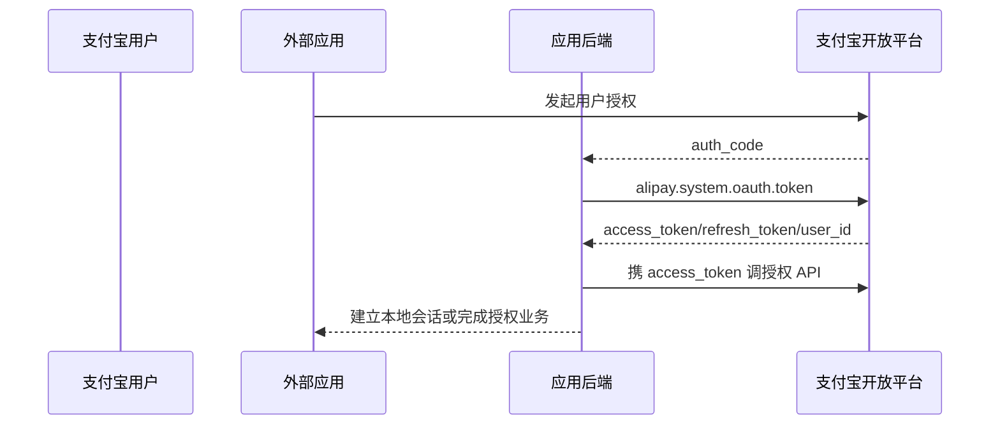

# 支付宝开放平台授权接入

支付宝开放平台至少包含两类容易混淆的外部授权：用户授权和商户/应用授权。它们使用不同的 code、token 和主体，必须分别建模；本页不评价蚂蚁体系的 IAM 产品。

::: tip 标准化边界
支付宝 OpenAPI 使用授权码、token 与 scope 等概念，并以 RSA2/证书保障 API 消息完整性，但整体仍是支付宝私有 OpenAPI 契约。RSA2 请求签名提高消息安全，不等同于 OIDC 身份联邦。
:::

## 两种授权角色

| 方向 | 授权主体 | 典型凭据 | 用途 |
|---|---|---|---|
| 用户授权 | 支付宝个人用户 | `auth_code` → 用户 `access_token` | 取得用户标识和获准的用户能力 |
| 商户/应用授权 | 商户或被代运营应用 | `app_auth_code` → `app_auth_token` | ISV 代商户调用开放 API |

两类 token 不可互换。本地账号、商户租户和开发者应用应使用不同表或明确类型字段。

## 用户授权流程

后端通过 `alipay.system.oauth.token` 以 code 换取用户 token，也可按平台规则刷新。`user_id` 是支付宝作用域主体标识；它不能与商户应用 ID、登录号或其它蚂蚁产品 ID 混用。

## 商户/应用授权流程

ISV 引导商户完成应用授权，取得 `app_auth_code`，再通过 `alipay.open.auth.token.app` 换 `app_auth_token`。后续代商户调用时同时明确：

- ISV 自身应用身份与私钥；
- 被授权商户/应用主体；
- `app_auth_token` 的权限和期限；
- API 业务请求的签名、证书与幂等键。

撤销授权或商户关系终止时，应停止代理调用、清理 token，并保留授权链审计，不能仅删除前端绑定。

## 签名与 SDK

官方 Easy SDK 和多语言 SDK封装 OpenAPI 调用、RSA2/证书签名与验签。接入方仍需：

- 私钥进入 KMS/HSM 或受控密钥服务，不随 SDK 配置文件进入镜像和仓库。
- 固定算法和字符集，按官方规则对原始字段签名/验签，避免二次序列化改变待签名文本。
- 支付宝公钥证书、根证书和应用证书按序列号选择并支持新旧证书过渡。
- 校验平台响应签名、请求追踪标识与业务幂等；HTTPS 不能替代应用层验签，应用层签名也不能替代 TLS。

## 接入方最低实现

- code 只在可信后端兑换；用户授权、商户授权使用不同回调和状态绑定。
- token、私钥、证书和应用 ID 分环境隔离，日志对敏感字段脱敏。
- 以 `(alipay, app_id, user_id)` 记录用户，以独立商户主体键记录 `app_auth_token` 的授权方。
- 不把用户 access token 当 OIDC `id_token`，也不因使用 RSA2 就宣称协议标准化。
- SDK版本与证书轮换纳入供应链和上线检查；关键金额/权限操作使用业务幂等键。

## 官方资料

- [支付宝 Easy SDK：用户授权 token 接口](https://github.com/alipay/alipay-easysdk)
- [支付宝官方 Node.js SDK：V3 API、RSA2 与证书模式](https://github.com/alipay/alipay-sdk-nodejs-all)

> 核验日期：2026-07-27。支付宝开放文档页面会动态更新，具体端点、scope 和证书规则应以目标应用控制台及当前 API 文档为准。
