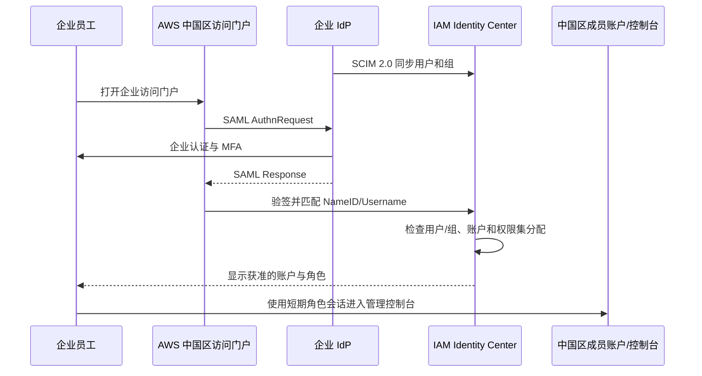
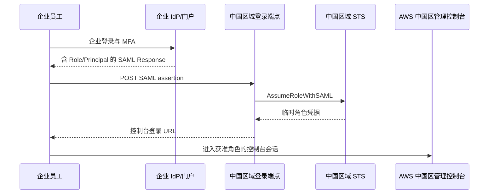
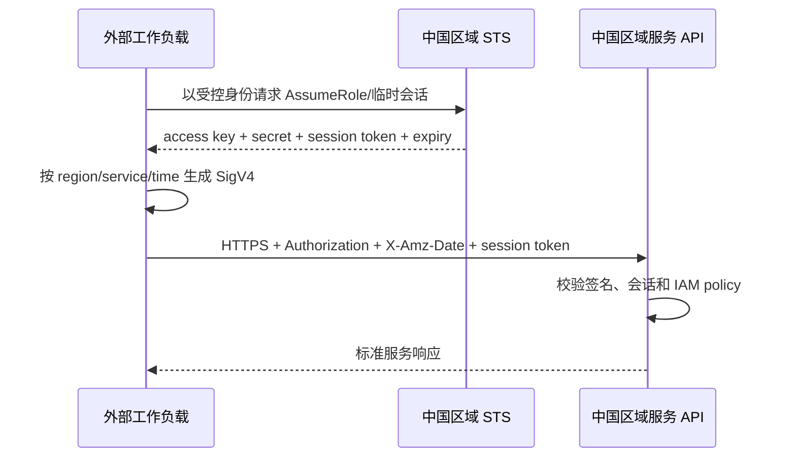

# 亚马逊云科技中国区域企业身份与 API 接入

本页同时讨论两条不能混淆的接入路径：企业员工如何使用自己的身份提供商（IdP）登录亚马逊云科技中国区域的访问门户和管理控制台，以及外部工作负载如何调用中国区域服务 API。IAM Identity Center 不作为独立 IDaaS 产品评价，但它为中国区域管理控制台提供的企业登录协议属于本页的外部接入面。

::: tip 结论先行
中国区域支持企业 IdP 接入。多账户场景优先采用 **IAM Identity Center：SAML 2.0 负责用户登录，SCIM 2.0 负责用户和组预置**。传统 IAM 也支持按账户配置 SAML 联邦角色。

OAuth 2.0/OIDC 在中国区域另有用途，但当前官方的 IAM Identity Center 外部身份源流程并不是“用企业 OIDC 直接登录管理控制台”：CLI 设备授权、可信身份传播和工作负载 OIDC 联邦是三种不同协议面。
:::

## 中国分区的关键差异

| 项目 | 中国区域 |
|---|---|
| 区域 | 北京 `cn-north-1`；宁夏 `cn-northwest-1` |
| 分区 | `aws-cn` |
| IAM Identity Center | 北京、宁夏均可用；实例 ARN 以 `arn:aws-cn:sso:::` 开头 |
| 访问门户 | 使用中国区域控制台中显示的 `awsapps.cn` / 中国区域门户地址，不沿用全球分区地址 |
| 服务端点 | 通常以 `.amazonaws.com.cn` 结尾 |
| ARN | 以 `arn:aws-cn:` 开头 |
| 账户与凭据 | 必须为中国区域单独注册，不能用于全球分区 |
| 服务 API 认证 | SDK/CLI 使用临时或长期访问凭据计算 SigV4；部分多区域能力使用 SigV4a |

北京区域由光环新网运营，宁夏区域由西云数据运营。中国区域位于独立的 `aws-cn` 分区：中国账户、组织、身份中心实例、凭据、ARN 和端点不能与全球商业区域互换。

## 先分清五种“企业接入”

| 目标 | 企业身份如何进入 AWS 中国区 | 实际协议 | 是否用于管理控制台登录 |
|---|---|---|---|
| 多账户员工访问 | 外部 IdP 接到 IAM Identity Center | **SAML 2.0 登录 + SCIM 2.0 预置** | 是，推荐方案 |
| 单账户或遗留联邦 | 在每个账户创建 IAM SAML Provider 与联邦角色 | **SAML 2.0 + STS `AssumeRoleWithSAML`** | 是 |
| AWS CLI 员工登录 | CLI 注册到 IAM Identity Center，并在浏览器完成授权 | IAM Identity Center OIDC API 所支持的 OAuth 2.0 Device Authorization 子集 | 间接复用同一员工会话；不是外部 IdP 的 OIDC 控制台入口 |
| 企业应用代用户访问受支持的 AWS 应用 | 把外部 OAuth 2.0 授权服务器配置为可信令牌颁发者 | OIDC Discovery + JWT + token exchange / 可信身份传播 | 否 |
| CI、容器或外部服务调用 API | OIDC/SAML 联邦换取 STS 角色会话，再签名服务请求 | `AssumeRoleWithWebIdentity` / `AssumeRoleWithSAML` + SigV4 | 否 |

## 方案 A：IAM Identity Center 对接企业 IdP

这是需要集中管理多个中国区域账户时的首选方案。IAM Identity Center 与中国区域的 Amazon Organizations 集成；管理员创建权限集并把同步进来的用户或组分配到成员账户。员工登录访问门户后选择账户和权限集，再进入管理控制台或获取 CLI 短期凭据。

### 配置顺序

1. 在中国区域的 Organizations 管理账户中选择主要区域并启用 IAM Identity Center。启用后不能把主要区域当成普通配置项随意切换。
2. 在“设置 → 身份源”中选择外部身份提供商，下载 IAM Identity Center 的 SAML metadata，并上传企业 IdP 的 metadata。
3. 在企业 IdP 中把 IAM Identity Center 配置为 SAML SP；ACS、Audience/Entity ID 和证书一律从当前中国区实例 metadata 复制，不从全球文档或示例域名推导。
4. 启用自动预置时，把 IAM Identity Center 生成的 SCIM endpoint 与 bearer token 配置到企业 IdP；不支持 SCIM 时只能手工预置用户和组。
5. 创建权限集，把用户或组分配到指定中国区账户；用普通员工、管理员、离职员工和未授权员工分别验收登录与回收。

### SAML 与 SCIM 的关键约束

- SAML `NameID` 格式必须为 `urn:oasis:names:tc:SAML:1.1:nameid-format:emailAddress`，其值必须与 IAM Identity Center 中已预置用户的 `Username` 完全一致；IdP 认证成功并不代表 AWS 侧一定能匹配用户。
- 企业 IdP metadata 必须包含 Entity ID、X.509 签名证书和 `SingleSignOnService`。IAM Identity Center 当前不支持 SAML 断言加密密钥，也不对发往外部 IdP 的 SAML AuthnRequest 签名，接入验收要明确这一信任边界。
- SAML 只负责认证，不会自动创建用户或组。SCIM 同步时应使用稳定且唯一的 `externalId`，并确保 SCIM Username 映射与 SAML NameID 使用同一个源属性。
- SCIM bearer token 是高权限预置凭据，必须进入密钥管理、监控到期并轮换；停用、删除、改名、换邮箱和组成员变更都要做端到端测试。
- 一个 Organizations 组织只有一个身份源。更换身份源、证书或属性映射前，应先评估现有用户、组和账户分配的影响。

## 方案 B：直接 IAM SAML 联邦到控制台

不使用 IAM Identity Center 时，可以在 IAM 中按账户创建 SAML IdP 和联邦角色。企业 IdP 生成的断言携带可选角色，浏览器把断言 POST 到中国区域登录端点；登录端点代表用户取得 STS 临时凭据并生成控制台登录 URL。

实施时应使用中国区域官方发布的区域 SAML metadata，例如 `https://{region-code}.signin.amazonaws.cn/static/saml-metadata.xml`。角色信任策略中的联合主体 ARN 使用 `arn:aws-cn:iam::{account}:saml-provider/{provider}`，并限制 `saml:aud`；SAML IdP 必须与引用它的角色位于同一账户。

这种方式适合单账户或兼容遗留门户，但每个账户都要维护 SAML Provider、角色信任和权限策略，人员/组生命周期也没有 IAM Identity Center + SCIM 那样的集中面。新的多账户部署应优先评估 IAM Identity Center。

## OAuth 2.0/OIDC 到底用在哪里

### IAM Identity Center OIDC 与 CLI

IAM Identity Center 提供 OIDC API，让 AWS CLI 等客户端注册、发起设备授权并取得访问令牌，再通过门户 API 换取角色凭据。官方说明该服务只实现了 OAuth 2.0 Device Authorization Grant 中服务于 CLI SSO 的部分；它不是面向任意第三方应用的完整通用 OIDC Provider。

当身份源是企业 IdP 时，用户在浏览器完成认证仍会被 IAM Identity Center 重定向到该 IdP 的 **SAML** 登录流程。不能因为 CLI 网络请求访问了 `oidc.{region}.amazonaws.com.cn`，就把企业身份源配置写成 OIDC。

### 可信令牌颁发者

IAM Identity Center 可以把外部 OAuth 2.0 授权服务器配置为可信令牌颁发者。外部 JWT 通过 OIDC Discovery 获取的密钥验证，随后被交换为 IAM Identity Center 令牌，用于支持可信身份传播的 AWS 托管应用代表用户访问资源。

这不是通用管理控制台登录：接收方必须是支持该能力的应用，外部 token 也不能直接作为普通 AWS 服务 API 的 Bearer token。每个目标服务还必须核对中国区域是否提供对应应用和可信身份传播能力。

### IAM OIDC Provider 与工作负载联邦

IAM 中配置 OIDC Provider 通常用于 Web Identity 或工作负载通过 `AssumeRoleWithWebIdentity` 取得 STS 角色凭据。最终调用普通 AWS 服务 API 时仍要用这些临时凭据计算 SigV4。它不等于让企业员工用 OIDC 登录 AWS 管理控制台。

::: warning 不要把 OAuth 与登录画等号
截至本页核验时，中国区域官方文档对 IAM Identity Center **外部身份源**公开的是 SAML 2.0 认证和 SCIM 2.0 预置。若企业只提供 OAuth 2.0/OIDC，应在企业身份平台启用其 SAML 企业应用/连接器，或使用受控身份代理转换；不能把 access token 直接提交给控制台或普通 AWS 服务端点。
:::

## 外部工作负载调用中国区域 API

外部工作负载应优先通过角色和 STS 取得短时效会话凭据。静态 access key 只用于无法使用角色的兼容场景，并必须进入密钥管理、设置轮换与异常调用检测。

SigV4 是亚马逊云科技的专用 API 签名协议，不是 OAuth 客户端认证标准。它把请求方法、路径、查询、头、负载摘要、日期、区域和服务绑定进规范请求，再用按日期、区域和服务派生的密钥计算签名。接入方应使用官方 SDK/CLI，避免手写 canonicalization，并同时锁定：

- `aws-cn` 分区和正确中国区域；
- 服务 endpoint 与签名 service name；
- 临时凭据中的 session token；
- 时间同步和允许时钟偏差；
- SigV4 或目标服务要求的 SigV4a。

中国北京 STS 会话 token 对 SigV4a 的兼容配置可能影响 token 长度，存储和代理不能假设固定长度。

## 事件与回调

中国区域的事件能力分散在 EventBridge、SNS、SQS 和具体服务中，不存在覆盖所有服务的统一 Webhook 身份协议。接入方必须按服务验证消息签名、队列策略、主题 ARN、事件 ID 和重试/重复投递语义，不能把某一个服务的验证方式套用到其它事件源。

## 权限、审计与应急控制

- IAM Identity Center 权限集和 IAM 策略都应限制 action、resource、condition、region、组织/账户和会话标签，管理员权限与日常只读/运维权限分开。
- 跨账户访问使用角色和明确的信任策略；第三方代调用使用外部 ID 等混淆代理防护。
- 对控制台会话同时验证企业 IdP MFA、SAML 会话时长、IAM Identity Center 门户会话时长和权限集角色会话时长，不能只调其中一层。
- 保留独立、受监控的紧急访问路径；外部 IdP、SCIM 或主要区域故障演练不能依赖同一故障域中的身份。
- CloudTrail 关联中国 account ID、role ARN、role session、source identity 和 `ExternalIdPDirectoryLogin` 等事件；不能与全球分区同名角色合并。
- 第三方 IdP 实例可能位于中国境外。部署前核对身份属性、日志和支持数据的位置及跨境合规要求。
- 中国与全球账户、组织、身份源、ARN、端点、配置文件和 CI Secret 完全隔离。
- 禁止把长期 access key、SCIM token、SAML assertion 或完整 Authorization 写入代码、镜像、浏览器存储和日志。
- SDK provider chain 中移除不必要的静态凭据回退；记录 request ID 和必要的签名诊断摘要，但不记录 secret、session token 或完整 canonical request。

## 官方资料

- [IAM Identity Center 在亚马逊云科技中国区域的可用性与差异](https://docs.amazonaws.cn/en_us/aws/latest/userguide/iam-identity-center.html)
- [IAM Identity Center 外部身份提供商](https://docs.amazonaws.cn/en_us/singlesignon/latest/userguide/manage-your-identity-source-idp.html)
- [外部 IdP 的 SAML 与 SCIM 互操作要求](https://docs.amazonaws.cn/en_us/singlesignon/latest/userguide/other-idps.html)
- [通过 SCIM 自动预置用户和组](https://docs.amazonaws.cn/en_us/singlesignon/latest/userguide/provision-automatically.html)
- [SAML 联邦主体访问 AWS 中国区管理控制台](https://docs.amazonaws.cn/en_us/IAM/latest/UserGuide/id_roles_providers_enable-console-saml.html)
- [IAM Identity Center OIDC API 的使用边界](https://docs.amazonaws.cn/en_us/singlesignon/latest/OIDCAPIReference/Welcome.html)
- [使用可信令牌颁发者的应用](https://docs.amazonaws.cn/en_us/singlesignon/latest/userguide/using-apps-with-trusted-token-issuer.html)
- [中国区域账户与凭据隔离](https://docs.amazonaws.cn/en_us/aws/latest/userguide/accounts-and-credentials.html)
- [中国区域端点与 ARN](https://docs.amazonaws.cn/en_us/aws/latest/userguide/endpoints-arns.html)
- [SigV4 API 请求签名](https://docs.amazonaws.cn/IAM/latest/UserGuide/reference_sigv.html)
- [中国区域 STS 会话 token 与 SigV4a](https://docs.amazonaws.cn/IAM/latest/UserGuide/id_credentials_temp_enable-regions.html)
- [中国区域与 `aws-cn` 分区](https://docs.amazonaws.cn/accounts/latest/reference/manage-acct-regions.html)

> 核验日期：2026-08-05。中国区域服务、IAM Identity Center 集成应用和可信身份传播能力可能因区域而异，必须按目标账户、主要区域和服务逐项验收。
