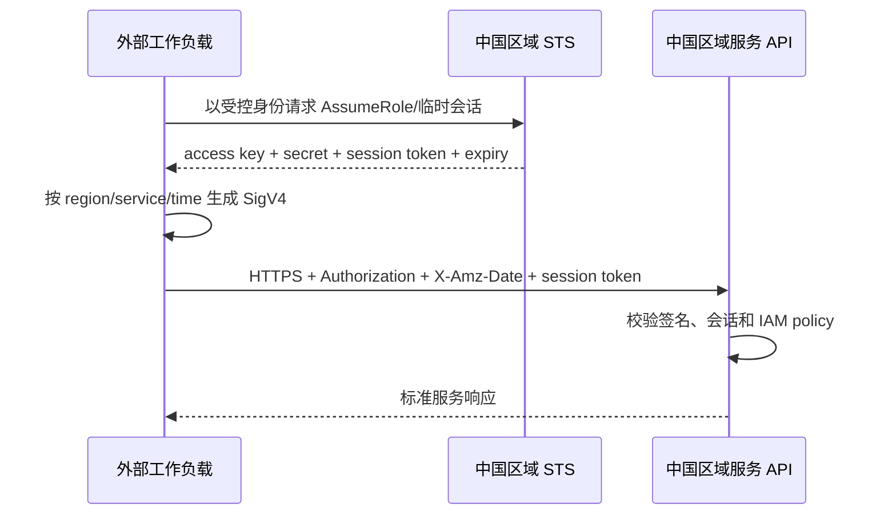

# 亚马逊云科技中国区域 API 接入

本页讨论外部系统如何调用亚马逊云科技中国区域的服务 API。评价对象是中国区平台的账户隔离、STS 临时凭据、SigV4/SigV4a、服务端点和 SDK 互操作，不单独评价 IAM 或 IAM Identity Center 产品。

::: tip 产品边界
北京区域由光环新网运营，宁夏区域由西云数据运营。中国区域位于独立的 `aws-cn` 分区：中国账户、凭据、组织、ARN、端点和全球商业区域不能互换。
:::

## 中国分区的关键差异

| 项目 | 中国区域 |
|---|---|
| 区域 | 北京 `cn-north-1`；宁夏 `cn-northwest-1` |
| 分区 | `aws-cn` |
| 服务端点 | 通常以 `.amazonaws.com.cn` 结尾，例如 DynamoDB 中国区域端点 |
| ARN | 以 `arn:aws-cn:` 开头 |
| 账户与凭据 | 必须为中国区域单独注册，不能用于全球分区 |
| API 认证 | SDK/CLI 使用访问凭据计算 SigV4；部分多区域能力使用 SigV4a |

## 推荐的服务端调用流程

外部工作负载应优先通过角色和 STS 取得短时效会话凭据。静态 access key 只用于无法使用角色的兼容场景，并必须进入密钥管理、设置轮换与异常调用检测。

## SigV4 与 SDK

SigV4 是亚马逊云科技的专用 API 签名协议，不是 OAuth 客户端认证标准。它的安全强项是把请求方法、路径、查询、头、负载摘要、日期、区域和服务绑定进规范请求，再使用按日期/区域/服务派生的密钥计算签名。

接入方应使用官方 SDK/CLI，避免手写 canonicalization。配置必须同时锁定：

- `aws-cn` 分区和正确中国区域；
- 服务 endpoint 与签名 service name；
- 临时凭据中的 session token；
- 时间同步和允许时钟偏差；
- SigV4 或目标服务要求的 SigV4a。

中国北京 STS 会话 token 对 SigV4a 的兼容配置可能影响 token 长度，存储和代理不能假设固定长度。

## 身份与权限

- 策略应限制 action、resource、condition、region、组织/账户和会话标签。
- 跨账户访问使用角色和明确的信任策略；第三方代调用使用外部 ID 等混淆代理防护。
- OIDC/SAML 联邦可用于换取角色会话，但最终服务 API 仍以 STS 凭据和 SigV4 调用；不要把第三方 ID token 直接发送到普通服务端点。
- 主体审计使用中国 account ID、role ARN、role session 与 source identity；不能与全球分区同名角色合并。

## 事件与回调

中国区域的事件能力分散在 EventBridge、SNS、SQS 和具体服务中，不存在覆盖所有服务的统一 Webhook 身份协议。接入方必须按服务验证消息签名、队列策略、主题 ARN、事件 ID 和重试/重复投递语义。

## 国内环境接入清单

- 中国与全球账户、组织、凭据、配置文件和 CI Secret 完全隔离。
- 禁止把长期 access key 写入代码、镜像、移动客户端或普通环境文件。
- 优先使用 STS 区域端点、最短可用会话和角色；SDK provider chain 中移除不必要的静态凭据回退。
- 记录 canonical request 摘要和 request ID，但不得记录 secret、session token 或完整 Authorization。
- ARN、endpoint、区域和签名算法全部使用中国官方参考，不做字符串替换推断。

## 官方资料

- [中国区域账户与凭据隔离](https://docs.amazonaws.cn/en_us/aws/latest/userguide/accounts-and-credentials.html)
- [中国区域端点与 ARN](https://docs.amazonaws.cn/en_us/aws/latest/userguide/endpoints-arns.html)
- [SigV4 API 请求签名](https://docs.amazonaws.cn/IAM/latest/UserGuide/reference_sigv.html)
- [中国区域 STS 会话 token 与 SigV4a](https://docs.amazonaws.cn/IAM/latest/UserGuide/id_credentials_temp_enable-regions.html)
- [中国区域与 `aws-cn` 分区](https://docs.amazonaws.cn/accounts/latest/reference/manage-acct-regions.html)

> 核验日期：2026-07-28。服务在北京、宁夏的可用性和端点可能不同，必须查目标服务的中国区域参考。
