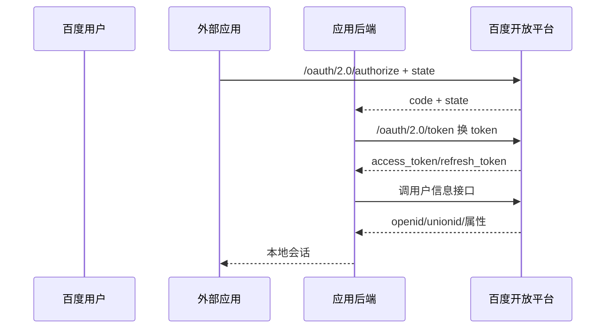

# 百度账号开放授权接入

本页讨论外部网站和应用如何接入百度账号 OAuth 授权及用户信息接口，不评价百度云 IAM 或其它百度企业身份产品。

::: warning 新系统注意
公开文档仍包含 GET token 请求、URL 查询参数中的 `client_secret`、可选 `state`、`oob` 回调和宽松回调域匹配等遗留设计。兼容接入时必须加网关与补偿控制，不应复制为新协议。
:::

## 接入流程

官方说明 authorization code 一次有效、约 10 分钟。`openid` 是应用作用域标识，`unionid` 用于同一开发者主体下的关联；本地应显式记录作用域，不能将裸 ID 视为全局唯一。

## 遗留接口的安全处理

官方示例以 GET 请求 token 端点并把 `client_secret` 放入查询串，用户信息调用也可把 access token 放在查询串。这会使凭据进入浏览器历史、反向代理、WAF、APM 与访问日志。若平台端点无法使用请求体或授权头：

1. 只允许专用后端适配器调用，禁止浏览器和移动客户端直连。
2. 配置代理、WAF、链路追踪和错误报告对相关参数彻底脱敏。
3. 使用短时效内部会话，不把百度 token 传播给其它微服务。
4. 缩短本地 token 保留时间，并对文档中可达十年的 refresh token 建立主动吊销与密钥轮换流程。

`state` 即使文档标为可选，生产登录也必须使用并校验。回调地址应由接入方在发起前与登记值做精确匹配，不使用 `oob` 或宽松域名作为新系统方案。

## 接入方最低实现

- code 一次兑换并绑定浏览器会话，拒绝无 `state` 或不匹配的回调。
- `client_secret`、access token、refresh token 不进入客户端；日志层按参数名和路径双重脱敏。
- 主键保存 `(baidu, app_key, openid)`；仅在验证同一开发者主体时使用 `unionid` 关联。
- 由企业身份网关把私有 OAuth 用户接口转换为内部标准会话，不宣称为 OIDC。
- 对 token 刷新、用户撤销、应用下线和账号删除建立清理机制。

## 官方资料

- [百度 OAuth 2.0 授权、token 与用户标识说明](https://openauth.baidu.com/doc/doc.html)

> 核验日期：2026-07-27。本文按当前公开文档评价；若生产端点支持更安全但未公开的调用方式，应以可复现证据更新。
