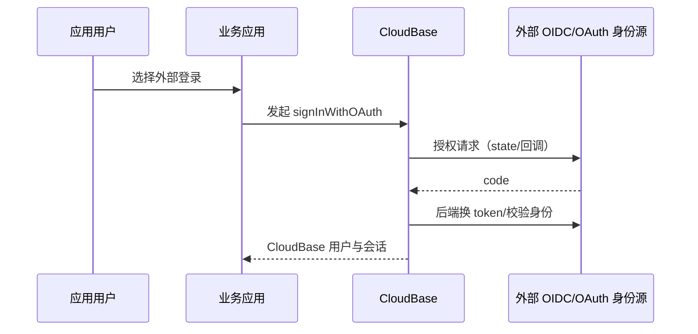

# 腾讯云 CloudBase 应用身份接入

CloudBase 面向应用开发者提供注册、登录、会话、身份源绑定和 HTTP API。本页评价的是这组面向应用用户的身份接口，不是腾讯云 IAM，也不代表微信、QQ 或企业微信；后三者各自独立接入和评价。

::: tip 标准化边界
CloudBase 可以消费 OAuth、OIDC、SAML 等外部身份源，也提供自己的应用身份 API。前者证明它具有协议客户端/SP 能力，并不自动证明它能够作为完整 OIDC Provider 供任意外部应用直接接入。
:::

## 两种接入角色

| 方向 | CloudBase 的角色 | 外部系统的角色 | 结果 |
|---|---|---|---|
| CloudBase 接外部身份源 | OAuth/OIDC 客户端或 SAML SP | 企业/社交身份源 | 外部身份映射为 CloudBase 用户 |
| 应用使用 CloudBase 身份 | 应用身份服务与资源服务 | Web、移动、服务端应用 | CloudBase session、access/refresh token |

## 接入外部 OAuth/OIDC/SAML 身份源

身份源配置可包含授权、token、用户信息端点，也可使用 OIDC `issuer`、`/.well-known/openid-configuration`、JWKS 和客户端认证方式；SAML 配置可使用 metadata。应优先选 OIDC Discovery 或 SAML metadata，避免手工复制一组长期漂移的 URL。

Web SDK 的 `signInWithOAuth` 可生成/校验授权状态并处理回调；应用仍应配置精确安全域名，避免开放重定向。对 OIDC 身份源还要校验 issuer、audience、签名算法、`kid`、过期时间与 nonce，不能只信任用户信息接口。

## 应用使用 CloudBase 身份 API

应用可通过 Web SDK 或 HTTP API完成密码、验证码、外部身份源等登录。HTTP 登录入口返回 `token_type`、`access_token`、`refresh_token`、`expires_in` 和 `sub`；资源请求使用 Bearer token。

刷新流程：

1. 后端或受支持的 SDK 向 `/auth/v1/token` 提交 `refresh_token`。
2. 服务返回新 access/refresh token。
3. 官方说明旧 refresh token 会立即失效，因此并发刷新必须串行化并原子保存新 token。

第三方 provider 登录可提交 `provider_token`、`client_id` 和设备标识。接入方必须先确认 provider token 的类型与受众，不能把来自任意客户端的 token 直接当作可交换凭据。

## 接入方最低实现

- 新项目使用当前 Web SDK/HTTP 身份 API，不再采用已停止维护的 v1 方案。
- 浏览器只使用 publishable 配置；API key、管理凭据和 provider Secret 只在可信后端。
- 账号主键保存 CloudBase 环境/项目作用域与 `sub`，外部身份另存 `(provider_issuer, provider_subject)`。
- 刷新令牌轮换必须有单飞锁、事务更新和重放告警；登出、解绑、注销时清理所有设备会话。
- 若要让其它系统“用 CloudBase 登录”，先要求平台证明 OIDC Provider 的 Discovery、JWKS、`id_token` 和标准 UserInfo；不能把私有 `/auth/v1` API包装成 OIDC。

## 官方资料

- [CloudBase 身份源配置字段](https://cloud.tencent.com/document/product/876/34822)
- [Web v3 身份认证 API](https://docs.cloudbase.net/api-reference/webv3/authentication)
- [Web SDK OAuth 登录](https://docs.cloudbase.net/api-reference/webv3-pg/authentication)
- [HTTP 登录 API](https://docs.cloudbase.net/http-api/auth/auth-sign-in)
- [刷新令牌 API](https://docs.cloudbase.net/en/http-api/auth/auth-grant-token)
- [第三方身份源登录](https://docs.cloudbase.net/en/http-api/auth/auth-sign-in-with-provider)
- [身份服务与凭据边界](https://docs.cloudbase.net/service/authentication)

> 核验日期：2026-07-27。本页不评价腾讯云 IAM，也不以 CloudBase 的 OIDC 客户端能力替代其 OIDC Provider 能力证明。
