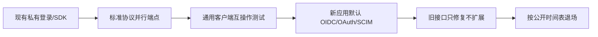

# 国内平台 SSO 标准化与安全横向评价

本页回答的不是“哪家产品功能最多”，而是：**哪家向外部系统提供的身份接口更接近开放标准、更符合当前安全最佳实践、更容易用通用实现接入和替换。**

所有平台均使用[同一评价方法](./methodology.md)。API 数量、SDK 语言、文档篇幅、市场份额和业务覆盖不计分。专用 SDK 能降低开发成本，但不能替代 OIDC、OAuth、SAML、SCIM 和标准密钥生命周期。

## 综合结果

| 平台 | 标准安全分 | 等级 | 核心判断 |
|---|---:|---|---|
| [飞书](./feishu-review.md) | **74.5** | B | SAML、权限分层和事件安全基础较好；对外账号登录仍未验证完整 OIDC/SCIM 和标准令牌治理 |
| [钉钉](./dingtalk-review.md) | **63.0** | C | OAuth 式授权码和 Stream 安全可用；登录、标识、令牌及新旧端点仍高度平台化 |
| [企业微信](./wecom-review.md) | **55.5** | C | 权限边界和加密回调有效；登录、通讯录、token 与消息密码学均为专有协议 |
| [喜马拉雅](./ximalaya-review.md) | **55.5** | C | 公开 OAuth 式入口具备迁移基础；车载换票与回调仍私有且来源认证未充分验证 |
| [网易云音乐](./netease-music-review.md) | **50.0** | D | AT/RT 与 RSA-SHA256 是正向基础；设备流、凭据位置、错误和身份声明未标准化 |
| [微信开放平台](./wechat-review.md) | **41.5** | D | 授权码可安全使用，但四套私有流程、无 OIDC/PKCE、查询参数凭据造成较高适配成本 |
| [QQ 音乐](./qqmusic-review.md) | **36.5** | E | SDK 账号绑定可工作，但无标准身份协议且采用自定义 MD5 回调，不适合作为新系统基线 |

> 该排序只代表公开可验证的协议标准化与安全控制，不代表产品整体安全、商业价值、用户规模或业务选型顺序。不同平台的业务类型不同，但开放给外部系统的协议仍应接受同一技术标准。

## 八项横向得分

单项满分 5；“-”不是“没有能力”，而是当前公开或合作方证据不足时按对应低分处理。

| 平台 | 联邦互操作 20% | 授权流程 15% | 令牌凭据 15% | 最小权限 15% | 密钥密码学 10% | 标识生命周期 10% | 回调防重放 10% | HTTP 语义 5% |
|---|---:|---:|---:|---:|---:|---:|---:|---:|
| 飞书 | 3.5 | 3.5 | 3.5 | 4.5 | 3.5 | 3.5 | 4.0 | 4.0 |
| 钉钉 | 2.5 | 3.0 | 3.0 | 4.0 | 3.0 | 3.0 | 4.0 | 3.0 |
| 企业微信 | 2.0 | 2.5 | 2.5 | 4.0 | 2.5 | 3.0 | 3.5 | 2.5 |
| 喜马拉雅 | 3.0 | 3.0 | 2.5 | 3.0 | 2.5 | 3.0 | 2.0 | 3.0 |
| 网易云音乐 | 2.5 | 2.5 | 2.0 | 2.5 | 3.5 | 2.5 | 2.5 | 2.0 |
| 微信开放平台 | 2.0 | 2.0 | 1.5 | 2.5 | 2.0 | 2.5 | 2.5 | 1.5 |
| QQ 音乐 | 1.5 | 1.5 | 2.0 | 2.0 | 1.5 | 2.5 | 2.0 | 2.0 |

## 共同问题

### 1. 把 OAuth 外观当成身份标准

多家平台都有 `code`、`access_token`、`refresh_token` 或路径中的 `oauth2`，但身份认证仍依赖私有“取用户”接口。没有 Discovery、标准 `id_token`、Issuer/Audience/Nonce 和 JWKS 时，通用 OIDC 客户端无法直接验证身份。

推动方向：对外同时提供完整 OIDC Provider；资源 API 继续使用 OAuth access token，不再让接入方把资源令牌冒充身份令牌。

### 2. 每家定义自己的用户 ID

`open_id`、`union_id`、`userid`、`userId`、`unionId` 的作用域不同，有些还受应用、开发者主体或企业租户约束。接入企业必须为每家写一次映射，迁移时容易出现账号串联和错误合并。

推动方向：公开稳定的 `issuer`，以 `iss + sub` 作为标准主体键；平台私有 ID 作为扩展 claim，并明确 pairwise/public subject 规则。

### 3. 通讯录可调用，但账号供应不标准

企业协作平台都有人员和部门 API，却未普遍提供公开可验证的 SCIM 2.0 Users/Groups、过滤、PATCH、停用和服务能力发现。这迫使每个 HR、IAM 和 SaaS 分别维护平台适配器。

推动方向：用 SCIM 2.0 暴露标准用户/组生命周期，厂商特有的部门、岗位和业务字段通过 schema extension 承载。

### 4. 设备登录重复发明二维码状态机

内容/车载平台常用自定义二维码 key、数字状态码和轮询规则。它们解决的是 OAuth Device Authorization Grant 已标准化的问题，却制造了 SDK 绑定和不同错误语义。

推动方向：采用 RFC 8628；设备只持 `device_code`，用户在受信设备完成授权，标准化 `authorization_pending`、`slow_down`、到期和轮询间隔。

### 5. 自定义签名缺少算法与密钥生命周期

RSA-SHA256 比 MD5/SHA-1 更现代，但“用了某种哈希/签名”仍不等于安全协议。常见缺口包括签名原文不清、无 `kid`、无双钥并行、无 nonce/replay cache、算法不可升级。

推动方向：采用 JWS、`private_key_jwt`、mTLS 或明确的 HMAC-SHA-256 Webhook 方案；发布算法版本、`kid`、JWKS、测试向量和轮换/吊销流程。

### 6. SDK 被当作互操作规范

SDK 可以处理 token、长连接和加解密，但它把私有协议固化进应用，并让语言版本决定安全修复速度。只有 SDK、没有线协议标准，会增加供应链、升级和退出成本。

推动方向：协议和一致性测试是主产品，SDK 只是可选参考实现；任何合规通用客户端都应能不依赖厂商 SDK 完成接入。

## 对平台方的共同迁移路线

### 第一阶段：建立标准并行面

- 发布 OIDC Discovery、OAuth Authorization Server Metadata、JWKS 和标准 `id_token`/UserInfo。
- 授权码流程强制 PKCE，严格 redirect URI；原生应用遵循 RFC 8252。
- 设备登录采用 RFC 8628；企业人员和组采用 SCIM 2.0。

### 第二阶段：补齐高保障安全

- refresh token 轮换与重放检测，提供 revocation/introspection。
- 机密客户端支持 `private_key_jwt` 或 mTLS；高风险资源支持 mTLS/DPoP 发送方约束。
- 回调使用 JWS/HMAC-SHA-256/mTLS，统一 timestamp、nonce/event ID、重放窗口和密钥轮换。

### 第三阶段：退出私有身份协议

- 新应用默认只显示标准端点；厂商 SDK 改为调用同一标准端点。
- 私有字段作为标准 claim/schema 扩展，不再创造新的基础身份语义。
- 公布兼容期、迁移测试工具和退场日期；旧协议在兼容期只做安全修复，不增加新功能。

## 对采购方和监管/行业组织的建议

- 招标评分应直接要求 OIDC/OAuth/SAML/SCIM 规范版本、metadata URL、互操作测试和安全配置，不接受“支持单点登录”“兼容 OAuth”替代。
- 把 PKCE、标准 `id_token` 验证、JWKS 轮换、revocation、SCIM 停用和回调防重放写入验收用例。
- 要求平台说明哪些字段是标准字段、哪些是扩展字段；不得以必须采用指定 SDK 作为唯一合规接入方式。
- 鼓励行业建立公开互操作测试：同一套标准客户端接入多家平台，并公开失败项，而不是只测试厂商 Demo。
- 对 MD5/SHA-1、自定义二维码登录、Secret 查询参数和无轮换共享密钥设置明确的新接入禁用日期。

## 当前选型结论

如果企业的目标是建立长期身份基础设施，应优先选择能提供完整 OIDC/SAML、SCIM、标准 metadata/JWKS 和现代令牌治理的平台；本表中的任何一家都不应仅凭“有扫码登录”直接成为企业身份中枢。

现阶段必须接入这些平台时，推荐统一使用身份网关：私有协议只存在于边界适配器，内部应用只消费企业自己的标准 OIDC/SAML/SCIM。这个架构能控制眼前风险，但最终目标仍应是推动平台直接提供标准端点，而不是永久合理化适配层。
