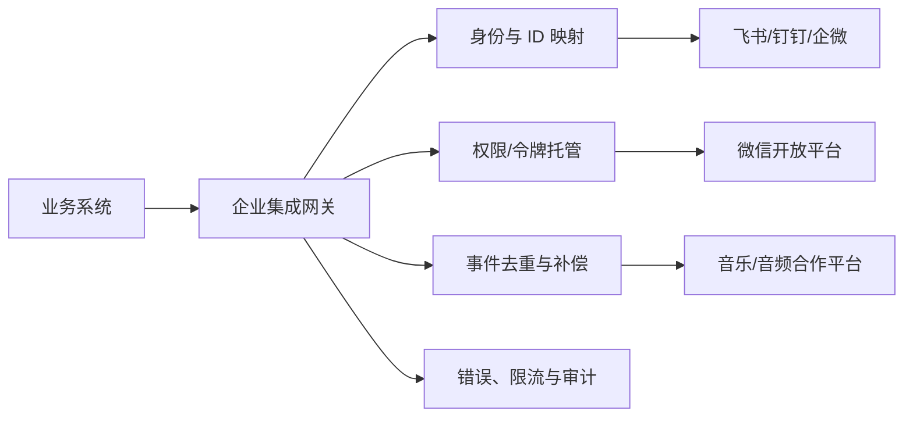

# 中国平台 API / SDK 横向综合评价

本表使用[统一评价方法](./methodology.md)，重点是企业外部系统调用 API/SDK 的成熟度。分数不是“谁的 SSO 更安全”，也不代表内容版权、终端用户量或采购价格。

## 综合结果

| 平台 | 类型 | 总分 | 结论 |
|---|---|---:|---|
| [飞书](./feishu-review.md) | 企业协作 | **94.5 / A** | API、四种主流服务端 SDK、调试台、细粒度权限和事件长连接最完整；重点治理 ID 作用域、敏感字段和应用审核 |
| [钉钉](./dingtalk-review.md) | 企业协作 | **89.5 / A** | API 面广，OpenAPI SDK 与 Stream SDK 体系成熟；新旧接口并存、文档入口和字段语义需要适配层收口 |
| [企业微信](./wecom-review.md) | 企业协作 | **80 / B** | 通讯录、消息、审批、客户联系和第三方应用授权覆盖强；服务端 SDK 一体化、错误语义和测试/可观测性弱于前两家 |
| [喜马拉雅](./ximalaya-review.md) | 内容/设备 | **74 / B** | 公开 API/H5/JS SDK 与车载、硬件合作形态较丰富；付费内容和车载 SDK 依赖审核与商务交付 |
| [微信开放平台](./wechat-review.md) | C 端身份/渠道 | **68.5 / C** | C 端登录与微信生态入口成熟，但不是企业组织开放平台；跨应用 ID、权限、审核和多套产品接口需专门治理 |
| [网易云音乐](./netease-music-review.md) | 内容/设备 | **64 / C** | 合作方 OpenAPI 覆盖登录、用户、内容与播放，RSA 签名较规范；公开文档、SDK、事件和企业运行承诺不足 |
| [QQ 音乐](./qqmusic-review.md) | 内容/设备 | **59.5 / C** | 车载 SDK 的内容与账号绑定可用，但公开可验证资料少、服务端工具和回调安全治理依赖项目交付 |

## 组内选择建议

### 企业协作开放平台

| 需求 | 首选判断 |
|---|---|
| 希望 API 文档、代码生成、四种主流服务端 SDK 和事件长连接体验一致 | **飞书**略占优 |
| 需要审批、组织、机器人、卡片等广覆盖，并希望用 Stream 模式降低公网回调成本 | **钉钉**很强，但应统一新旧 API 与 SDK |
| 企业已经以微信/客户联系为业务入口，重点是客户运营和内部通讯录 | **企业微信**的业务适配最自然 |
| 需要标准 SCIM 或完整 OIDC/SAML 联邦生命周期 | 三家都不应仅凭“支持登录”判断，需单独验证 SSO、账号供应和离职回收能力 |

### C 端身份与渠道

微信开放平台适合“让个人微信用户登录网站/App/小程序”，不等同于“让企业员工用组织身份登录”。如果需求包含部门、雇佣状态、管理员授权或离职停用，应使用企业微信或企业 IdP，不能用个人微信 `openid/unionid` 替代企业身份。

### 内容与设备合作

| 需求 | 首选判断 |
|---|---|
| 需要公开 API、H5/JS SDK、车载/硬件多种接入形态 | **喜马拉雅**的公开接入路径最完整 |
| 需要相对完整的登录令牌生命周期与 RSA 请求签名 | **网易云音乐**更接近常规服务端 API，但 SDK/运维证据需补齐 |
| 已有 QQ 音乐车载项目资源，重点是账号绑定和播放 SDK | **QQ 音乐**可用，但必须把非公开能力和服务承诺合同化 |

## 所有平台共同的落地架构

建议给每个平台建立独立适配器，对业务系统只暴露统一的用户、组织、消息、内容和错误模型：

统一适配层至少要做：

- 以 `(platform, tenant/app, external_id)` 作为复合键，禁止裸 `openid`/`userid` 跨作用域使用；
- 令牌只在后端托管，按平台分别处理应用身份、用户身份和合作方票据；
- 事件先验签/解密，再按事件 ID 去重，快速应答后异步处理，并用定时全量/增量拉取补偿；
- 将平台私有错误码映射为统一的可重试、权限、配额、参数和服务端错误；
- 记录 API 版本、请求 ID、配额消耗和权限变更，避免把平台升级直接传导到业务代码。

## 采购结论

如果目标是通用企业协作集成，飞书、钉钉、企业微信是同一赛道，综合成熟度依次为飞书、钉钉、企业微信，但最终应以本企业已采用的协作平台和所需业务域为先。微信是 C 端身份渠道，不能替代组织身份。三家音乐/音频平台属于内容授权和 OEM 合作，技术能力之外，版权范围、车型/终端范围、会员结算、上线审核和支持 SLA 往往才是决定性条款。
