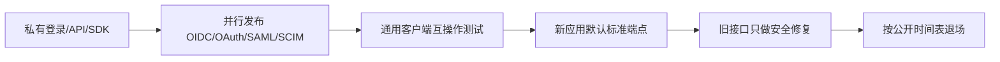

# 国内平台 SSO 标准化与安全横向评价

本页比较各具体产品向外部系统提供的身份接口，是否接近开放标准与当前安全最佳实践。所有系统采用[同一评价方法](./methodology.md)；标准 IAM/IDaaS 不参与，同一厂家下的不同产品也不互相继承能力。

## 综合结果

| 排名 | 具体产品 | 角色 | 分数 | 等级 | 核心判断 |
|---:|---|---|---:|---|---|
| 1 | [Microsoft 365 中国版](./microsoft365-china-review.md) | ToB | **84.5** | B | 标准 OIDC/OAuth、Graph 与权限体系最完整；国家云端点/能力差异和通知签名仍有缺口 |
| 2 | [亚马逊云科技中国区域](./aws-china-review.md) | ToB/API | **82.0** | B | SAML/SCIM 企业控制台接入与短期角色成熟；服务 API 仍是专用 SigV4 |
| 3 | [飞书](./feishu-review.md) | ToB | **74.5** | B | SAML、权限与事件基础较好；对外登录未验证完整 OIDC/SCIM |
| 4 | [极狐 GitLab](./jihu-gitlab-review.md) | ToB/开发者 | **73.5** | B | PKCE、撤销和现代 Webhook 较完整；无完整 OIDC 且仍保留遗留流程 |
| 5 | [华为账号 Account Kit](./huawei-account-review.md) | ToC | **72.5** | B | 明确 OAuth2/OIDC 与 ID token；PKCE、Discovery/JWKS 等仍需补证 |
| 6 | [阿里云上的 Salesforce](./salesforce-china-review.md) | ToB/CRM | **72.0** | B | 连接应用和 API 标准化较好；中国 org 的全球功能等价性需逐项验收 |
| 7 | [腾讯云 CloudBase](./cloudbase-review.md) | ToC/应用身份 | **71.0** | B | 消费 OIDC/SAML 与刷新轮换较强；完整 OIDC Provider 能力未验证 |
| 8 | [钉钉](./dingtalk-review.md) | ToB | **63.0** | C | 授权码和 Stream 可用；身份接口仍高度平台化 |
| 9 | [抖音开放平台](./douyin-review.md) | ToC | **56.5** | C | 后端授权码、刷新轮换与解授权可用；未验证完整 OIDC/PKCE 强制 |
| 10 | [支付宝开放平台](./alipay-review.md) | ToC/商户 | **56.0** | C | RSA2/证书与主体分离较强；授权仍是私有 OpenAPI |
| 11 | [企业微信](./wecom-review.md) | ToB | **55.5** | C | 权限与加密回调有效；登录、通讯录和 token 为专有协议 |
| 11 | [华为云 WeLink](./welink-review.md) | ToB | **55.5** | C | 后端换票与应用 token 可用；OIDC/PKCE/SCIM 未验证 |
| 11 | [喜马拉雅](./ximalaya-review.md) | 内容/设备 | **55.5** | C | OAuth 式入口具备迁移基础；车载换票仍私有 |
| 14 | [WPS 365](./wps-review.md) | ToB | **53.5** | D | 权限层次较好；私有 SSO、查询串凭据与遗留回调算法拉低基线 |
| 15 | [网易云音乐](./netease-music-review.md) | 内容/设备 | **50.0** | D | AT/RT 与 RSA-SHA256 可用；设备流与身份声明未标准化 |
| 16 | [Gitee](./gitee-review.md) | ToC/开发者 | **47.5** | D | OAuth/企业 API 可接入；Webhook 缺现代消息签名和重放保护 |
| 17 | [微信开放平台](./wechat-review.md) | ToC | **41.5** | D | 授权码可用；多套私有流程、无 OIDC/PKCE 与查询串凭据 |
| 18 | [QQ 互联](./qq-connect-review.md) | ToC | **41.0** | D | code/state 与刷新轮换可用；Implicit、查询串凭据和私有响应遗留明显 |
| 19 | [微博开放平台](./weibo-review.md) | ToC | **40.0** | D | OAuth 式授权可接入；OIDC、PKCE 和标准 token 治理证据不足 |
| 20 | [百度账号](./baidu-review.md) | ToC | **37.5** | E | 查询串凭据、可选 state、宽松回调和超长 refresh token 不适合新基线 |
| 21 | [QQ 音乐](./qqmusic-review.md) | 内容/设备 | **36.5** | E | SDK 绑定可工作；无标准身份协议且采用自定义 MD5 回调 |

> 排名只表示公开可验证的协议标准化和外部接入安全，不代表产品功能、商业价值、用户规模或内部安全水平。

## 按系统角色的判断

- **ToB**：Microsoft 365 中国版的标准 OIDC/Graph 体系领先；飞书、极狐 GitLab、AWS 中国和 Salesforce 中国各自在联邦、Webhook、短期凭据或连接应用方面较强。国家云/国内实例必须单独验证，不能让全球版能力自动替国内版加分。
- **ToC/开发者**：Account Kit 的 OIDC/ID token 方向最明确；CloudBase 擅长消费标准身份源，但不能把 RP/SP 能力当成 OP/IdP 能力；其余平台普遍需要私有用户接口。
- **内容/设备**：三家均未把车载/二维码登录统一为 OAuth Device Authorization Grant，设备厂商仍需维护专用 SDK、换票和状态机。
- **同厂边界**：企业微信、微信、QQ 互联、CloudBase、QQ 音乐分别评价；WeLink 与 Account Kit 分别评价。厂商归属不能推导主体 ID 等价。

## 八项横向得分

单项满分 5；低分也可能表示公开证据不足。

| 产品 | 联邦 | 授权 | token | 权限 | 密钥 | 主体 | 回调 | HTTP |
|---|---:|---:|---:|---:|---:|---:|---:|---:|
| Microsoft 365 中国版 | 4.5 | 4.5 | 4.0 | 4.5 | 4.5 | 3.5 | 3.5 | 4.5 |
| 亚马逊云科技中国区域 | 4.0 | 3.5 | 4.5 | 5.0 | 4.5 | 4.0 | 3.0 | 4.0 |
| 飞书 | 3.5 | 3.5 | 3.5 | 4.5 | 3.5 | 3.5 | 4.0 | 4.0 |
| 极狐 GitLab | 3.0 | 4.0 | 3.5 | 4.0 | 3.5 | 3.5 | 4.5 | 4.0 |
| 华为账号 Account Kit | 4.0 | 3.5 | 3.5 | 3.5 | 4.0 | 3.5 | 3.0 | 4.0 |
| 阿里云上的 Salesforce | 3.5 | 3.5 | 3.5 | 4.0 | 4.0 | 3.5 | 3.0 | 4.0 |
| 腾讯云 CloudBase | 3.5 | 3.5 | 4.0 | 3.5 | 3.5 | 3.5 | 3.0 | 4.0 |
| 钉钉 | 2.5 | 3.0 | 3.0 | 4.0 | 3.0 | 3.0 | 4.0 | 3.0 |
| 抖音开放平台 | 2.5 | 3.0 | 2.5 | 3.0 | 2.5 | 3.0 | 3.5 | 3.0 |
| 支付宝开放平台 | 2.0 | 2.5 | 2.5 | 3.5 | 4.0 | 3.0 | 3.0 | 2.5 |
| 企业微信 | 2.0 | 2.5 | 2.5 | 4.0 | 2.5 | 3.0 | 3.5 | 2.5 |
| 华为云 WeLink | 2.5 | 2.5 | 2.5 | 3.5 | 2.5 | 3.0 | 3.0 | 3.0 |
| 喜马拉雅 | 3.0 | 3.0 | 2.5 | 3.0 | 2.5 | 3.0 | 2.0 | 3.0 |
| WPS 365 | 2.5 | 2.5 | 2.0 | 4.0 | 2.5 | 3.0 | 2.5 | 2.0 |
| 网易云音乐 | 2.5 | 2.5 | 2.0 | 2.5 | 3.5 | 2.5 | 2.5 | 2.0 |
| Gitee | 2.5 | 2.5 | 2.0 | 3.0 | 2.0 | 2.5 | 1.5 | 3.0 |
| 微信开放平台 | 2.0 | 2.0 | 1.5 | 2.5 | 2.0 | 2.5 | 2.5 | 1.5 |
| QQ 互联 | 2.0 | 2.0 | 1.5 | 2.5 | 2.0 | 2.5 | 2.0 | 2.0 |
| 微博开放平台 | 2.0 | 2.0 | 1.5 | 2.5 | 2.0 | 2.5 | 1.5 | 2.0 |
| 百度账号 | 2.0 | 2.0 | 1.0 | 2.5 | 2.0 | 2.5 | 1.5 | 1.0 |
| QQ 音乐 | 1.5 | 1.5 | 2.0 | 2.0 | 1.5 | 2.5 | 2.0 | 2.0 |

权重依次为 20%、15%、15%、15%、10%、10%、10%、5%。

## 共同问题与统一技术要求

| 共同问题 | 新系统统一要求 | 兼容期处理 |
|---|---|---|
| OAuth 外观代替身份标准 | OIDC Discovery、签名 ID token、JWKS、issuer/audience/nonce | 私有用户接口只留在身份网关适配器 |
| 每家自定义用户 ID | 稳定 issuer + subject，明确租户和 public/pairwise 作用域 | 保存平台、租户、应用与原始 ID 复合键 |
| 通讯录 API 代替账号供应 | SCIM 2.0 Users/Groups、PATCH、filter、停用 | 私有同步显式处理离职、删除与幂等 |
| 公共客户端授权流遗留 | 授权码 + PKCE、state/nonce、精确回调；禁用 Implicit/ROPC | 受控后端中转并限制权限和 token 寿命 |
| 自定义二维码/设备流 | OAuth Device Authorization Grant（RFC 8628） | 网关统一 pending、slow_down、过期和轮询间隔 |
| token 生命周期私有 | refresh 轮换/重放检测、revocation/introspection、明确 audience | token 不内传，短会话、加密存储、主动清理 |
| 遗留回调签名 | JWS、HMAC-SHA-256 或 mTLS，含 timestamp、event ID、kid 与轮换 | 独立低权限网关、重放缓存、高风险二次授权 |
| SDK 代替线协议 | 公布标准端点、schema、错误与一致性测试 | 固定版本、SBOM、契约测试和退出方案 |

## 共同迁移路线

1. 发布 Discovery、Authorization Server Metadata、JWKS、标准 ID token/UserInfo；企业目录补 SCIM 2.0。
2. 公共客户端强制授权码 + PKCE，设备采用 RFC 8628，停止新增 Implicit 和 ROPC。
3. 增加刷新轮换/重放检测、revocation/introspection；高风险接口支持 private_key_jwt、mTLS 或 DPoP。
4. 回调使用现代签名，包含算法版本、kid、timestamp、event ID 与轮换协议。
5. SDK 调用同一标准端点，私有字段只作标准扩展；公布旧接口迁移和退场日期。

## 最终横向判断

当前 21 个系统没有一家在全部八个维度达到 A。短期可用统一身份网关控制私有适配风险；长期目标不应是永久维护 21 个适配器，而应推动平台只在 OIDC、OAuth、SAML、SCIM 等标准端点增加新能力，让通用实现可以替换厂商 SDK。对国内独立运营的国际品牌，还应把中国 endpoint、账户分区、实例版本和功能矩阵写进验收，不能用全球版本截图替代。
