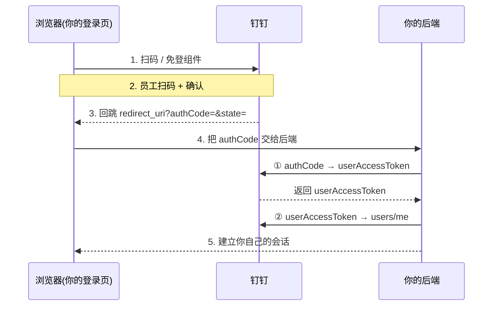
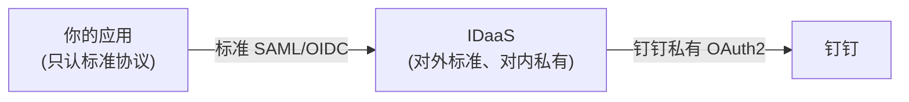

# 钉钉(DingTalk)SSO 对接实现

本文讲钉钉登录的落地流程；面向企业客户的 OpenAPI、SDK、事件、权限和交付评价见 [钉钉 API / SDK 企业评价](./dingtalk-review.md)。

> 和 [企业微信扫码登录](./wecom.md) 一样,钉钉的登录本质也是**私有 OAuth2 变体**,凭据、字段、端点都是钉钉自有的,不能直接套标准 [OAuth 2.0](../oauth2/) / [OIDC](../oidc/) 客户端库。先把方向分清楚再动手。

## 先分清方向和形态

"钉钉 SSO"在现实里是几件不同的事,混在一起最容易踩坑。先对号入座:

| 形态 | 方向 | 协议 | 能不能落地 |
|---|---|---|---|
| **钉钉作 IdP(私有 OAuth2)** | 用钉钉账号登录**你自己的系统** | 钉钉自有 OAuth2 变体 | ✅ 主流做法,本文重点 |
| **外部 IdP 登录钉钉** | 用企业已有 IdP 登录**钉钉客户端** | 能力随普通版、专属版和采购方案变化 | ⚠️ 不凭历史资料下结论，须在目标版本后台与合同中确认 SAML/OIDC 支持 |
| **专属钉钉收外部 IdP** | 外部 IdP 登录专属版钉钉 | 历史资料显示存在 OIDC 对接；当前流程以专属版后台为准 | ⚠️ 账号类型、授权模式、claim 映射和安全要求需项目验证 |
| **IDaaS 桥接** | 需要标准 SAML/OIDC 对接钉钉 | 对外标准协议 + 对内钉钉私有 OAuth2 | ✅ 业界普遍做法 |

::: tip 一句话判断
- 想让**别人拿钉钉登录你** → 走「钉钉私有 OAuth2」(下一节)。
- 想让**员工拿公司账号登录钉钉** → 先确认所购版本是否原生提供所需 SAML/OIDC；不支持时再评估 IDaaS 桥接。
:::

## 钉钉私有 OAuth2 登录(钉钉作 IdP)

这是最常见的场景:在你的登录页放钉钉扫码 / 免登,员工确认后浏览器拿到一次性 `authCode`,再由**后端**用它换 `userAccessToken`,最后取用户信息。

### 整体流程

第 1~3 步在浏览器里拿到 `authCode`;第 4~5 步是后端换 token、取信息、建会话。**密钥换 token 的动作只能在后端做**。

### 后端两步

新版统一走 `api.dingtalk.com` 域,只需两个调用:

| 步骤 | 端点 | 入参 | 出参 |
|---|---|---|---|
| ① 换用户令牌 | `POST https://api.dingtalk.com/v1.0/oauth2/userAccessToken` | `clientId`、`clientSecret`、`code`(即前端拿到的 `authCode`)、`grantType=authorization_code` | `accessToken`(即 `userAccessToken`)、`refreshToken`、`expireIn` |
| ② 取用户信息 | `GET https://api.dingtalk.com/v1.0/contact/users/me` | 请求头 `x-acs-dingtalk-access-token: <userAccessToken>` | `nick`、`avatarUrl`、`mobile`、`unionId`、`openId` 等 |

::: tip 新旧版差异
旧版扫码登录走 `login.dingtalk.com/oauth2/auth` 授权 + 私有 userinfo 端点;新接入直接用上面 `api.dingtalk.com/v1.0/oauth2/userAccessToken` 这套即可,别再混用旧端点。
:::

### 字段映射(私有 → 标准)

钉钉返回的用户标识是**私有字段**,没有现成的 `sub`/`email` 语义,需要你手动映射进自己的账号体系:

| 钉钉字段 | 含义 | 映射到标准的建议 |
|---|---|---|
| `unionId` | 用户在**同一开发者企业下所有应用**内唯一 | 最适合当稳定 `sub`(跨应用一致) |
| `openId` | 用户在**当前单个应用**内唯一 | 单应用场景可作 `sub`,跨应用不稳定 |
| `userid` | 用户在**企业通讯录内**的 ID | 企业内主键;需调通讯录接口获取,`users/me` 不直接给 |
| `mobile` | 手机号 | 需申请对应权限;不是所有企业都可读 |
| —— | 邮箱 | 钉钉**不保证返回标准邮箱**,`email`/`sub` 常需自行补全或与内部账号手动关联 |

::: warning 不要臆造字段
钉钉登录接口返回的是平台字段，而不是完整 OIDC claim 集。跨应用关联可优先评估 `unionId`，但数据库仍须保存开发者主体、组织和应用作用域，不能把裸 `unionId` 当跨主体全局主键。
:::

## 外部 IdP 登录钉钉：按产品版本核验

历史专属钉钉资料描述过 OIDC `id_token` 隐式模式和 SSO 类型账号限制，但这不能证明 2026 年所有专属版或普通版仍采用相同配置。落地时应从目标租户后台和厂商方案确认：

- 当前支持 SAML、OIDC 还是厂商自有桥接，以及能力属于哪个套餐；
- OIDC 是否已支持授权码模式与 PKCE；若仍要求 implicit，应记录风险并要求迁移计划；
- 用哪个 claim 匹配钉钉账号，账号创建、变更、离职和冲突如何处理；
- metadata/JWKS、签名算法、密钥轮换、回调地址和测试账号如何交付。

::: warning
本节仅保留历史方案的风险提示，不把“只有专属版”“必须 implicit”“仅限 SSO 类型账号”写成当前永久事实。最终配置以目标产品版本的官方文档和合同附件为准。
:::

## 用 IDaaS 桥接(业界普遍做法)

如果你的系统只认标准 **[SAML](../saml/)** 或标准 **[OIDC](../oidc/)**,又想用钉钉账号登录,直接对接钉钉私有 OAuth2 意味着每个应用都要写一遍钉钉专属逻辑。业界更常见的是加一层 **IDaaS 中间件**(阿里云 IDaaS / EIAM、竹云、宁盾等)来桥接:

- **为什么**:IDaaS 对外暴露**标准协议**(标准 SAML/OIDC),你的应用当成普通标准 IdP 接即可;对内由 IDaaS 用钉钉私有 OAuth2 完成对接和字段映射。私有部分被封装在 IDaaS 里,应用侧零私有代码。
- **怎么接**:
  1. 在 IDaaS 里把钉钉配置为**身份源 / 认证源**(填 `clientId`/`clientSecret` 等,由 IDaaS 完成上面的 `userAccessToken` → `users/me` 流程)。
  2. 在 IDaaS 里把你的应用登记为**标准 SAML/OIDC 应用**,拿到标准的元数据 / discovery 端点。
  3. 应用侧用标准客户端库对接 IDaaS,`sub`/`email` 等 claim 由 IDaaS 统一映射输出。

::: tip
需要**多个应用**统一用钉钉登录、或需要标准协议、或需要把钉钉与其它身份源(AD/LDAP 等)合并时,IDaaS 桥接通常比每个应用各自对接钉钉私有 OAuth2 更省事。
:::

## 参考来源

- [钉钉 SSO 概述 —— 钉钉开放平台](https://open.dingtalk.com/document/orgapp/sso-overview)
- [获取用户 token(userAccessToken)—— 钉钉开放平台](https://open.dingtalk.com/document/orgapp/obtain-identity-credentials)
- [获取用户信息 contact/users/me —— 钉钉开放平台](https://open.dingtalk.com/document/orgapp/dingtalk-retrieve-user-information)
- [通过钉钉 SSO 登录应用 —— 阿里云 IDaaS EIAM](https://help.aliyun.com/zh/idaas/eiam/use-cases/log-on-to-applications-from-dingtalk-through-sso)
- [专属钉钉 SSO —— 阿里云 IDaaS EIAM](https://help.aliyun.com/zh/idaas/eiam/user-guide/dedicated-dingtalk-sso)
