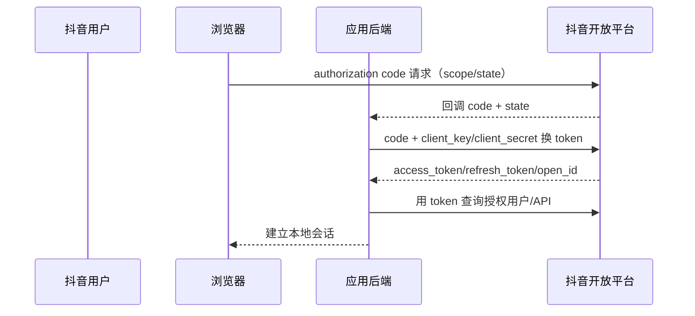

# 抖音开放平台账号接入

本页讨论外部网站、移动应用和服务端如何使用抖音用户授权及开放 API，不评价内容分发、商业化或推荐能力。

::: tip 标准化边界
抖音公开流程采用 OAuth 2.0 风格的授权码、access token、refresh token 与 scope，但用户身份仍通过平台私有接口和字段取得。本次未验证完整 OIDC Discovery、`id_token` 与 JWKS，因此不能称为通用 OIDC 登录。
:::

## 网页授权流程

接入顺序：

1. 创建并审核应用，登记回调地址与需要的权限 scope。
2. 将用户导向官方授权页，生成高熵 `state` 并绑定发起登录的浏览器会话。
3. 回调后严格比对 `state`，由后端提交 code 和应用凭据换 token。
4. 以平台返回的应用作用域用户标识建立映射，再按 scope 调用账号或内容 API。
5. 刷新时原子保存新的 refresh token；官方说明续期会使旧 refresh token 失效。
6. 用户解除授权时处理官方回调，立即撤销本地会话、删除或冻结相应数据授权。

移动端可使用登录/授权 SDK，但 SDK 只是调用封装；客户端仍不得持有 `client_secret`，服务端仍要验证 code、回调关联和 token 生命周期。

## 凭据、标识与 SDK

- `client_token` 表示应用身份，用户 `access_token` 表示用户授权，两者不能互换。
- 平台 `open_id` 等标识具有应用/平台作用域，本地应保存 `(douyin, client_key, open_id)` 及绑定时间。
- 官方说明历史 PHP、Python、Java OpenAPI SDK 已不再维护。新项目应直接依照当前 HTTP 规范或维护良好的生成客户端，并把协议测试纳入 CI。
- 返回体使用平台私有数据与错误码；接入层需区分 HTTP 失败、平台业务失败、权限不足和 token 失效。

## 接入方最低实现

- code 仅后端兑换，强制校验 `state`；若平台提供 PKCE，应在 Web/移动公共客户端启用。
- access/refresh token 加密存储并按用户、应用、环境隔离，不进入 URL、日志或分析事件。
- 解除授权事件校验来源、签名、时间与幂等键；未验证的回调不得直接执行高风险账号操作。
- 不把抖音 access token 当作本系统身份令牌，由本地网关签发短时效会话。
- 新项目不能因官方接口含 `oauth` 字样就宣称 OIDC；需要 OIDC 时由标准身份网关封装私有适配。

## 官方资料

- [抖音开放平台 OAuth2 网页授权](https://open.douyin.com/platform/resource/docs/develop/permission/web/oauth2)
- [登录与授权 SDK](https://open.douyin.com/platform/resource/docs/develop/summarize/sdk/)
- [网页授权接入流程](https://open.douyin.com/platform/resource/docs/develop/permission/web/permission)
- [获取 access token](https://open.douyin.com/platform/resource/docs/openapi/account-permission/get-access-token/)
- [开放 API 与旧 SDK维护说明](https://open.douyin.com/platform/resource/docs/openapi/account-permission/douyin-get-permission-code/)

> 核验日期：2026-07-27。
