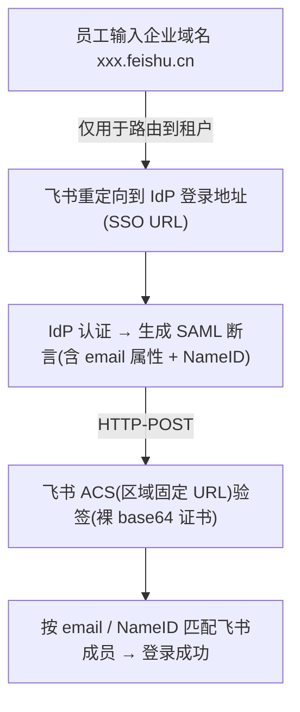
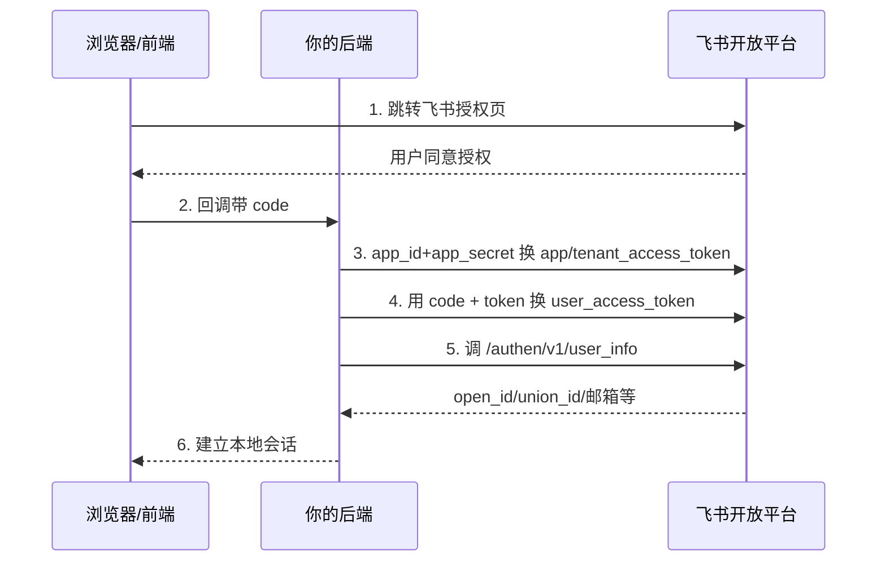

# 飞书(Feishu)SSO 对接实现

本页讲飞书登录方向的落地对接；面向企业客户的 OpenAPI、服务端 SDK、事件、权限与交付评价见 [飞书 API / SDK 企业评价](./feishu-review.md)。企业微信对接见 [企业微信](./wecom.md)。

## 先分清两个方向

对接飞书 SSO 前,务必先确认你要做的是哪个方向——两者协议、配置位置、可用能力完全不同。

| 维度 | 方向 A:飞书作 **SP** | 方向 B:飞书作 **IdP** |
|------|----------------------|------------------------|
| 场景 | 用企业已有 IdP 登录**进飞书** | 用飞书账号登录**别的系统** |
| 支持协议 | 管理后台提供的企业 SSO 以 SAML 配置为主，具体以租户版本为准 | 开放平台网页授权登录为 OAuth2 授权码流程；其它应用 SSO 形态按应用类型确认 |
| 配置位置 | 管理后台 → 企业设置 → **SSO 账号登录** | 飞书**集成平台**(开放平台应用) |
| 版本要求 | 需购买并由管理员开通对应 SSO 能力，套餐名称可能调整 | 需创建并发布相应开放平台应用 |
| 元数据 | 是否支持导入/下载取决于当前管理后台入口和 SSO 形态 | 不同应用集成方式不同，不应统一写成“都可下载 metadata” |
| 本质 | 企业 IdP 与飞书建立 SAML 信任 | 飞书账号授权第三方应用访问身份或资源 |

::: tip 一句话判断
"让员工用公司账号登飞书" → 方向 A(SAML);"让飞书用户登我们自己的系统" → 方向 B(OAuth2)。
:::

---

## 方向 A:飞书作 SP(SAML 2.0)

以下步骤依据本文核验时飞书帮助中心所示的 SAML 配置流程。控制台、套餐和字段可能迭代；若当前租户后台提供 OIDC、metadata 导入或其它选项，应以后台与合同为准。

### 关键约束

- 本文所依据的帮助页要求手工填写 IdP 参数；上线前应检查当前后台是否已提供 metadata 导入，不能把历史界面限制当作永久产品承诺。
- 证书要填**裸 base64**:去掉 `-----BEGIN CERTIFICATE-----` / `-----END CERTIFICATE-----` 头尾和换行,只留中间的 base64 正文。
- 证书是**写死的、需手动轮换**:一旦 IdP 侧轮换了签名证书而飞书这边没更新,登录会**突然全部失败**。

### 第一步:在飞书后台填 IdP 参数

在"SSO 账号登录"里手动填这三项(来自你的 IdP metadata):

| 飞书字段 | 含义 | 来自 IdP metadata 的哪里 |
|----------|------|--------------------------|
| 登录地址(SSO URL) | IdP 的单点登录端点 | `<SingleSignOnService Binding="HTTP-Redirect/POST">` 的 `Location` |
| Issuer / Entity ID | IdP 的实体标识 | `<EntityDescriptor entityID="...">` |
| 签名证书 | IdP 签名断言用的公钥证书 | `<X509Certificate>`(**去头尾、裸 base64**) |

::: tip 用工具省去手抄
把 IdP 的 metadata XML 丢给 [飞书 SAML SSO 助手](../tools/feishu-saml.html),它能直接解析出上面三个要手填的字段,并能反向生成飞书 SP metadata。证书去头尾也可以用 [证书处理工具](../tools/cert.html)。metadata 的通用解析见 [SAML metadata 工具](../tools/saml-metadata.html)。
:::

### 第二步:在 IdP 侧配置飞书这个 SP

本文核验的帮助页未提供可直接下载的 SP metadata，列出了中国和国际站点参数。其它数据驻留区必须从当前租户后台或官方文档取得，不能仅替换域名推断：

| 区域 | 域名 | ACS URL(Recipient / Destination) | SP Entity ID(Audience) |
|------|------|-------------------------------------|--------------------------|
| 飞书中国 | `*.feishu.cn` | `https://www.feishu.cn/suite/passport/authentication/idp/saml/call_back` | `https://www.feishu.cn` |
| Lark 国际 | `*.larksuite.com` | `https://www.larksuite.com/suite/passport/authentication/idp/saml/call_back` | `https://www.larksuite.com` |
| 其它数据驻留区 | 以当前租户后台为准 | 从后台/官方文档复制，不自行替换域名 | 同左 |

要点:

- **ACS 绑定是 HTTP-POST**。在 Okta 里配置时勾选 **"Use this for Recipient URL and Destination URL"**。
- 企业域名(如 `xxx.feishu.cn`)只在**员工登录时输入**、用于路由到你的租户,**不出现在 SAML 端点里**——不要把它拼进 ACS / Entity ID。

### 第三步:配置断言属性(必做)

- 本文所依据的配置示例使用邮箱属性匹配成员；实际可用的 NameID/属性映射以当前后台为准。若使用邮箱，必须保证 IdP 与飞书成员邮箱一致，并为改名、换域准备变更流程。
- 不要假设 `emailAddress` 是唯一可用的 NameID 格式；先在测试租户验证匹配键、大小写、别名和用户变更后的行为。

---

## 方向 B:飞书作 IdP(OAuth2 授权码)

用飞书账号登录自己的系统，公开平台提供的是 OAuth2 授权码式网页授权流程。旧版接口和新版 `authen` 接口并存时，应以当前开放平台“登录流程”文档生成端点和参数，不要照搬历史示例。

### 流程图

### 后端换 token 步骤

| 步骤 | 输入 | 输出 |
|------|------|------|
| 1. 前端拿授权码 | 用户在飞书授权 | `code` |
| 2. 换应用凭证 token | `app_id` + `app_secret` | `app_access_token` / `tenant_access_token` |
| 3. 换用户 token | `code` + 应用凭证 token | `user_access_token` |
| 4. 拉用户信息 | `user_access_token` | 用户身份字段 |

用户信息接口:`/open-apis/authen/v1/user_info`。

### 关键字段

飞书的用户标识**以 `open_id` / `union_id` / `user_id` 为主**:

| 字段 | 说明 |
|------|------|
| `open_id` | 用户在**单个应用**内的唯一标识 |
| `union_id` | 用户在**同一开发者旗下多应用**间的统一标识 |
| `user_id` | 用户在**租户内**的标识 |

::: tip 本地账号映射
建议始终保存标识作用域：企业内部成员优先使用 `(tenant_key, user_id)`；仅能取得 `open_id` 时保存 `(tenant_key, app_id, open_id)`；`union_id` 只用于同一开发商主体下的跨应用关联。不要只依赖邮箱。
:::

---

## 常见坑

::: warning 手工证书配置必须设计轮换
若当前租户后台仍采用手工上传单张 IdP 签名证书的方式，IdP 换证前必须同步更新并验证；若后台已支持多证书或 metadata 自动刷新，则按当前能力设计新旧证书并行。
:::

::: warning 身份匹配键变更会导致登录失败
若当前配置使用邮箱或 NameID 匹配成员，两边值不一致就会登录失败。上线前确认实际匹配键，并把邮箱、姓名、域名等变更纳入身份生命周期流程。
:::

::: warning 套餐与后台能力需预先确认
企业 SSO 的可用套餐、协议和配置入口可能调整。立项时应在目标租户后台实际确认，并把所需能力写入采购与验收清单。
:::

其他易错点:

- 把区域搞错——中国用 `feishu.cn`,国际用 `larksuite.com`,ACS / Entity ID 常量不能混用。
- 证书没去头尾、带了 `-----BEGIN/END-----` 或换行,导致飞书解析失败。
- 不要依据旧帮助页推断 metadata 能力永久不变；每次新项目和证书轮换前检查当前后台与官方文档。

飞书的企业 OpenAPI、SDK、事件与权限评价见 [飞书 API / SDK 企业评价](./feishu-review.md)；SAML、OAuth2/OIDC 基础见本站对应专题。

---

## 参考来源

- 飞书帮助中心 — SSO 账号登录配置:<https://www.feishu.cn/hc/zh-CN/articles/360043576234>
- 飞书帮助中心 — SAML 配置说明:<https://www.feishu.cn/hc/zh-CN/articles/360049067599>
- Lark Admin — Configure SAML 2.0 SSO login (Okta or Google),含各区域固定参数:<https://www.larksuite.com/hc/en-US/articles/360048487935-admin-configure-saml-2.0-sso-login-okta-or-google>
- 飞书开放平台 — 获取登录用户信息(方向 B `user_info`):<https://open.feishu.cn/document/common-capabilities/sso/api/get-user_info>
