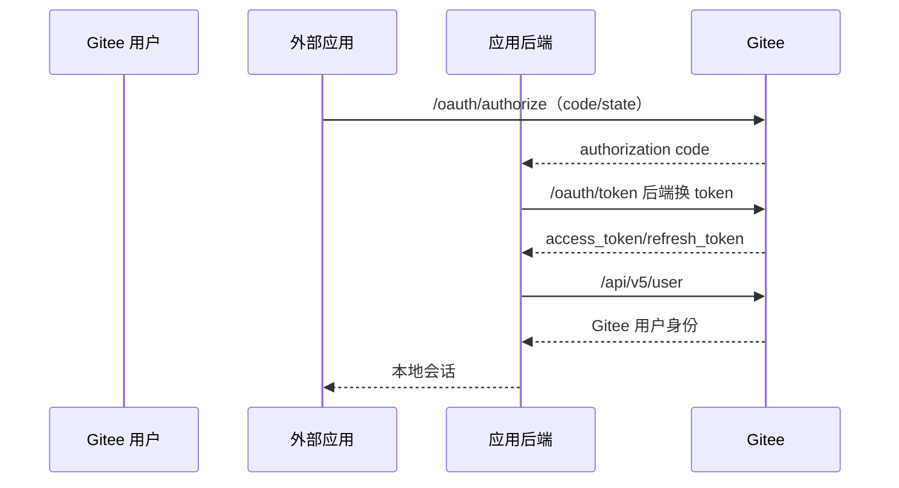

# Gitee 开放平台账号与 API 接入

本页讨论 Gitee 用户 OAuth、企业 OpenAPI token 和 Webhook；不评价代码托管功能，也不把 Gitee 企业版的权限管理当作通用 IAM 产品。

::: tip 标准化边界
Gitee 的用户授权、企业 API 凭据和 Webhook 分别代表三种主体，必须隔离；SDK 数量不增加协议标准化得分。
:::

## 用户 OAuth 接入

新应用只应使用授权码流程。历史资料中的资源所有者密码模式不得用于新系统。公开资料未验证 OIDC Discovery、`id_token`、JWKS 或公共客户端强制 PKCE，因此应通过平台专用适配器接入。

## 企业 OpenAPI token

企业 token 代表企业 API 调用资格，不是登录用户身份。它应与普通用户 token 分库存储，限制企业、项目和操作，并由服务端密钥管理；不得下发给浏览器、CI 日志或不受控插件。

## Webhook

官方帮助说明 Webhook 可配置 URL 和一个随 POST 发送的明文共享值。即使使用 HTTPS，这仍缺少消息签名、时间戳与标准重放保护。

接入方应在独立网关终止 Webhook：

1. 强制 HTTPS，使用专用 URL，并以常量时间比较共享值。
2. 入队前为原始请求体添加内部 HMAC、接收时间和内容摘要。
3. 以事件类型、仓库、提交/请求 ID 和摘要做幂等与重放缓存。
4. Webhook 只触发低权限异步流程；部署、账号和权限变更需要二次授权。

这些补偿控制只能降低风险，不能把平台的共享值机制评价为标准签名。

## 主体与 SDK

官方 SDK 组织提供 Java、TypeScript、Go 等客户端。应用应固定版本并运行契约测试；用户主键保存 `(gitee, client_id, user_id)`，仓库/企业 ID 另存，不以用户名作为不可变主体。

## 官方资料

- [Gitee API v5 OAuth 文档](https://gitee.com/api/v5/oauth_doc)
- [Gitee API v5 Swagger](https://gitee.com/api/v5/swagger)
- [Gitee 官方 SDK 组织](https://gitee.com/sdk)
- [Gitee Webhook 配置说明](https://gitee.com/help/articles/4184)
- [Gitee 企业 token 与 OpenAPI](https://gitee.com/help/articles/4378)

> 核验日期：2026-07-27。接入前需在目标应用控制台复核 token 端点、scope 和回调精确匹配规则。
