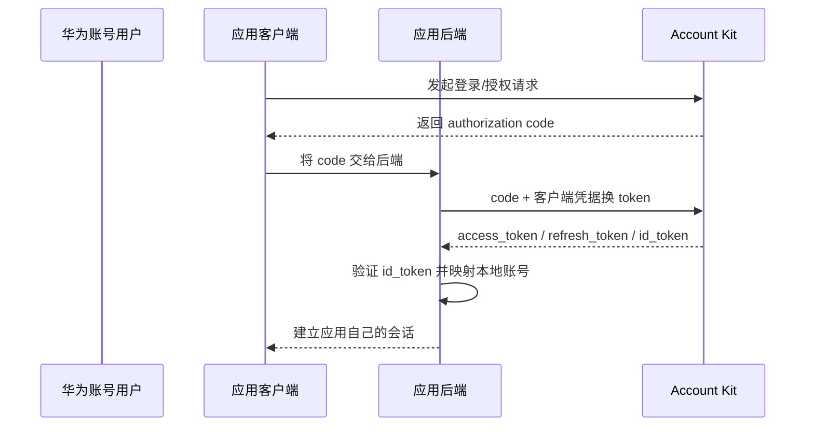

# 华为账号 Account Kit 接入

本页讨论消费应用通过 Account Kit 接入华为账号。它不是华为云 IAM，也不是华为云 WeLink；三个产品的租户、主体、端点和用途不能混用。

::: tip 标准化边界
官方将 Account Kit 描述为基于 OAuth 2.0 与 OpenID Connect，并支持 Android、HarmonyOS 和 Web。接入评估仍需逐项确认 `id_token` 验证、Discovery/JWKS、PKCE、回调匹配与吊销，而不能只依据产品介绍中的协议名称。
:::

## 系统角色

| 产品 | 角色 | 本页是否评价 |
|---|---|---|
| 华为账号 Account Kit | 消费者身份提供方；向应用授权身份与账号能力 | 是 |
| 华为云 WeLink | 企业协作平台和企业成员目录 | 否，见独立页面 |
| 华为云 IAM | 云资源 IAM | 否，属于标准 IAM 产品排除范围 |

## 授权码接入流程

实施步骤：

1. 在 AppGallery Connect/开发者平台创建应用，配置签名、包名、回调地址与所需权限。
2. Android、HarmonyOS 或 Web 客户端通过 Account Kit SDK 发起授权，取得短时效 code。
3. code 交给后端兑换 access、refresh 和 ID token；客户端不得内置可提取的 Secret。
4. 后端验证 ID token 的签名、issuer、audience、过期时间和 nonce，再以稳定 subject 绑定本地账号。
5. access token 只用于调用其目标 API；退出、解绑或用户撤销授权时调用对应撤销能力并清理本地会话。

## 服务端凭据与 token

服务端 API 还提供应用 token 获取接口，例如 `POST /oauth2/v3/token` 的 `client_credentials` 请求。应用 token 代表应用，不代表具体华为账号用户。官方参考列出 TLS 1.2 与密码套件要求；接入方仍需使用当前安全 TLS 配置并限制私钥/Secret 的使用面。

公开材料未在本次核验中完整证明所有平台统一提供 OIDC Discovery、公开 JWKS、公共客户端强制 PKCE、刷新重放检测和发送方约束 token。采购或上线验收应要求给出实际端点与验证样例。

## 接入方最低实现

- 原生应用采用系统浏览器/安全 SDK 回跳，使用 PKCE（若平台支持）并拒绝自定义 WebView 收集账号密码。
- 必须在后端验证 `id_token`；不能把 access token 的存在等同于认证成功。
- 本地主键使用 `(issuer, subject)`，不使用手机号、邮箱或设备 ID 作为全局账号键。
- 为 token 刷新、撤销、账号解绑、应用卸载和华为账号注销建立生命周期处理。
- Account Kit 适配器与 WeLink、华为云 IAM 完全隔离，日志中明确记录产品、应用与环境。

## 官方资料

- [华为账号 Account Kit 产品页](https://developer.huawei.com/consumer/cn/sdk/account-kit)
- [Account Kit 授权码与 token Codelab](https://developer.huawei.com/consumer/cn/codelab/HMSAccounts/index.html)
- [获取应用 token API](https://developer.huawei.com/consumer/en/doc/harmonyos-references/account-api-obtain-app-token)

> 核验日期：2026-07-27。“未验证”只表示公开材料不足，验收时可由厂商提供可复现证据补充。
