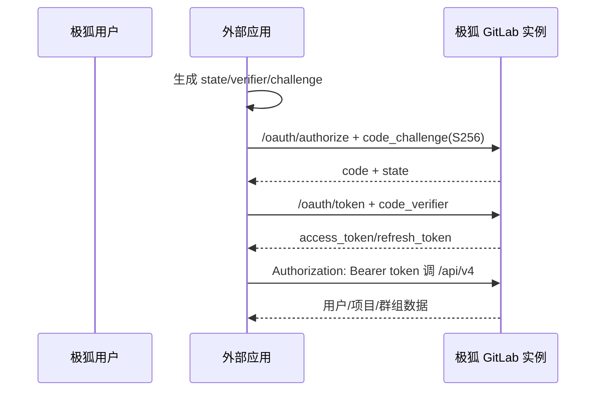

# 极狐 GitLab 外部系统接入

极狐 GitLab 是面向中国市场独立运营的 GitLab 产品，提供 JihuLab.com SaaS 和私有化部署。本页不把它写成笼统的“GitLab 中国”，也不以 GitLab 全球 SaaS 的端点、账号或上线时间替代极狐实例。

::: tip 产品边界
OAuth、REST、GraphQL、Webhook 和 token 都以具体极狐实例为 issuer/资源边界。JihuLab.com、客户私有化实例与 GitLab.com 的用户 ID、应用和 token 不能直接互换。
:::

## OAuth 应用接入

极狐实例可作为 OAuth 2.0 授权服务器，应用可由用户、群组或实例拥有。外部服务先在目标实例注册应用、配置回调 URI 和 scope，再使用授权码访问用户资源。

实施要求：

1. 公共和机密客户端都优先使用授权码 + PKCE，并校验高熵 `state`。
2. 生产回调只使用 HTTPS；开发环境允许 HTTP 不能带入生产配置。
3. access token 放 `Authorization: Bearer`，不要使用文档仍兼容的查询参数或 Git URL 内嵌 token。
4. 按需申请 `read_user`、`read_api`、`api`、仓库等 scope；不同自动化用途创建不同应用。
5. 使用 `/oauth/revoke` 撤销 token，并处理刷新、用户停用和应用 Secret 更新。

官方文档仍保留资源所有者密码凭据流程并明确不建议使用，新系统应禁用。设备授权支持说明在当前页面存在前后不一致，必须按目标极狐版本做协议测试，不能仅依据目录标题宣称符合 RFC 8628。

## API 和主体

极狐提供 REST API v4、GraphQL API、CLI 和多种访问 token。OAuth 用户 token、个人 token、项目 token、群组 token、部署 token 和作业 token代表不同主体与权限边界，不能统一存成“GitLab token”。

本地用户主键应保存 `(instance_origin, user_id)`；项目、群组和机器人主体分别建模。私有化实例迁移或域名变化时，必须显式迁移 issuer/实例映射。

## Webhook 接入

较新版本提供签名 token：使用 HMAC-SHA-256 生成 `webhook-signature`，并发送 `webhook-id`、`webhook-timestamp` 和幂等 ID。旧的 Secret token 仅以明文值放在 `X-Gitlab-Token`，安全性较弱。

接收端应：

- 对原始请求体计算 HMAC 并常量时间比较；
- 校验 timestamp 的短重放窗口；
- 用 `webhook-id`/`Idempotency-Key` 去重；
- 在过渡期同时支持新签名和旧 token，验证稳定后删除旧 token；
- 保持 SSL 验证开启，不允许普通项目关闭后仍接入生产系统。

## 官方资料

- [极狐 GitLab OAuth 2.0 Provider](https://gitlab.cn/docs/jh/integration/oauth_provider/)
- [OAuth 2.0 API、PKCE、撤销与 token](https://gitlab.cn/docs/jh/api/oauth2.html)
- [REST、GraphQL、Webhook 与 CLI 扩展入口](https://gitlab.cn/docs/jh/api/_index/)
- [Webhook 签名、时间戳和幂等 ID](https://docs.gitlab.cn/docs/jh/user/project/integrations/webhooks/)
- [极狐与 GitLab 全球 SaaS 的国内服务边界说明](https://resources.gitlab.cn/resources/articles/46da325fc4834c6698f60253a16d3e1a)

> 核验日期：2026-07-28。SaaS 与私有化版本能力可能不同，接入时必须记录实例 origin 和版本。
