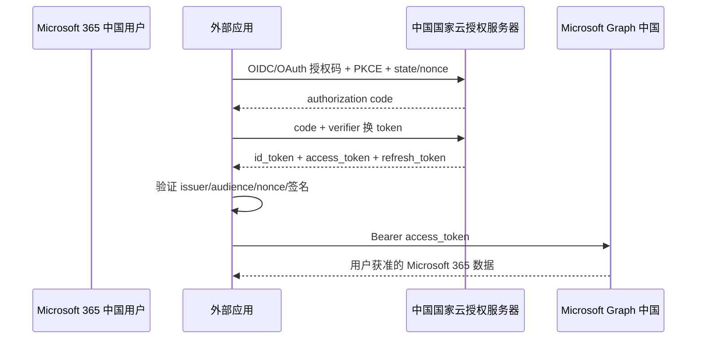

# Microsoft 365 中国版外部系统接入

本页讨论**由世纪互联运营的 Microsoft 365** 如何供外部企业应用登录用户、取得授权并调用 Microsoft Graph。它与 Microsoft 365 全球云物理和逻辑隔离；Microsoft Entra 中国版只是鉴权依赖，不作为独立 IAM 产品评分。

::: tip 产品边界
中国租户必须在中国国家云单独注册应用、获取 token 并调用中国 Graph。全球云的应用、账号、token 和 `graph.microsoft.com` 不能直接替代中国环境。
:::

## 接入角色与端点

| 组件 | 中国环境用途 |
|---|---|
| Azure 中国门户 | 在 `https://portal.azure.cn` 注册应用和配置权限 |
| 国家云授权服务器 | 为中国租户提供 OAuth 2.0/OIDC 授权、token、Discovery 与 JWKS |
| Microsoft Graph 中国 | `https://microsoftgraph.chinacloudapi.cn`，访问中国租户的 Microsoft 365 数据 |
| 外部企业应用 | OAuth/OIDC 客户端和 Graph API 调用方 |

Microsoft 官方页面目前分别出现 `login.partner.microsoftonline.cn` 与 `login.chinacloudapi.cn` 两种中国身份基地址。实现时不要在代码中猜测或混用：应从目标租户“应用注册 → 终结点”、国家云配置和 OIDC Discovery 取得实际 authority、issuer、token 与 JWKS 地址。

## 委托权限接入

1. 在中国租户中单独注册应用，登记精确回调 URI。
2. Web、SPA、桌面和移动应用使用授权码；公共客户端启用 PKCE，并使用 `state`、OIDC `nonce`。
3. 后端按 Discovery 发布的 issuer、JWKS 和算法验证 ID token。
4. Graph access token 的 audience 必须指向中国 Graph，不能发送到全球 Graph 或企业其它 API。
5. 只申请当前业务所需的委托权限；需要管理员同意的权限必须进入企业审批。

## 应用权限和服务端调用

无用户后台任务可使用应用程序权限和客户端凭据。优先使用证书或 `private_key_jwt`，不要长期依赖共享 Secret。Microsoft Graph 将委托权限和应用程序权限分开，并明确最低权限；目录级读写权限影响整个租户，应避免用 `Directory.ReadWrite.All` 替代具体资源权限。

Graph SDK支持国家云配置，但 SDK不会自动纠正错误的云实例。应用配置至少要把 `cloud/partition`、tenant、authority、Graph base URL 和预期 audience 作为一组不可拆分参数。

## 变更通知

Graph 中国支持订阅 API，但具体资源在国家云是否可用必须逐项检查。Webhook 创建时 Graph 会验证 HTTPS 回调；通知通过 `subscriptionId` 关联，并要求接收方比较保密的 `clientState`。

接收方还应：

- 续订短期订阅并处理生命周期通知；
- 按 subscription ID、tenant ID、resource 和通知 ID 做幂等；
- 丰富通知按官方证书流程解密；
- 不把来源 IP 或 `clientState` 单独当作强消息签名。

## 国内环境接入清单

- 中国和全球租户分别注册应用、分开保存凭据与主体映射。
- authority、issuer、JWKS 和 Graph 根地址来自同一国家云配置，禁止跨云 token 重放。
- 用户主键保存 `(issuer, tenant_id, object_id/sub)`，不以 UPN 或邮箱作为不可变主键。
- 生产客户端使用 MSAL/Graph SDK时显式选择中国云，并执行 Discovery/audience 契约测试。
- 对每一个 Graph API 和变更通知查询“中国国家云可用性”，不能根据全球文档推定。

## 官方资料

- [Microsoft Entra 国家云身份验证](https://learn.microsoft.com/zh-cn/entra/identity-platform/authentication-national-cloud)
- [Microsoft Graph 国家云部署与中国端点](https://learn.microsoft.com/zh-cn/graph/deployments)
- [Microsoft 标识平台 OAuth 2.0/OIDC](https://learn.microsoft.com/zh-cn/entra/identity-platform/v2-protocols)
- [Microsoft Graph 权限参考](https://learn.microsoft.com/zh-cn/graph/permissions-reference)
- [Microsoft Graph Webhook 更改通知](https://learn.microsoft.com/zh-cn/graph/change-notifications-delivery-webhooks)

> 核验日期：2026-07-28。中国国家云功能可能晚于全球云或不提供，必须按目标租户实际 endpoint 和 API 可用性验收。
