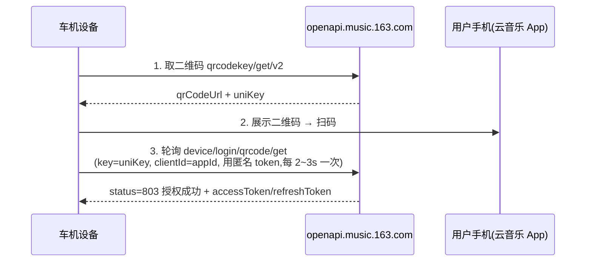

# 网易云音乐 OpenAPI 登录对接实现

本页讲网易云音乐合作方 OpenAPI 的设备登录流程；授权、令牌、签名、设备流与标准化评价见 [网易云音乐标准安全评价](./netease-music-review.md)。

::: tip 标准化边界
本页说明如何兼容平台当前协议，不表示本站建议继续扩展私有实现。新系统应优先要求标准 OIDC/OAuth/SAML/SCIM；必须接入私有流程时，应将它限制在身份网关适配器内。评价基线见[统一协议安全评价方法](./methodology.md)。
:::

> 依据网易云音乐开放平台《音乐 API 文档 · 用户登录 API / 公共 · 访问方式》。域名 `openapi.music.163.com`。

## 这是什么

与 [喜马拉雅](./ximalaya.md) / [QQ 音乐](./qqmusic.md) 那种"绑定你方账号"的模式不同,网易云音乐是**让用户直接登录自己的云音乐账号**,结构上接近 OAuth2，但仍是私有 OpenAPI:设备通过**扫码**或 **H5/唤端**拿到用户授权,换取 `accessToken` + `refreshToken`,再用 `accessToken` 访问用户信息与资源。

两种登录入口:

| 入口 | 适用 | 拿到什么 |
|---|---|---|
| **扫码登录** | 车机 / 手表等无输入设备 | 轮询二维码状态,授权成功直接返回 `accessToken`/`refreshToken` |
| **H5 / 唤端授权登录** | 能拉起 H5 或云音乐 App 的场景 | 回调得到临时 `grantCode`,再由**后端**换 `accessToken` |

## 准备工作

1. **创建应用**,拿到 `appId` / `appSecret`(开放平台 → 应用管理)。
2. **上传 RSA 公钥**:开放平台 → 应用管理 → 应用详情 → 接口加密方式。**你用私钥对请求签名,平台用你上传的公钥验签**(`signType=RSA_SHA256`)。
3. 线上域名:`openapi.music.163.com`,统一 HTTPS,按接口用 GET/POST。

## 公共参数与鉴权

除各接口的业务参数(打包进 `bizContent` JSON 字符串)外,请求还需公共参数:

| 参数 | 说明 |
|---|---|
| `appId` | 控制台应用 id |
| `signType` | 固定 `RSA_SHA256` |
| `timestamp` | 当前时间戳 |
| `sign` | 用你的 RSA **私钥**对请求参数 + 时间戳签名 |
| `accessToken` | 已登录后访问用户资源时携带 |
| `device` | 设备信息 JSON(deviceType/os/model/deviceId…) |

鉴权与风控(见「访问方式」):

- **签名校验**:平台用你上传的公钥验证 `sign`;
- **时效校验**:校验 `timestamp`,**超过 5 分钟的请求被拒**;
- **访问频率限制**:按 AppID 的各接口限流,超阈值返回 `-444`/`-445`/`-446`。

## 扫码登录流程

1. **获取二维码** `GET/POST /openapi/music/basic/user/oauth2/qrcodekey/get/v2`
   - `bizContent`:`{"type":2,"expiredKey":"300"}`(`type=2` 设备类型固定;`expiredKey` 二维码过期秒数)
   - 返回:`qrCodeUrl`(需预留 8~512 字符,长/短链都可能)、`uniKey`;二维码有效期 5 分钟。
2. **轮询状态** `GET/POST /openapi/music/basic/oauth2/device/login/qrcode/get`
   - `bizContent`:`{"key":"<uniKey>","clientId":"<appId>"}`;用一个**匿名 token** 轮询,间隔 2~3s。
   - `status`:`800` 不存在/过期、`801` 等待扫码、`802` 授权中、`803` 授权登录成功、`804` 未知错误。
   - `803` 时返回 `AccessToken{ accessToken, refreshToken, expireTime }`。

## H5 / 唤端授权登录 → code → token

H5 或唤起云音乐 App 授权后,回调拿到临时 `grantCode`(**10 分钟**有效),再换 token(**建议服务端调用**):

`GET/POST /openapi/music/basic/user/oauth2/token/get/v2`

- `bizContent`:`{"grantCode":"xxxx"}`
- 返回:`accessToken`、`refreshToken`、`expireIn`(秒)。(`openId`/`unionId` 字段已标注**失效**。)

## 刷新 AccessToken

`GET/POST /openapi/music/basic/user/oauth2/token/refresh/v2`(**建议服务端调用**)

- `bizContent`:`{"clientId":"<appId>","clientSecret":"<appSecret>","refreshToken":"<rt>"}`
- 返回:新的 `accessToken`、`refreshToken`、`expiresTime`(AT/RT 同时续期)。
- 生命周期:**accessToken 默认 7 天,refreshToken 默认 20 天**。刷新逻辑:7 天内 AT 可用;7–20 天用 RT 刷新;20 天不活跃引导重登。
- 任意接口提示 token 过期(`1406`)先用 RT 刷新,仍过期则重登;`1407`/`1408` 直接重登。

## 获取用户基本信息

`GET/POST /openapi/music/basic/user/profile/get/v2`(携带 `accessToken`,`bizContent` 为空)

| 字段 | 说明 |
|---|---|
| `id` | 用户 Id |
| `nickname` / `avatarUrl` / `gender` / `signature` | 昵称 / 头像 / 性别(0 未知 1 男 2 女)/ 签名 |
| `redVipLevel` | 黑胶会员等级 |
| `vipDetail` / `fullVipDetail` | 当前生效 / 全部会员类型(`6` 黑胶 VIP、`15` 黑胶 SVIP、`13` 车载端、`16` 手表端、`17` TV 端、`18` 音箱端…) |

## 端点速查

| 用途 | 端点(`openapi.music.163.com` 下) |
|---|---|
| 取二维码 | `/openapi/music/basic/user/oauth2/qrcodekey/get/v2` |
| 轮询二维码状态 | `/openapi/music/basic/oauth2/device/login/qrcode/get` |
| code 换 token | `/openapi/music/basic/user/oauth2/token/get/v2` |
| 刷新 token | `/openapi/music/basic/user/oauth2/token/refresh/v2` |
| 用户信息 | `/openapi/music/basic/user/profile/get/v2` |

统一响应外壳:`{ "code": 200, "subCode": null, "message": null, "data": {...} }`(`code` 非 200 视为异常)。

## 参考

- [网易云音乐登录:标准化与安全评价与改造建议](./netease-music-review.md)
- 网易云音乐开放平台文档([获取登录二维码](https://developer.music.163.com/st/developer/document?docId=2bb12a93e71a4be0842243b930c2f33c) 等,登录相关)
- [OAuth 2.0 文档](../oauth2/) · [OpenID Connect 文档](../oidc/)
