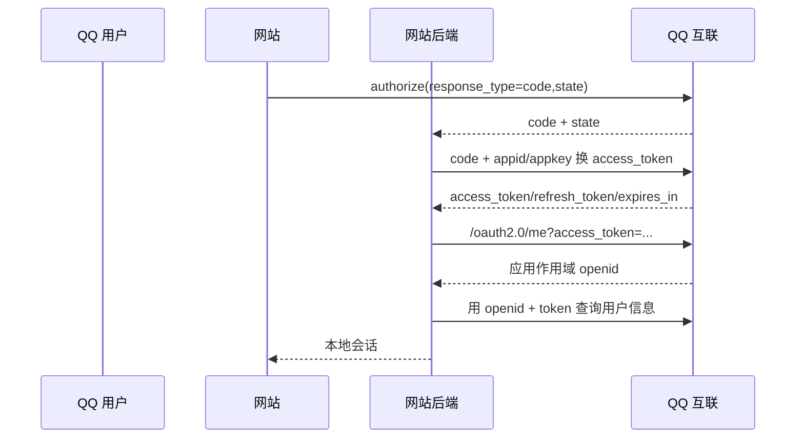

# QQ 互联账号接入

QQ 互联让网站和移动应用使用 QQ 账号授权。它与微信开放平台、企业微信、腾讯云 CloudBase 是不同产品；即使同属腾讯，也必须分别登记应用、处理标识并独立评价。

::: warning 新系统注意
QQ 互联公开资料仍包含查询串中的 `client_secret`、默认非 JSON token 响应、JSONP 式 OpenID 响应，以及面向移动端的 Implicit Grant 指引。这些是兼容性接口，不符合新建公共客户端的安全基线。
:::

## 网站授权码流程

官方说明授权码约 10 分钟有效。token 默认有效期较长，refresh token 为一次性轮换且总授权期限有限；接入方必须以响应中的实际期限为准，不能硬编码文档示例。

## 标识与响应处理

- QQ `openid` 只在一个应用下唯一。本地主键应为 `(qq_connect, appid, openid)`。
- `/oauth2.0/me` 默认返回类似回调包装的数据，不是 OIDC UserInfo，也不是标准 `id_token`；必须使用严格解析器，不能执行任意响应脚本。
- token 和错误使用平台私有格式/错误码。接入适配器应显式校验 content type、字段集合与长度，并统一转换为内部错误。
- QQ 互联的 `openid` 不应与微信 `openid`、微信 `unionid`、企业微信 `userid` 或 CloudBase `sub` 相互推导。

## 移动与桌面应用

官方页面仍提及 Implicit Grant。新公共客户端不应把 access token 经 URL fragment 直接返回；优先使用官方当前 SDK支持的授权码流程，并要求 PKCE。若平台无法提供授权码 + PKCE，应通过受控后端中转、限制权限和 token 寿命，并在风险登记中记录例外。

## 接入方最低实现

- 强制 `state` 并绑定发起会话；code 只由后端兑换。
- `appkey` 与 token 不进入 URL 日志、前端代码或移动安装包；无法避免查询串时，在专用出口与全链路日志做脱敏。
- 禁用新项目的 Implicit 接入，不把 `/me` 返回的 OpenID 当作已验证 OIDC claim。
- 对刷新令牌轮换使用事务更新；退出、解绑、授权到期后删除会话和缓存。
- QQ 互联使用独立适配器与独立账号映射表，不与其它腾讯身份产品共用裸 ID。

## 官方资料

- [QQ 互联 OAuth 2.0 简介](https://wiki.connect.qq.com/oauth2-0%E7%AE%80%E4%BB%8B)
- [使用 authorization_code 获取 access_token](https://wiki.connect.qq.com/%E4%BD%BF%E7%94%A8authorization_code%E8%8E%B7%E5%8F%96access_token)
- [获取用户 OpenID](https://wiki.connect.qq.com/%E8%8E%B7%E5%8F%96%E7%94%A8%E6%88%B7openid_oauth2-0)
- [公共返回码说明](https://wiki.connect.qq.com/%E5%85%AC%E5%85%B1%E8%BF%94%E5%9B%9E%E7%A0%81%E8%AF%B4%E6%98%8E)

> 核验日期：2026-07-27。
