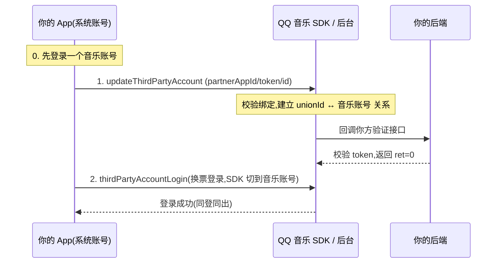

# QQ 音乐第三方登录(账号绑定)对接实现

本页讲 QQ 音乐车载/设备 SDK 的第三方账号绑定；账号协议、回调密码学与标准化评价见 [QQ 音乐标准安全评价](./qqmusic-review.md)。

::: tip 标准化边界
本页说明如何兼容平台当前协议，不表示本站建议继续扩展私有实现。新系统应优先要求标准 OIDC/OAuth/SAML/SCIM；必须接入私有流程时，应将它限制在身份网关适配器内。评价基线见[统一协议安全评价方法](./methodology.md)。
:::

> 依据 QQ 音乐开放平台《Android SDK 文档 · 登录相关 · 2.1.1.8 第三方登录(账号绑定)/ 2.1.1.9 第三方登录接口》。

## 这是什么

当你需要**用自己内部账号绑定 QQ 音乐账号**,并用自身登录票据访问 QQ 音乐资源时,走「第三方登录」。核心是**换票机制**:

- 绑定关系存在 **QQ 音乐侧**,挂在你的 `unionId` 上,**一处绑定、所有设备共享**;
- **同登同出**:第三方账号退出时对应的音乐账号一并退出;
- **单一管理原则**:SDK **不再保存**第三方账号 token,由**接入方接管**,SDK 只提供绑定关系的「表操作」方法。

功能被简化为**三个表操作 + 一个登录操作**:

| SDK 接口 | 操作 |
|---|---|
| `updateThirdPartyAccount` | 绑定(增 / 改) |
| `deleteThirdPartyAccountBindState` | 解绑(删) |
| `queryThirdPartyAccountBindState` | 查询绑定关系 |
| `thirdPartyAccountLogin` | 用第三方账号登录音乐账号 |
| `logout` / `queryThirdPartyAccountID` | 退出 / 取当前账号 ID |

> 第三方相关能力通过 `OpenApiSDK.getPartnerApi()` 获取。

## 准备工作(向 QQ 音乐申请)

1. **权限申请**:与 Q 音项目对接同学沟通开通「三方登录」(或提交工单),附上分配的 `appid`(QQ 音乐侧 `music_app_id`,一般 `2000000` 开头)。
2. **提供第三方验证回调接口(公网可访问)**:由**你方**实现,QQ 音乐后台在**每次账号操作时**回调它校验票据合法性(校验规则由你方后台定义)。详见 [第三方验证回调接口](#第三方验证回调接口你方实现)。

## 接入流程(绑定 → 登录)



要点(见官方 2.1.1.9 注意事项):

- 调 `thirdPartyAccountLogin` 前**必须已用 `updateThirdPartyAccount` 建立绑定关系**(暗账号 `PARTNER_INDEPENDENT` 模式除外);
- **每次重启 App 需重新检查绑定关系**再调登录,否则不会自动登录;设了 `enableRestoreLogin` 时要处理"系统账号与自动恢复的 Q 音账号绑定关系可能不一致"的交互;
- 绑定前**必须先登录一个音乐账号**;若当前是以三方账号形式登录,更新绑定关系会导致账号退出。

## SDK 端接口(Android · `getPartnerApi()`)

### 绑定 `updateThirdPartyAccount`

```kotlin
abstract fun updateThirdPartyAccount(
    partnerAppId: String,
    partnerAccessToken: String,
    partnerAccountId: String?,
    forceBind: Boolean = true,
    callback: IPartnerNetworkCallback
)
```

| 入参 | 必传 | 含义 |
|---|:--:|---|
| `partnerAppId` | 是 | 第三方应用 id |
| `partnerAccessToken` | 否 | 第三方 AccessToken(票据) |
| `partnerAccountId` | 是 | 第三方账号 id |
| `forceBind` | 是 | 是否强制绑定。默认 `true`:当前 Q 音账号已绑另一个三方账号时新账号也能绑成功;`false` 则返回错误并带回原绑定的三方账号 id |

返回 `ret`(`0` 成功,否则见[错误码](#错误码))。

### 解绑 / 查询 / 登录

```kotlin
fun deleteThirdPartyAccountBindState(partnerAppId, partnerAccessToken, partnerAccountId?, callback)
fun queryThirdPartyAccountBindState(partnerAppId, partnerAccessToken, partnerAccountId?, callback)
fun thirdPartyAccountLogin(...)   // 前置:已建立绑定关系
fun queryThirdPartyAccountID(): String?
```

- 解绑:若当前正以该三方账号登录,解绑会导致账号退出;
- 查询:按当前登录的 Q 音账号查询绑定的三方独立账号 id;
- 登录:成功即表示已通过第三方账号登录音乐账号(绑定 / 解绑等仅操作后台关系表,不影响登录状态)。

### 错误码

| ret | 含义 |
|---|---|
| `0` | 成功 |
| `10010` | 账号绑定关系混乱 |
| `10014` | 解绑账号未绑定 |

(完整错误码以官方 2.1.1.9.9 为准。)

## 第三方验证回调接口(你方实现)

QQ 音乐后台在每次账号操作时,用下列参数 **POST** 你方接口来校验第三方票据。

- **方法**:`POST`,`application/json`
- **URL**:你方提供的公网回调地址

**请求参数**

| 参数 | 类型 | 含义 |
|---|---|---|
| `unionId` | string | (你方提供)第三方用户 id(同 `partner_id`;同一用户 `unionId` 一致) |
| `appId` | string | (你方提供)第三方应用 id(同 `partner_appid`;不同应用不同) |
| `token` | string | (你方提供)第三方给用户颁发的票据,供 QQ 音乐后台调用你方接口验证(验证成功后 QQ 音乐服务端会缓存) |
| `music_app_id` | string | (Q 音提供)你在 QQ 音乐开放平台申请的 appid(一般 `2000000` 开头) |
| `timestamp` | int64 | (Q 音提供)当前秒级时间戳 |
| `sign` | string | (Q 音提供)**签名,供你方验证请求确实来自 QQ 音乐**——对 `md5(appId=..&music_app_id=..&timestamp=..&token=..&unionId=.._appkey)` 按参数名字母升序拼接后做 MD5,`appkey` 从开发者平台获取 |

**返回格式**

| 参数 | 含义 |
|---|---|
| `ret` | 响应码,正常返回 `0`,否则视为异常 |
| `unionId` | 经校验的第三方用户 id(绑定关系挂在 `unionId` 上) |
| `expireTime` | 票据缓存时长(秒),如 10 分钟填 `600`;QQ 音乐后台据此缓存你的 token,不合理的时长会被限制 |

::: warning 官方明确的几条约束
- **不能设置 IP 白名单**:QQ 音乐服务端出口 IP 可能变化;请求真实性靠上面的 `sign` 校验,而非来源 IP。
- **QQ 音乐不适配你方自定义的校验协议**:回调接口仅供 QQ 音乐后台调用,格式固定。
- 三方登录**依赖你方后台稳定性**、且多一次网络往返,官方直言"**非必要不建议使用**"。
- `partner_` 前缀字段均为**你方(合作方)**数据,非 QQ 音乐数据。
:::

## 三方登录请求公共票据参数

使用 QQ 音乐侧 SDK 时**无须关注**(SDK 自动带上);在请求中以 `login_type=7`(第三方登录)或 `login_type=5, user_login_type=7`(联合登录)标明,并携带:

| 参数 | 含义 |
|---|---|
| `partner_name` | 第三方唯一标识(填 `app_id`) |
| `partner_id` | 第三方用户 id(同 `unionId`) |
| `partner_appid` | 第三方应用 id(不同车型 / 应用不同) |
| `partner_access_token` | 第三方给用户颁发的票据 |

## 参考

- [QQ 音乐第三方登录:标准化与安全评价与改造建议](./qqmusic-review.md)
- QQ 音乐开放平台 Android SDK 文档(登录相关 → 第三方登录)
- [OAuth 2.0 文档](../oauth2/) · [OpenID Connect 文档](../oidc/)
