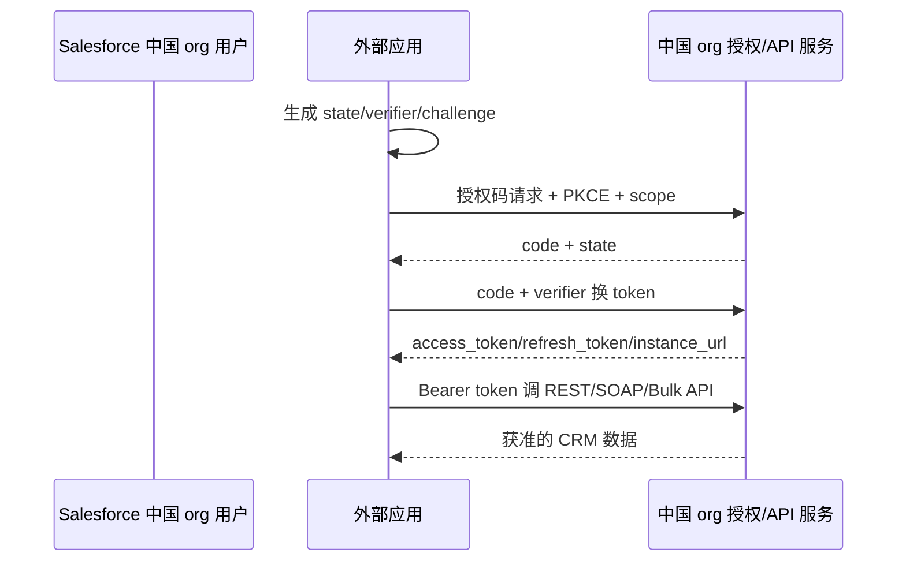

# 阿里云上的 Salesforce 外部系统接入

本页讨论**阿里云上的 Salesforce**（Salesforce on Alibaba Cloud）如何向外部企业系统提供连接应用、OAuth、数据 API 和事件流。它是 Salesforce 全球核心产品与中国本地化组件的国内交付架构，不能直接假设所有全球云功能和域名在中国环境可用。

::: tip 产品边界
官方中国架构资料确认 Sales Cloud、Service Cloud、Salesforce Platform 与中国本地化 CXG，并要求对 API 版本 V31+ 做兼容验证。具体登录域名、My Domain、OAuth endpoint、API 和事件能力必须从目标中国 org 获取。
:::

## 连接应用与授权码

1. 在目标中国 org 创建 Connected App 或当前推荐的 External Client App，使用该 org/My Domain 给出的端点。
2. Web、移动和桌面客户端使用授权码 + PKCE，登记精确 HTTPS 回调并校验 `state`。
3. scope、profile、permission set、共享规则和字段权限共同决定实际访问。
4. token 响应中的 `instance_url` 只用于已验证的目标 org，不能接受任意主机或全球 org token。
5. 为用户退出、管理员撤权、连接应用策略变更和 refresh token 到期实现重新授权。

Salesforce 2026 年对适用的合作伙伴连接应用加强 PKCE、refresh token 轮换、绝对/空闲 TTL 和 IP 绑定。中国 org 是否已适用相同控制必须在上线验收中验证，不能只依据全球公告推定。

## 服务端集成

后台服务可使用客户端凭据或 JWT Bearer 等流程。推荐为每个集成创建独立 integration user、API-only 权限和最小 permission set；高保障场景优先证书/JWT，不让多个业务共享一个全能用户和 refresh token。

连接应用可配置 token introspection、refresh token 轮换和撤销策略。即使平台允许“有效直至撤销”的 refresh token，新系统也应设置固定或空闲 TTL，并保存每次轮换后的新 token。

## API 与事件

- 中国架构资料要求验证 V31 及以上 API 兼容性；REST、SOAP、Bulk 等具体版本以目标 org 为准。
- Pub/Sub API、Platform Events 与 Change Data Capture 使用订阅和 replay ID 恢复事件，不等同于普通无状态 Webhook。
- 每条平台事件具有事件 ID，订阅方保存 replay ID，并按 72 小时公开保留窗口设计断线恢复。
- 中国环境能否使用某个 Pub/Sub/CDC 资源必须单独验收，不能根据全球开发者文档直接打勾。

## 主体与国内边界

- 主键保存 `(salesforce_china_org_id, user_id)`，客户、联系人和社区用户不能混作登录主体。
- 中国 org 与全球 org 的用户、连接应用、token、事件 replay ID 和 instance URL 分开。
- CXG、本地渠道与全球核心 CRM 之间的数据跨境和同步不属于身份协议，应另行做数据流和授权审查。

## 官方资料

- [阿里云上的 Salesforce 中国架构与 API 兼容要求](https://www.alibabacloud.com/help/en/sfoa/user-guide/china-architecture-datasheet-of-salesforce-on-alibaba-cloud)
- [Salesforce 连接应用的 OAuth/SAML/OIDC 能力](https://help.salesforce.com/s/articleView?id=xcloud.connected_app_overview.htm&language=zh_CN&type=5)
- [连接应用 OAuth、token 轮换和 introspection](https://help.salesforce.com/s/articleView?id=sf.connected_app_create_api_integration.htm&language=en_US&type=5)
- [2026 连接应用 PKCE 与 refresh token 安全控制](https://help.salesforce.com/s/articleView?id=005388177&language=en_US&type=1)
- [Pub/Sub API 与 Change Data Capture](https://developer.salesforce.com/docs/platform/pub-sub-api/guide/qs-set-up-events.html)
- [事件保留、事件 ID 与 replay ID](https://developer.salesforce.com/docs/platform/pub-sub-api/guide/event-message-durability.html)

> 核验日期：2026-07-28。全球 Salesforce 文档只用于说明协议能力，是否在中国 org 可用必须由阿里云和 Salesforce 的目标租户证据确认。
