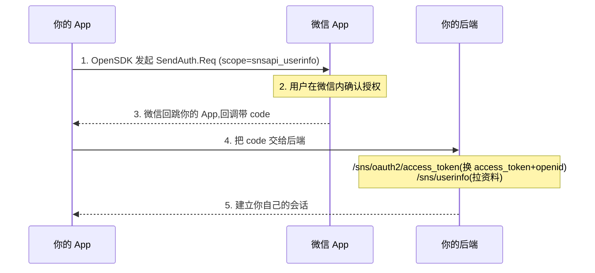
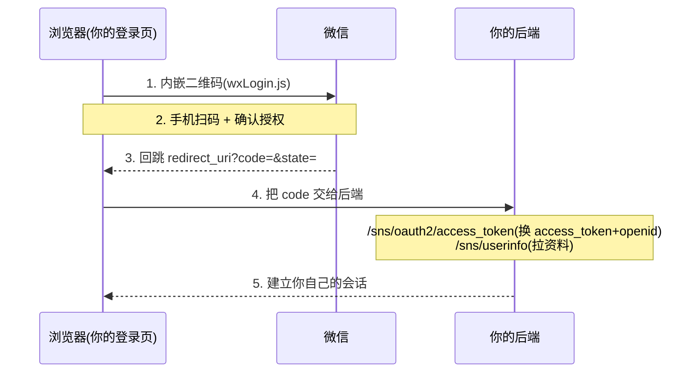

# 微信扫码登录(协议详解)

"用微信登录"面向 **C 端个人用户**:让访客用自己的个人微信扫码登进你的网站。它本质是 **OAuth2 授权码模式(Authorization Code)** 的实现,`scope=snsapi_login`:PC 网页展示二维码,用户手机微信扫码授权,浏览器拿到一次性 `code`,再由**后端**换取用户信息。

> 面向企业员工的 [企业微信扫码登录](./wecom.md) 取用户要三步、凭据也不同,别混用。想直接联调 / 看可点演示,见 [Mock 微信(使用)](../mock/wechat.md)。

> 本页讲**落地对接**;它与标准 OAuth2/OIDC 的差距、风险与改造建议见 [微信扫码登录:与标准的差距](./wechat-review.md)。

## 微信登录的几种方式

"用微信登录"按**入口不同**分四种,底层都是 OAuth2 授权码思路,但**发起方式、用户确认方式、换 token / 取用户信息的端点**各有差异:

| 方式 | 发起入口 | 用户确认方式 | 换 token 端点 | 拉用户信息 |
|---|---|---|---|---|
| **移动应用(App)** | Native iOS/Android SDK(微信 OpenSDK) | 在**微信 App 内**确认授权 | `https://api.weixin.qq.com/sns/oauth2/access_token` | `https://api.weixin.qq.com/sns/userinfo` |
| **网站应用(PC)** | `https://open.weixin.qq.com/connect/qrconnect` | 用微信 App **扫二维码** | `https://api.weixin.qq.com/sns/oauth2/access_token` | `https://api.weixin.qq.com/sns/userinfo` |
| **小程序** | 小程序 SDK `wx.login` | **无需用户显式授权**(静默拿 `code`) | `https://api.weixin.qq.com/sns/jscode2session` | 随 `jscode2session` 返回(`openid`/`session_key`) |
| **公众号网页授权** | `https://open.weixin.qq.com/connect/oauth2/authorize` | 在**微信 App 内**确认授权 | `https://api.weixin.qq.com/sns/oauth2/access_token` | `https://api.weixin.qq.com/sns/userinfo` |

::: tip 怎么选
- **PC 网站**登录 → 网站应用(扫码),即本页下文详解的流程。
- **自己的 iOS/Android App** 里用微信登录 → 移动应用(App),见下节。
- **微信内的公众号 H5 页面** → 公众号网页授权。
- **微信小程序内** → `wx.login` + `jscode2session`。

移动应用、网站应用、公众号三者**后端流程一致**(`/sns/oauth2/access_token` 换 `access_token`+`openid`,再 `/sns/userinfo` 拉资料),区别只在**前端如何发起、如何让用户确认、如何拿到 `code`**。小程序是另一套(见下)。
:::

### 移动应用(App)登录

在你自己的 **iOS / Android App** 里用微信登录,走**微信 OpenSDK**,是 App 间跳转而非扫码:

要点:

- 需在微信开放平台注册**移动应用**,配置 iOS 的 `Bundle ID`(及 Universal Link)/ Android 的**包名 + 应用签名**,否则拉起微信授权会失败。
- App 端集成 OpenSDK 后用 `SendAuth.Req` 发起授权(`scope=snsapi_userinfo`),用户在微信内确认,微信通过 `onResp` 回调把一次性 `code` 交回你的 App。
- **拿到 `code` 之后与网站应用完全一样**:App 把 `code` 交给你的后端,后端用 `AppID`+`AppSecret`+`code` 调 `/sns/oauth2/access_token` 换 `access_token`+`openid`,再调 `/sns/userinfo` 拉资料。`AppSecret` 只在后端。
- 移动应用**不涉及二维码、也不涉及 `wxLogin.js`**;下文关于 JS SDK 的内容仅适用于网站应用。

### 小程序 / 公众号(简述)

- **小程序**:前端 `wx.login()` **静默**拿 `code`(无需用户点授权),后端用 `AppID`+`AppSecret`+`js_code` 调 `/sns/jscode2session` 换 `openid`+`session_key`(+`unionid`)。注意它**不用** `/sns/userinfo`;头像昵称等资料需前端 `wx.getUserProfile` 由用户主动授权后获取。
- **公众号网页授权**:微信内 H5 跳 `/connect/oauth2/authorize`——`scope=snsapi_base` 静默只拿 `openid`,`scope=snsapi_userinfo` 需用户在微信内确认、可拿完整资料。后端换 token / 拉资料端点与网站应用相同。

> 下文以 **网站应用(PC 扫码)** 为主线详解落地。

## 整体流程

`code` 在浏览器里拿到,换 token 与拉资料都在**后端**完成(需要 `AppSecret`)。

## JS SDK(wxLogin.js)到底在干什么

`wxLogin.js` 是一段很薄的浏览器脚本。你给它 `appid`、`scope`、`redirect_uri`、`state` 等,它在你指定的容器 `
` 里:

1. **拼出官方授权 URL** 并**插入一个 `<iframe>`** 指向微信官方扫码页(`open.weixin.qq.com/connect/qrconnect`)——二维码是微信域下的页面,渲染、扫码状态、过期刷新都由官方页处理;
2. **把 `code` 交回你的页面**:用户扫码确认后,官方页带着 `code` + `state` 跳转到你的 `redirect_uri`;
3. **`self_redirect` 控制在哪跳**:`false` = 顶层窗口跳转(整页到 `redirect_uri`),`true` = 在 iframe 内跳转;
4. **顺带处理** iframe 尺寸/样式、Chrome 142+ 的 `allow="local-network-access"` 等。

一句话:**SDK = "把官方二维码嵌进你的页面 + 把扫码得到的 `code` 送回来"**。它不接触 `AppSecret`,也不参与后端换 token。

## 为什么要用 JS SDK(而不是自己拼链接)

也可以不用 SDK——直接整页跳转到 `https://open.weixin.qq.com/connect/qrconnect?...#wechat_redirect`,扫完回跳。但用 SDK 内嵌二维码:

- **不跳出站点**:用户停在你的登录页,不被带到微信域再跳回,体验连续、转化更高;
- **回避跨域**:二维码页在微信域、你的页面在你自己域。自己写 iframe 要处理扫码状态轮询、跨域拿 `code`、样式适配;SDK 用官方页完成这些,扫码成功后由官方页顶层跳转把 `code` 交回,你不用碰跨域通信;
- **官方维护、协议对齐**:微信改版(快捷登录、样式参数、Chrome 兼容)由 SDK 跟进。

> 若你就是想整页跳转 / 后端渲染,也**可以不用 SDK**;拿到 `code` 之后的后端流程完全一样。

## 拿到 `code` 之后

微信"网站应用"取用户只要两步(比企业微信少):

1. **`/sns/oauth2/access_token`**:用 `AppID` + `AppSecret` + `code` 换 `access_token` + `openid`(+ `unionid`、`refresh_token`)。这里的 `access_token` **与用户绑定**(不同于企业微信的应用级 token)。
2. **`/sns/userinfo`**:用 `access_token` + `openid` 拉昵称、头像等资料。

## 关键概念

- **`openid`**:用户在**该应用**内的唯一标识;换个应用同一个人 `openid` 不同。
- **`unionid`**:同一开放平台账号下**多应用/公众号打通**同一用户。做网站 + 小程序 + 公众号统一账号时,应以 `unionid` 作主键。
- **`scope=snsapi_login`**:网站应用扫码登录固定用它。
- **授权回调域**:开放平台后台配置(只填域名);与 `redirect_uri` 域名不一致会报错。
- **`state`**:防 CSRF。
- **快捷登录**:较新桌面微信(Windows 3.9.11+ / Mac 4.0+)已登录时会提示免扫码确认,用户仍可切二维码。

> 注意:微信"网站应用"扫码登录**不使用 PKCE**(PKCE 属标准 OAuth2,微信这条链路不涉及);安全靠"`code` 只在后端用 `AppSecret` 交换"来保证。

## 安全要点

- **`code` 换 token 一律在后端**,`AppSecret` 绝不进前端或仓库;
- **校验 `state`**,防 CSRF;
- **强制 HTTPS**,正确配置授权回调域;
- `code` 短时效、应视为一次性;`access_token` 有有效期,注意刷新。

## 动手 / 联调

- 🔬 [扫码登录演示](../tools/wechat-login.html) —— 用 Mock 同款 SDK **真实可点**跑通扫码登录(切到「微信」标签)
- 🧪 [Mock 微信(使用)](../mock/wechat.md) —— 端点、接入代码与"上线只改 JS 与 URL"
- 📖 [OAuth 2.0 文档](../oauth2/) · [企业微信扫码登录](./wecom.md) 对比

## 参考来源

- [网站应用微信登录开发指南 —— 微信开放文档](https://developers.weixin.qq.com/doc/oplatform/Website_App/WeChat_Login/Wechat_Login.html)
- [网站应用授权登录(含内嵌二维码 wxLogin.js)—— 微信开放文档](https://developers.weixin.qq.com/doc/oplatform/developers/dev/auth/web)
