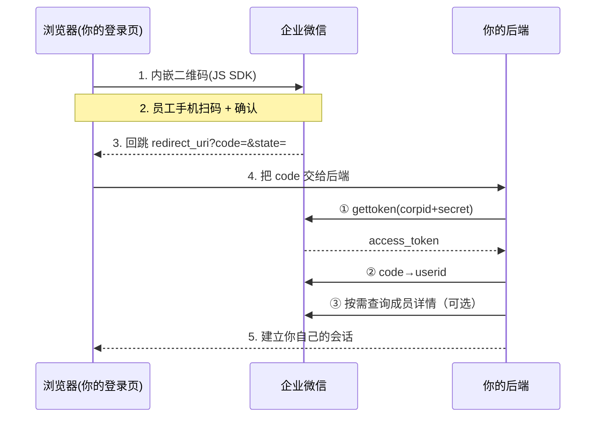

# 企业微信扫码登录(协议详解)

"用企业微信登录"让企业员工用企业微信扫码登进内部系统(OA、云桌面、后台等)。它本质是 **OAuth2 授权码模式(Authorization Code)的一个变体**:PC 网页上展示一个二维码,员工用手机企业微信 App 扫码并确认,浏览器拿到一个一次性的 `code`,再由**后端**用 `code` 换取该员工的身份。

> 面向 C 端个人用户的 [微信扫码登录](./wechat.md) 只需一步取用户信息、凭据体系也不同,别混用。想直接联调 / 看可点演示,见 [Mock 企业微信(使用)](../mock/wecom.md)。

> 本页讲登录落地；企业微信服务端 API、回调、权限、第三方应用与 SDK 的统一评价见 [企业微信 API / SDK 企业评价](./wecom-review.md)。

## 整体流程

第 1~3 步是在浏览器中取得 `code`，后续由后端完成应用凭据与成员身份查询。**JS SDK 只负责前端登录面板和返回 code**，不参与后端 token 或成员资料调用。

## JS SDK(wwLogin / @wecom/jssdk)到底在干什么

企业微信的登录 JS SDK 是一段**很薄的浏览器脚本**。你给它 `corpid`(appid)、`agentid`、`redirect_uri`、`state` 等参数,它在你指定的容器 `
` 里做这些事:

1. **拼出官方授权 URL**:按参数拼出企业微信的扫码登录地址(`login_type=CorpApp` 等),你不用手记参数格式;
2. **插入一个 `<iframe>`** 指向企业微信官方的扫码页(`open.work.weixin.qq.com/wwopen/sso/qrConnect` 或新版 `login.work.weixin.qq.com/wwlogin/sso/login`)——**二维码本身是企业微信域下的页面**,渲染、扫码状态轮询、过期刷新都由官方页处理;
3. **把最终的 `code` 交回你的页面**:员工扫码确认后,官方页会带着 `code` + `state` **跳转到你的 `redirect_uri`**(旧版 `wwLogin` 顶层窗口跳转;新版 `@wecom/jssdk` 还支持 `onLoginSuccess` 回调直接把 `code` 交给你,不整页跳转);
4. **顺带处理细节**:iframe 尺寸/样式、`redirect_type`(在 iframe 内跳还是顶层跳)、Chrome 142+ 的 `allow="local-network-access"` 等。

一句话:**SDK = "把官方二维码嵌进你的页面 + 把扫码结果 `code` 送回来"的封装**。它不接触你的 `secret`,也不参与后端换 token。

## 为什么要用 JS SDK(而不是自己拼链接 / 手写 iframe)

也可以完全不用 SDK——直接整页跳转到企业微信的扫码登录链接,扫完再回跳。但用 JS SDK 内嵌二维码有几个实打实的好处:

- **不跳出你的站点,体验连续**:整页跳转会把用户带到企业微信域,再跳回来;内嵌二维码让用户始终停在你的登录页,转化率和观感都更好。
- **回避跨域的坑**:二维码页在企业微信域、你的页面在你自己的域。如果你自己写 `<iframe>`,扫码状态的轮询/长连接、样式适配、拿 `code` 的跨域通信都得自己处理,而浏览器同源策略会挡住很多操作。SDK 内部用官方页完成轮询,扫码成功后**由官方页做顶层跳转(或回调)把 `code` 交回**,你根本不需要碰跨域通信。
- **拿到"桌面端快速登录"能力**:`@wecom/jssdk` 在满足条件时会自动展示**免扫码的桌面端快速登录面板**(见下)——自己拼 URL 拿不到这个。
- **协议对齐、官方维护**:企业微信改版(新版 host、`login_type`、面板逻辑、快速登录条件)由 SDK 跟进,你的代码不用动。

> 反过来说:如果你的场景是纯后端渲染、或就是想整页跳转,也**可以不用 SDK**,直接构造扫码登录链接跳转即可。SDK 只封装了"内嵌 + 体验 + 快速登录"这一层;**拿到 `code` 之后的后端流程完全一样**。

## 新旧 SDK:`wwLogin.js` vs `@wecom/jssdk`

| | 旧版 `wwLogin.js` | 新版 `@wecom/jssdk`(推荐) |
|---|---|---|
| 引入 | `<script>` 全局 `WwLogin` | `npm i @wecom/jssdk`,`import { createWWLoginPanel }` |
| 用法 | `new WwLogin({ id, appid, agentid, redirect_uri, state })` | `ww.createWWLoginPanel({ el, params:{ login_type, appid, agentid, redirect_uri, state }, onLoginSuccess })` |
| 桌面快速登录 | ❌ | ✅(桌面企业微信 > 3.1.23、HTTPS、用户在可见范围内时出现免扫码面板) |
| 拿 code | 顶层窗口回跳 | 回跳**或** `onLoginSuccess({ code })` 回调 |
| 维护 | 维护模式 | 官方持续演进,新功能只在这里 |

官方建议新接入用 `@wecom/jssdk`;两者最终都走同一套 qrConnect 与后端 `/cgi-bin/*` 接口。

## 拿到 `code` 之后：身份查询与可选资料查询

企业微信先用应用身份取得 token，再用扫码 `code` 确认成员；是否继续读取通讯录或授权用户详情，取决于业务所需字段和已获权限，并非所有登录都固定必须三步：

1. **`gettoken`**：用 `corpid` + 应用 `secret` 获取应用级 `access_token`。它代表应用而非扫码用户，必须仅在服务端按 `expires_in` 缓存；可访问范围仍受 API 权限、应用可见范围、可信 IP 和资源规则约束。
2. **`auth/getuserinfo`**：用 `access_token` + 扫码得到的 `code` 获取成员标识（如 `userid`，部分场景还会返回 `user_ticket`）。仅建立登录态时，取得并映射稳定成员标识后即可完成。
3. **按需补充资料**：需要通讯录字段时调用 `user/get`；需要本次授权用户的敏感详情时，按接口规则使用 `user_ticket` 调 `auth/getuserdetail`。可返回字段取决于权限，不能假设姓名、手机、邮箱一定存在。

这套模型把应用身份与本次扫码成员分开：应用 token 证明“哪个应用在调用”，一次性 `code` 表示“本次是哪个成员登录”。应用 token 泄露的影响范围等于该应用已获授权范围，不应写成必然可读取全企业通讯录，但仍需最小权限和后端安全存储。

（具体返回字段、`user_ticket` 适用条件和接口选择，以当前应用类型对应的企业微信官方文档为准。）

## 关键概念与参数

- **`corpid`**:企业 ID(在 SDK 里就是 `appid`)。
- **`agentid`**:自建应用 ID;决定"可见范围"和权限。
- **`secret`**:应用密钥,**只在后端**用于 `gettoken`,绝不进前端。
- **`userid`**:成员在企业通讯录内的唯一标识,是后续查详情、发消息的主键。
- **应用级 `access_token`**:见上,务必缓存。
- **可见范围**:员工不在该应用可见范围内,扫码会提示无权限。
- **`state`**:发起时生成、回跳时比对,防 CSRF。
- **`errcode` / `errmsg`**:企业微信所有接口统一的错误结构(`errcode:0` 为成功)。

## 安全要点

- **`code` 换 token 一律在后端**,`secret` 绝不出现在前端或仓库。
- **校验 `state`**,防 CSRF / 回跳伪造。
- **强制 HTTPS**,并正确配置应用的**可信域名 / 回调域名**(域名不一致会直接报"链接无法访问")。
- `code` 短时效、应视为**一次性**;`access_token` 有配额,注意缓存与刷新。

## 动手 / 联调

- 🔬 [扫码登录演示](../tools/wechat-login.html) —— 用 Mock 同款 SDK **真实可点**跑通扫码登录(切到「企业微信」标签)
- 🧪 [Mock 企业微信(使用)](../mock/wecom.md) —— 端点、接入代码与"上线只改 JS 与 URL"
- 📖 [OAuth 2.0 文档](../oauth2/) · [微信扫码登录](./wechat.md) 对比

## 参考来源

- [Web 登录组件 / 构造扫码登录链接 —— 企业微信开发者中心](https://developer.work.weixin.qq.com/document/path/98152)
- [获取访问凭证 gettoken —— 企业微信开发者中心](https://developer.work.weixin.qq.com/document/path/91039)
- [身份验证 auth/getuserinfo · 读取成员 user/get —— 企业微信开发者中心](https://developer.work.weixin.qq.com/document/path/91023)
