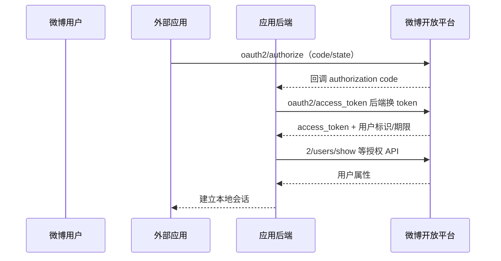

# 微博开放平台账号接入

本页讨论外部网站和应用通过微博开放平台取得用户授权并调用账号 API，不评价微博自身登录系统或企业 IAM。

::: tip 证据边界
官方 Wiki 提供 OAuth2 授权、token 与用户信息接口，但本次公开页面无法稳定取得完整参数说明。下文只记录可复核的主流程；未公开验证的 PKCE、Discovery、JWKS、token 吊销和回调策略不作正面推定。
:::

## 接入流程

接入方应在开放平台创建应用、登记回调、申请最小权限，由后端以 authorization code 换 token，再取得用户标识和必要属性。用户信息 API 返回的是微博平台主体，不是标准 OIDC UserInfo 响应。

## 兼容接入要求

- 无论文档是否把 `state` 标为必填，生产登录都必须生成、绑定和严格校验。
- 不采用 Implicit 作为新移动/Web 客户端方案；应要求授权码 + PKCE。平台不能满足时，用受控后端适配并限制权限。
- access token 和应用 Secret 只在后端；不得通过查询串传播到企业内部服务、日志或前端分析。
- 保存 `(weibo, app_key, uid)` 及绑定状态，不以昵称、手机号或邮箱作为账号主键。
- 授权撤销、token 到期、用户停用与应用下线都应关闭本地会话和数据访问。

## 不应作出的标准化声明

- 使用 `/oauth2/authorize` 和 `/oauth2/access_token` 不代表 OIDC；没有标准 `id_token`、issuer/audience 校验、Discovery 与 JWKS 证据时，应称为微博 OAuth 授权。
- 官方 SDK或示例只降低接入成本，不证明 PKCE、刷新重放检测、标准吊销或发送方约束 token。
- 微博用户 `uid` 不能与其它平台身份直接合并；跨平台账号合并必须重新验证用户控制权。

## 官方资料

- [微博 OAuth2 授权接口](https://open.weibo.com/wiki/Oauth2/authorize)
- [微博 OAuth2 access_token 接口](https://open.weibo.com/wiki/Oauth2/access_token)
- [微博用户信息接口](https://open.weibo.com/wiki/2/users/show)

> 核验日期：2026-07-27。由于公开页面可读取性有限，本页对未验证控制保守计分。
