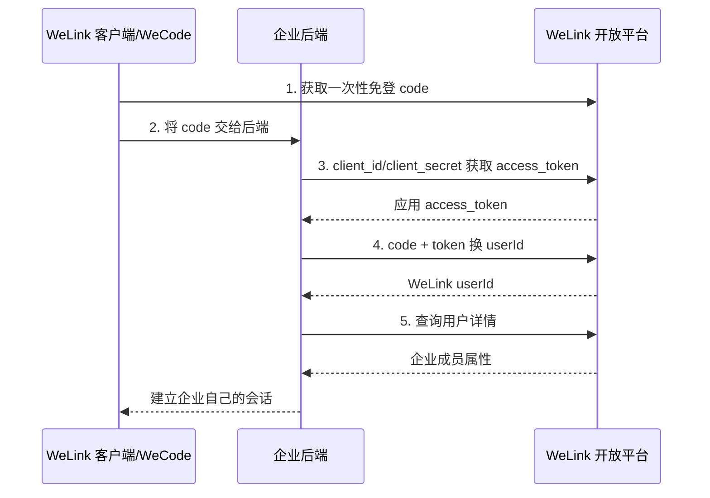

# 华为云 WeLink 外部系统接入

本页讨论企业应用、WeCode 小程序和服务端如何取得 WeLink 用户身份并调用开放 API。华为账号 Account Kit 是另一个产品，见 [华为账号接入](./huawei-account.md)；二者不合并评价。

::: tip 标准化边界
WeLink 文档把免登流程描述为 OAuth2，但外部系统实际接入的是 WeLink 专用 code、ticket、请求头和用户接口。除非目标能力同时公开标准授权服务器 metadata、OIDC claims 与验证规则，否则不能按完整 OIDC 接入。
:::

## 系统角色

| 场景 | WeLink 的角色 | 外部系统的角色 |
|---|---|---|
| WeCode 小程序免登 | 宿主客户端、授权服务、用户资源服务 | 小程序前端与企业后端 |
| 服务端开放 API | 应用 token 签发方与资源服务 | 企业服务端应用 |
| 企业消息与通讯录 | 企业协作平台 | 企业业务系统 |

## WeCode 免登流程

实施顺序：

1. 在 WeLink 开放平台创建应用、配置可见范围与回调/安全参数，取得 `client_id`、`client_secret`。
2. 前端只负责获取短时效 code，不持有应用 Secret。
3. 后端向 `POST https://open.welink.huaweicloud.com/api/auth/v2/tickets` 提交 JSON 凭据，取得应用 `access_token` 和过期时间。
4. 后端用 code 取得 `userId`，再按需查询用户详情；不得仅用显示名或手机号匹配。
5. 后端建立本地会话，并按应用权限调用通讯录、消息等 API。

## API 调用约定

WeLink 示例使用专用 `x-wlk-Authorization: access_token` 请求头，返回体采用平台自己的 `code`、`message` 和数据结构。接入层应把它转换为企业内部统一的 HTTP/错误模型，但保留原始请求 ID 便于审计。

应特别区分：

- 应用 `access_token` 表示应用调用资格，不等于登录用户身份声明。
- 免登 `code` 是一次性交互凭据，不应写入 URL 日志、前端持久化或重复兑换。
- `userId` 是 WeLink 租户内主体标识。本地建议使用 `(welink, tenant_or_org, userId)` 作为复合键。

## 接入方最低实现

- Secret 只存放在后端密钥管理系统，按应用和环境分离，并准备轮换。
- code 兑换和本地会话签发绑定一次性 nonce、设备/会话上下文和短超时。
- API token 缓存按实际过期时间提前刷新，失败时不能退化为长期静态凭据。
- 通讯录同步实现停用、离职、部门变更和删除的幂等处理；私有通讯录 API 不应对外宣称为 SCIM。
- 在身份网关中单独维护 WeLink 适配器；华为账号 Account Kit、华为云 IAM 与 WeLink 不共享主体命名或评分。

## 官方资料

- [WeLink WeCode 快速入门与免登步骤](https://support.huaweicloud.com/devg-welink/start-05.html)
- [获取应用 access_token](https://support.huaweicloud.com/devg-welink/start-09.html)
- [调用 WeLink 开放 API](https://support.huaweicloud.com/devg-welink/start-21.html)
- [WeLink 开放平台开发指南 PDF](https://support.huaweicloud.com/devg-welink/devg-welink-pdf.pdf)

> 核验日期：2026-07-27。未从公开资料验证 OIDC Discovery、`id_token`、JWKS、PKCE 或 SCIM 服务端。
