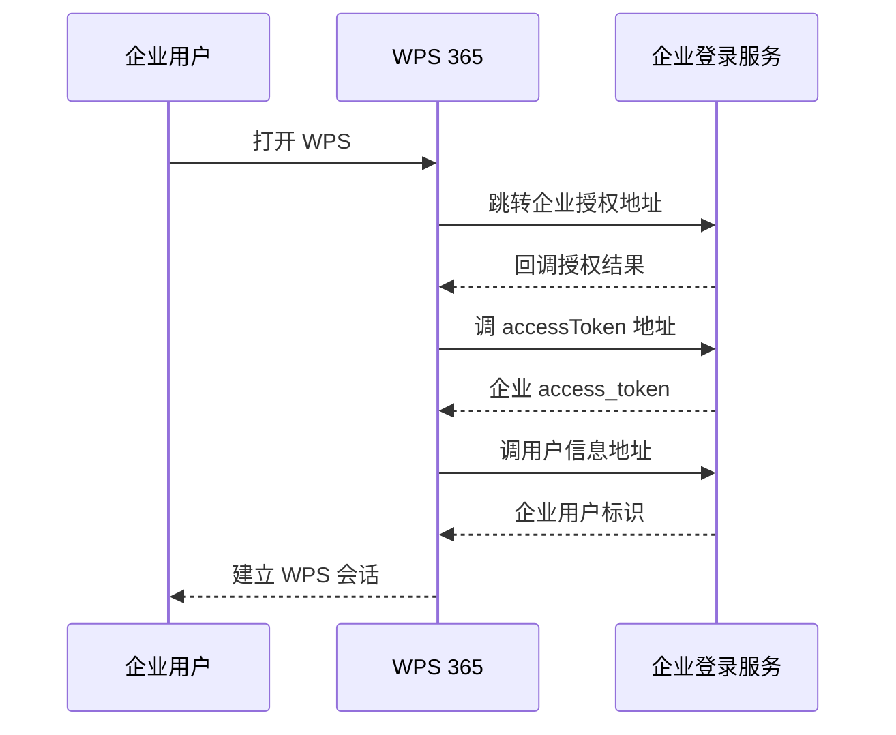

# WPS 365 外部系统接入

本页只讨论 WPS 365 与外部系统之间的身份、授权、OpenAPI 和回调接入，不评价办公功能本身。统一评价见 [WPS 365 标准安全评价](./wps-review.md)。

::: tip 标准化边界
WPS 365 同时扮演企业应用和开放平台：既可把企业现有登录接入 WPS，也可向外部应用签发用户或应用 `access_token`。两种方向必须分开建模；接口中出现 OAuth2 参数，不等于已经实现完整 OIDC。
:::

## 系统角色

| 方向 | WPS 365 的角色 | 外部系统的角色 | 接入性质 |
|---|---|---|---|
| 企业用户登录 WPS | 依赖企业身份源的 SP | 企业登录服务 | WPS 约定的授权、换 token、取用户三端点 |
| 外部应用调用 WPS 365 | OAuth 式授权服务与资源服务 | Web/服务端应用 | 用户授权码或应用凭据换取平台 token |
| 机器人与事件 | Webhook 发送方/接收方 | 企业业务系统 | WPS 私有签名和消息格式 |

## 方向一：让企业账号登录 WPS

管理员在 WPS 365 后台配置企业系统的三个地址：授权地址、`accessToken` 地址和用户信息地址。登录时 WPS 将浏览器导向企业授权页，再由 WPS 后端用授权结果获取用户信息并建立 WPS 会话。

实施时应注意：

- 这是 WPS 定义的三端点契约，不应标注为 OIDC；公开流程未要求 Discovery、`id_token`、JWKS、`nonce` 等 OIDC 要素。
- 示例中存在以查询参数传递 `client_secret` 的形态。企业实现应避免凭据进入 URL、代理日志和监控标签，并要求 WPS 支持请求体或更强客户端认证。
- 企业用户主键必须稳定且不可复用；邮箱、手机号只能作为属性，不宜作为长期主键。

## 方向二：外部应用调用 WPS 365

用户授权流程采用授权码式交互：

1. 应用把用户导向 `https://openapi.wps.cn/oauth2/auth`，携带 `client_id`、回调地址、`scope` 和 `state`。
2. WPS 回调应用后端并返回一次性 `code`；官方说明其有效期为 10 分钟。
3. 后端向 token 端点提交 `code`、`client_id` 和 `client_secret`，取得用户 `access_token` 与 `refresh_token`。
4. 后端用 Bearer token 调用 OpenAPI；部分接口还要求 `X-Kso-Authorization` 等请求签名头。
5. 刷新时保存新 `refresh_token`；官方说明刷新令牌会轮换，但总有效期继承首次授权的期限。

应用身份调用则先取得应用 `access_token`，不应把应用 token 与用户授权 token 混用。权限还同时受 `scope`、应用可见范围、字段权限和数据权限约束。

## 标识、签名和生命周期

- `user_id` 具有企业/服务商作用域；同一个人在不同企业中的标识可能不同。本地应保存 `(platform, enterprise_id, user_id)`。
- WPS OpenAPI 使用 Bearer token，并可能叠加 KSO/WPS 系列签名；接入方要锁定算法版本、校验时间并保护签名密钥。
- Webhook 自定义签名公开方案包含 `Content-MD5`、SHA-1 拼接和约 15 分钟时间窗。它不应承载直接修改账号、权限或资金的高风险动作。
- 注销、成员离职、授权撤销后，应同步清理本地 token、会话和映射；不能只等待最长 365 天的刷新期限自然结束。

## 接入方最低实现

- 回调必须校验 `state`，授权码只在后端兑换；凭据不得进入前端或日志。
- token 按企业、应用、用户三层隔离加密存储，刷新更新采用并发锁。
- 不把 WPS `access_token` 当成本系统身份令牌；由本地身份网关完成主体映射并签发内部会话。
- Webhook 校验原始请求体、时间戳和签名，并用事件 ID/内容摘要做幂等与重放缓存。

## 官方资料

- [WPS 365 开放平台接入概览](https://open.wps.cn/documents/app-integration-dev/guide/overview)
- [WPS SSO 登录](https://open.wps.cn/documents/app-integration-dev/collaboration-middleware/server/SSO-login)
- [用户授权流程](https://open.wps.cn/documents/app-integration-dev/wps365/server/certification-authorization/user-authorization/flow)
- [获取用户 access_token](https://open.wps.cn/documents/app-integration-dev/wps365/server/certification-authorization/get-token/get-user-access-token)
- [权限说明](https://open.wps.cn/documents/app-integration-dev/guide/permission)
- [用户标识说明](https://open.wps.cn/documents/app-integration-dev/guide/user)
- [请求签名工具](https://open.wps.cn/documents/app-integration-dev/guide/dev-tool-and-source/sign-tool)
- [Webhook 机器人](https://open.wps.cn/documents/app-integration-dev/guide/robot/webhook)

> 核验日期：2026-07-27。端点、字段和控制台入口应以目标租户当前页面为准。
