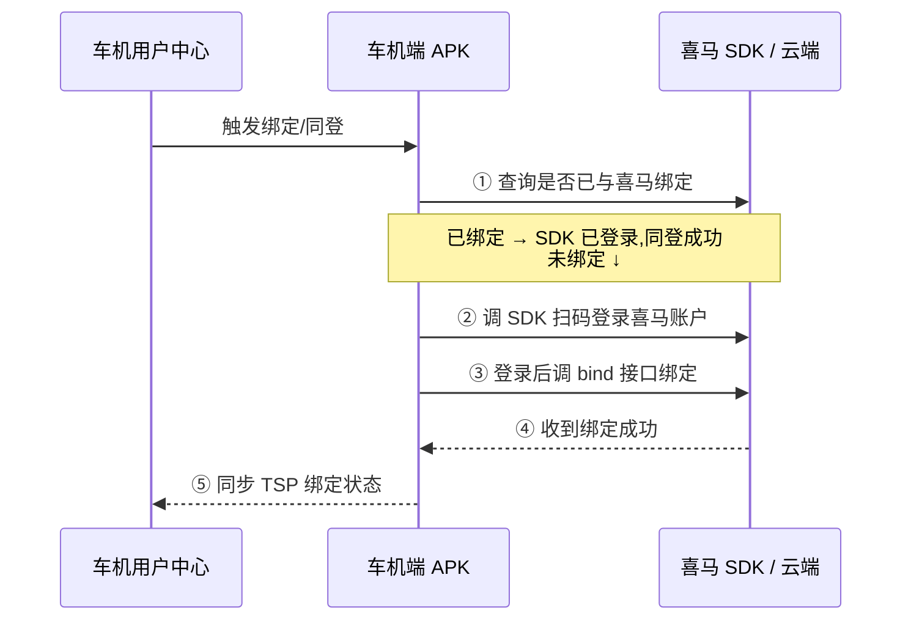

# 喜马拉雅车载 SDK 账户互通对接实现

本页讲**怎么落地对接**喜马拉雅车载 SDK 的「账户互通」(账号绑定 / 同登同退)。它与标准 OIDC/OAuth2 的差距、风险与改造建议,单独成文:[喜马拉雅账户互通:标准化与安全评价](./ximalaya-review.md)。

::: tip 标准化边界
本页说明如何兼容平台当前协议，不表示本站建议继续扩展私有实现。新系统应优先要求标准 OIDC/OAuth/SAML/SCIM；必须接入私有流程时，应将它限制在身份网关适配器内。评价基线见[统一协议安全评价方法](./methodology.md)。
:::

> 依据喜马拉雅《车载 SDK 文档》→「账户」→「账户互通」(最低版本 **1.0.6.0**)。

## 这是什么

车机端 / TSP 服务端接入喜马拉雅 SDK,用**车机自己的用户体系**打通喜马拉雅账户:

- **绑定 / 同登**:车机用户一键登录到喜马拉雅账户;
- **解绑 / 同退**:车机退出时同步退出喜马拉雅。

核心是:通过车机的用户信息,在喜马拉雅侧完成双方账户绑定,从而用车机端用户信息登录喜马账户。

## 准备工作(向喜马申请)

1. **`thirdAppId`** —— 账户互通的客户标识。申请邮箱 `rui5.wang@ximalaya.com`:
   - 同品牌多车型要**互通** → 各车型共用同一个 `thirdAppId`;
   - 车型间账号**独立** → 申请各自独立的 `thirdAppId`(可分别提供测试 / 正式的验证接口 URL)。
2. **第三方账户信息验证接口(公网可访问)** —— 由**你方**实现,喜马云端回调它校验用户合法性并拿回第三方 `uid` 用于绑定。见下文[第三方账户信息验证接口](#第三方账户信息验证接口你方实现)。

## 接入流程

### 绑定 / 同登



1. 车机已登录状态下,由车机用户中心触发,跳到车机端应用界面,先**查询是否已与喜马绑定**;
2. 已绑定 → 喜马 SDK 已处于登录态,**同登成功**;
3. 未绑定 → 车机 APK 调用喜马 SDK 的**扫码登录**能力登录喜马账户(接口见喜马 SDK 文档「用户 → 二维码登录」);
4. 扫码登录后,车机 APK 调 **`bindThirdAccount`** 绑定;
5. 收到绑定成功通知后,车机 APK 同步 TSP 服务端。

### 解绑 / 同退

1. **同退**:直接调喜马 SDK 的**退出登录**接口即可;
2. **解绑**:带第三方账户信息调 **`unbindThirdAccount`**,喜马云端完成第三方账户信息验证后解绑;
3. 解绑后,车机 APK 同步解绑关系到 TSP 服务端。

## SDK 端接口(Android · `IXmCarAdvanceAPI`)

四个方法签名一致,均为 `(String thirdAppId, String body, ResultReceiver callback)`:

| 方法 | 作用 |
|---|---|
| `loginByThird(thirdAppId, body, cb)` | 用第三方账户信息登录(已绑定则成功;未绑定失败,需走扫码流程) |
| `bindThirdAccount(thirdAppId, body, cb)` | 账户绑定 |
| `unbindThirdAccount(thirdAppId, body, cb)` | 账户解绑 |
| `getThirdAccountBoundState(thirdAppId, body, cb)` | 查询第三方账号绑定状态 |

**入参**

| 字段 | 说明 |
|---|---|
| `thirdAppId` | 账户互通客户标识,向喜马申请 |
| `body` | 调用第三方账号接口的入参报文(**JSON**),喜马回调你方验证接口时**原样透传** |

**回调返回值**(`ResultReceiver` 的 Bundle)

| KEY | 类型 | 说明 |
|---|---|---|
| `XmConstants.EXTRA_ERR_CODE` | Int | 成功 `CODE_SUCCESS`;失败 `CODE_REMOTE_ERROR`(`loginByThird`/`bind` 中"未绑定"也返回 `CODE_REMOTE_ERROR`) |
| `XmConstants.EXTRA_ERR_MSG` | String | 异常原因 |
| `XmConstants.EXTRA_DATA` | Bundle | 详细信息(含下表);`getThirdAccountBoundState` 操作成功时无论是否绑定都会返回 |

`EXTRA_DATA` Bundle 内字段:

| 字段 | 说明 |
|---|---|
| `thirdUid` | 第三方 UID(查询接口下未绑定为 null) |
| `ximaUid` | 喜马拉雅 UID(查询接口下未绑定为 null) |

## 第三方账户信息验证接口(你方实现)

喜马云端会用绑定/解绑等接口里传入的 `body` 回调此接口来校验用户。

- **方法**:`POST`,`application/json`
- **URL**:`http(s)://合作方域名/合作方path`
- **入参**:即各 SDK 接口传入的 `body`(喜马原样透传)
- **返回**:

成功:

```json
{ "code": 200, "third_uid": "xxxxx" }
```

失败:

```json
{ "code": 500, "msg": "该用户不存在", "third_uid": null }
```

| 返回字段 | 类型 | 必须 | 说明 |
|---|---|:--:|---|
| `code` | int | 是 | 成功 200,其他 500 |
| `third_uid` | String | 否 | 第三方 uid(或 openID);报错 / 不存在可不填 |
| `msg` | String | 否 | 报错原因,`code=500` 时需要 |

::: warning 安全提示
现有合作方车载 SDK 文档片段未说明平台侧回调签名、mTLS 或固定证书机制，因此不能假设请求来源已被验证。项目应要求厂商明确当前版本的来源认证、时间戳、重试和重放规则；如没有平台签名，合作方至少应在自身短期票据中加入 audience、过期时间和防重放信息，并强制 HTTPS。详见 [喜马拉雅标准安全评价](./ximalaya-review.md)。
:::

## 参考

- [喜马拉雅标准安全评价](./ximalaya-review.md)
- [OAuth 2.0 文档](../oauth2/) · [OpenID Connect 文档](../oidc/)
- 喜马拉雅车载 SDK 官方文档(账户 → 账户互通)
