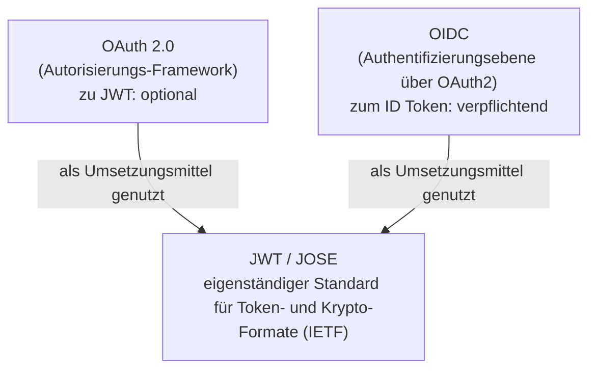

# JWT-Überblick

**JWT (JSON Web Token, RFC 7519) ist ein universelles, kontextunabhängiges Tokenformat**: Es verpackt eine Menge von Aussagen (Claims) in einen kompakten, signier-/verschlüsselbaren und URL-sicheren String. Es kümmert sich selbst **nicht darum, wofür Sie es verwenden** — Authentifizierung, Autorisierung oder die Weitergabe von Kontext zwischen Services, alles ist möglich.

## Die "Herkunft" von JWT: Es gehört weder zu OAuth 2.0 noch zu OIDC

Dies ist das häufigste Missverständnis. JWT ist ein von der IETF definierter **eigenständiger Standard** und gehört zu einer größeren kryptografischen Spezifikationsfamilie, **JOSE (JSON Object Signing and Encryption)**:

| Spezifikation | Nummer | Zweck |
|------|------|------|
| **JWS** | RFC 7515 | JSON Web Signature —— Signatur (Manipulationsschutz) |
| **JWE** | RFC 7516 | JSON Web Encryption —— Verschlüsselung (Schutz vor Offenlegung) |
| **JWK** | RFC 7517 | JSON Web Key —— JSON-Darstellung von Schlüsseln |
| **JWA** | RFC 7518 | JSON Web Algorithms —— die für die obigen Spezifikationen verfügbaren Algorithmen (`RS256`, `ES256`, `A256GCM` usw.) |
| **JWT** | RFC 7519 | JSON Web Token —— ein Token, das Claims über JWS/JWE transportiert |

OAuth 2.0 und OIDC haben dieses Format nur **ausgeliehen**, sie "besitzen" es nicht:



- **OAuth 2.0 (RFC 6749)**: **schreibt kein** Tokenformat vor. Ein access token kann ein zufälliger String oder ein JWT sein (für die JWT-Variante gibt es das eigene [RFC 9068](https://www.rfc-editor.org/rfc/rfc9068)). JWT ist für OAuth2 eine optionale Umsetzungsentscheidung.
- **OIDC**: die einzige Stelle mit "JWT verpflichtend" —— **das ID Token muss ein JWT sein**. Das ist auch eine der zentralen Neuerungen, die OIDC gegenüber OAuth2 einführt.

::: tip Merksatz
**JWT ist ein universelles Format, das von OAuth2 / OIDC ausgeliehen wird. Für OAuth2 ist es "optional", für OIDC (nur das ID Token) "verpflichtend".** Sie können JWT problemlos auch in Szenarien einsetzen, die mit beiden nichts zu tun haben (Signieren von Daten zwischen Services, Weitergabe von Kontext über ein API-Gateway).
:::

## JWS und JWE: Signatur ≠ Verschlüsselung

Was im Alltag "JWT" genannt wird, ist in den allermeisten Fällen ein **JWS** (signiert) und besteht aus drei Segmenten:

```
Header.Payload.Signature
```

- Header und Payload sind nur **Base64URL-codiert**, **nicht verschlüsselt** —— jeder kann sie decodieren und den Inhalt sehen. JWS garantiert die **Integrität** (der Inhalt wurde nicht manipuliert), nicht die **Vertraulichkeit**.
- Daher: **Legen Sie keine sensiblen Informationen wie Passwörter oder Schlüssel in den Payload eines JWS.** Wenn Vertraulichkeit nötig ist, verwenden Sie **JWE** (fünfteilige Struktur, deren Inhalt tatsächlich verschlüsselt ist).

Die allermeisten Authentifizierungs-/Autorisierungsszenarien (ID Token, access token) verwenden JWS. Wenn in dieser Dokumentation nicht ausdrücklich anders angegeben, bezeichnet "JWT" stets die JWS-Form.

## Die drei Segmente auf einen Blick

Am Beispiel eines mit `RS256` signierten JWT:

```
eyJhbGciOiJSUzI1NiIsInR5cCI6IkpXVCIsImtpZCI6IjIwMjQtMDEifQ   ← Header
.eyJpc3MiOiJodHRwczovL29wLmV4YW1wbGUuY29tIiwic3ViIjoiMTIzNCJ9  ← Payload
.NHVaYe26MbtOYhSKkoKYdFVomg4i8ZJd8_-RU8VNbftc4TSMb4b...          ← Signature
```

| Segment | Inhalt | Erklärung |
|----|------|------|
| **Header** | `{"alg":"RS256","typ":"JWT","kid":"2024-01"}` | Signaturalgorithmus `alg`, Typ `typ`, Schlüsselbezeichner `kid` |
| **Payload** | `{"iss":...,"sub":...,"exp":...}` | Menge von Claims (siehe [Referenz](./reference.md)) |
| **Signature** | Signatur über `base64url(header) + "." + base64url(payload)` | berechnet mit dem in `alg` des Headers angegebenen Algorithmus, dient dem Manipulationsschutz |

::: warning Decodieren ≠ Verifizieren
Die ersten beiden Segmente eines JWT sind nur codiert, jeder kann sie lesen. Erst nachdem die **Signaturprüfung erfolgreich** war und Claims wie `iss`/`aud`/`exp` validiert wurden, ist der Inhalt vertrauenswürdig. Details siehe [Kernkonzepte · Ablauf der Signaturprüfung](./concepts.md#ablauf-der-signaturprufung). Mit dem [JWT-Parser](../tools/jwt.md) dieser Website können Sie live decodieren und die Signatur prüfen.
:::

## Navigation dieses Kapitels

- [Kernkonzepte](./concepts.md) —— die drei Segmente im Detail, Signaturalgorithmen, Ablauf der Signaturprüfung und häufige Fallstricke; welche der drei OIDC-Tokens (ID / Access / Refresh) JWTs sind; wie man erkennt, ob ein Refresh Token ungültig ist
- [Parameter & Claims – Referenz](./reference.md) —— Schnellübersicht der registrierten Claims, `alg`-Werttabelle, Base64URL-Erläuterung, Index verwandter RFCs

## Verwandte Tools

- [JWT-Parser](../tools/jwt.md) —— drei Segmente decodieren, Zeitprüfung, Signaturprüfung
- [JWT-Signaturgenerator](../tools/jwt-sign.md) —— Test-Tokens erstellen
- [JWK-Generierung](../tools/jwk.md) / [Base64URL-Codierung/Decodierung](../tools/base64url.md)
