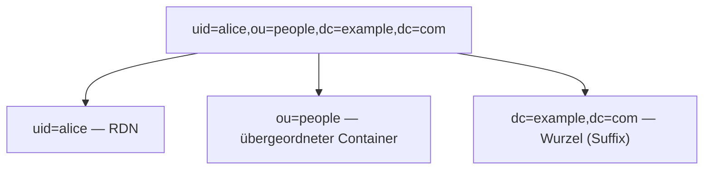

# LDAP-Kernkonzepte

## Einträge, DN und RDN

Jeder Knoten im Verzeichnis heißt **Eintrag (entry)** und besteht aus mehreren **Attributen**. Jeder Eintrag hat einen eindeutigen **DN (Distinguished Name)**, der den Pfad vom Eintrag zur Baumwurzel darstellt:



- **RDN (Relative Distinguished Name)**: Der linke Teil des DN, z.B. `uid=alice`, ist unter dem gleichen übergeordneten Knoten eindeutig.
- DN verläuft von links nach rechts vom Spezifischen zur Wurzel; `dc=example,dc=com` ist normalerweise das **Suffix / Base DN** des Verzeichnisses.
- **DC**=domainComponent, **OU**=organizationalUnit, **CN**=commonName, **UID**=user id – all dies sind Attributtypen, die in den DN eingefügt werden.

## Attribute

Die Daten eines Eintrags sind **Attribut-Wert**-Paare, wobei ein Attribut **mehrwertig** sein kann (wie `objectClass`, `member`, `mail`):

```
dn: uid=alice,ou=people,dc=example,dc=com
objectClass: inetOrgPerson
cn: Alice Zhang
sn: Zhang
mail: alice@example.com
```

Attributnamen sind **Groß-/Kleinschreibung-unempfindlich**; ob die Wertevergleiche groß-/kleinschreibungsabhängig sind und wie Vergleiche erfolgen, wird durch die **Matching Rule** des Attributs bestimmt (die meisten wie `cn` sind unempfindlich gegenüber Groß-/Kleinschreibung).

## objectClass und Schema

- Jeder Eintrag muss eine oder mehrere **objectClass** haben, die festlegt, welche Attribute dieser Eintrag **MUSS (MUST)** und **KANN (MAY)** haben.
- objectClasses werden in strukturelle (wie `inetOrgPerson`) und Hilfsklassen (wie `posixAccount`) eingeteilt.
- **Schema** definiert alle Attributtypen und objectClasses; herstellerübergreifende Standard-Schemas (inetOrgPerson, groupOfNames usw.) garantieren Interoperabilität.

## LDIF

**LDIF**(LDAP Data Interchange Format) ist eine Textdarstellung von Verzeichnisdaten, die für Import und Export verwendet wird:

```ldif
dn: uid=alice,ou=people,dc=example,dc=com
objectClass: inetOrgPerson
uid: alice
cn: Alice Zhang
sn: Zhang
mail: alice@example.com
```

## Operationen: bind und search

- **bind**: Sitzung etablieren und **authentifizieren**. Anonymer bind (ohne Anmeldedaten), einfacher bind (DN + Kennwort), SASL (z.B. GSSAPI/Kerberos). Ein erfolgreicher einfacher bind bedeutet, dass das Kennwort korrekt ist.
- **search**: Der wichtigste Lesevorgangstyp, bestimmt durch drei Elemente, was zurückgegeben wird:
  - **base DN**: Von welchem Eintrag ausgehen;
  - **scope (Suchbereich)**: `base` (nur dieser Eintrag), `one` (nur direkte Unterordnungen), `sub` (dieser Eintrag und alle Nachfolger);
  - **filter (Filtern)**: RFC 4515-Ausdruck, z.B. `(&(objectClass=person)(uid=alice))`.
- Andere: `compare` (ein Attribut vergleichen), `add`/`modify`/`delete`/`modifyDN` (Schreibvorgänge).

## Gruppen und Mitgliedschaftsbeziehungen

Zwei häufige Modelle:

- **groupOfNames / groupOfUniqueNames**: Der Gruppeneintrag listet Mitglieder mit `member` auf (z.B. hat `cn=admins` `member: uid=alice,...`).
- **memberOf**(Rückwärtsattribut in AD und einigen Verzeichnissen): Direkt auf dem Benutzereintrag angebracht, ermöglicht Filter wie `(memberOf=cn=admins,...)`.

## Sichere Übertragung

- **LDAP**: 389/tcp im Klartext (kann mit **StartTLS** auf demselben Port zu TLS aktualisiert werden).
- **LDAPS**: 636/tcp, bereits mit TLS verschlüsselt. In der Produktion muss TLS verwendet werden, da sonst das Kennwort beim einfachen bind im Klartext übertragen wird.

Terminologie und Operatoren schnell nachschlagen unter [Referenz](./reference.md); diese zu einem Login zusammenfassen unter [Typische Workflows](./flows.md).
