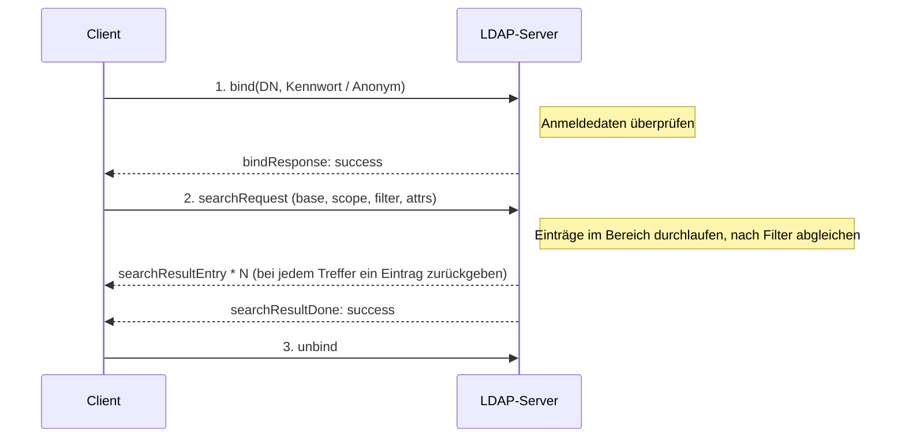
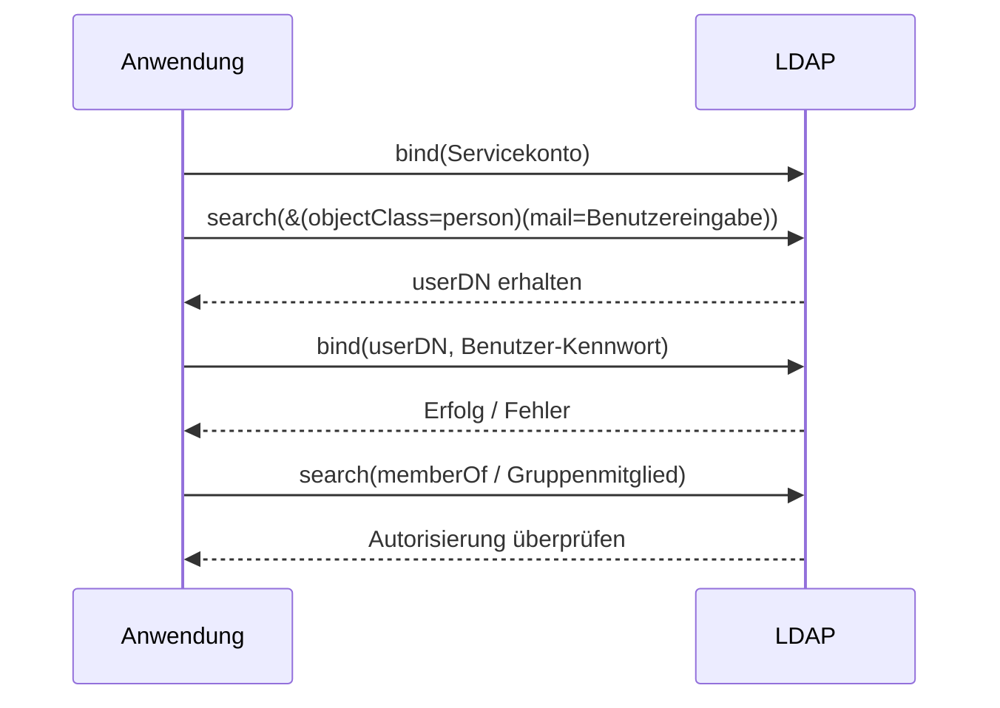
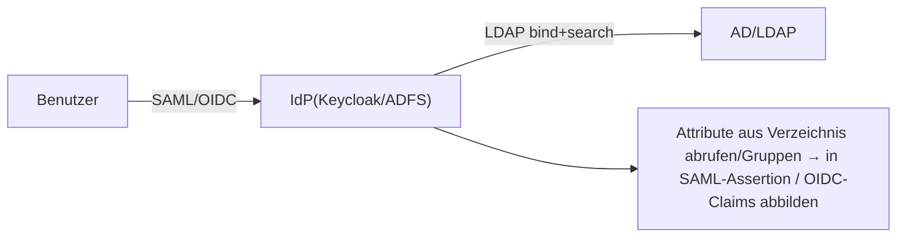

# LDAP Typische Workflows

## Suche: bind → search → Ergebnisse



Demonstration des gleichen Prozesses mit `ldapsearch`:

```bash
ldapsearch -H ldaps://ldap.example.com \
  -D "cn=svc-reader,ou=apps,dc=example,dc=com" -w '****' \
  -b "ou=people,dc=example,dc=com" -s sub \
  "(&(objectClass=person)(mail=alice@example.com))" cn mail
```

## Benutzerauthentifizierung: Zwei Ansätze

### 1) Direkter bind (simple bind)

Die Anwendung führt direkt einen bind mit dem **DN des Benutzers + vom Benutzer eingegebenes Kennwort** durch. Ein erfolgreicher bind bedeutet Authentifizierung bestanden:

1. Falls die DN-Vorlage des Benutzers bekannt ist (z.B. `uid=<Eingabe>,ou=people,dc=example,dc=com`), direkt die DN zusammenstellen;
2. `bind(userDN, password)`;
3. Erfolg = Kennwort ist korrekt; Fehler (`invalidCredentials`)= Login ablehnen.

Einfach, erfordert aber, dass die Anwendung den DN aus dem Benutzernamen ableiten kann.

### 2) search + bind (am häufigsten)

Der Benutzername ist nicht unbedingt gleich dem RDN (es könnte sein, dass man sich mit E-Mail oder sAMAccountName anmeldet), daher:

1. Die Anwendung führt zuerst einen bind mit einem **Servicekonto** durch (Nur-Lese-Berechtigung);
2. **Search** nach dem Login-Namen, um den Benutzereintrag zu finden, seinen echten DN zu erhalten, z.B. `(|(uid=<Eingabe>)(mail=<Eingabe>))`;
3. Mit **dem gefundenen DN + Benutzer-Kennwort** einen zweiten bind durchführen, um das Kennwort zu überprüfen;
4. (Optional) Erneut search durchführen / `memberOf` lesen, um die Gruppenmitgliedschaft für die Autorisierung zu überprüfen.



## Verbindung mit Verbund-Login

In Unternehmen dient LDAP/AD häufig als Backend-Verzeichnis des IdP:



Mit anderen Worten, das Frontend nutzt [SAML](../saml/flows.md) / [OIDC](../oidc/flows.md), aber im Hintergrund führt LDAP bind/search Authentifizierung und Datenbeschaffung durch.

Möchten Sie praktisch ausprobieren? Verwenden Sie den [Filtergenerator](../tools/ldap-filter.md) mit dem [Mock LDAP](../mock/ldap.md)-Beispielverzeichnis.
