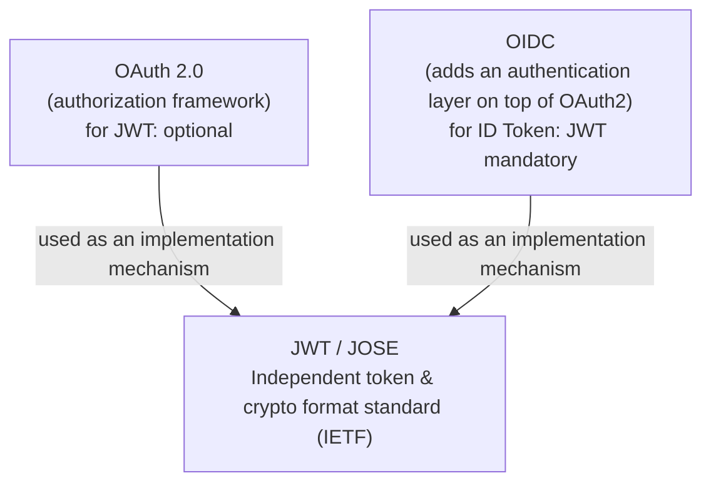

# JWT Overview

**JWT (JSON Web Token, RFC 7519) is a general-purpose, scenario-agnostic token format**: it packs a set of claims into a compact string that can be signed/encrypted and safely placed in a URL. It **doesn't care what you use it for**—authentication, authorization, or passing context between services all work.

## Where JWT Belongs: It Is Owned by Neither OAuth 2.0 Nor OIDC

This is the most common misconception. JWT is an **independent standard** defined by the IETF, belonging to a larger cryptographic specification family, **JOSE (JSON Object Signing and Encryption)**:

| Specification | Number | Purpose |
|------|------|------|
| **JWS** | RFC 7515 | JSON Web Signature — signing (tamper protection) |
| **JWE** | RFC 7516 | JSON Web Encryption — encryption (confidentiality) |
| **JWK** | RFC 7517 | JSON Web Key — JSON representation of a key |
| **JWA** | RFC 7518 | JSON Web Algorithms — the algorithms available to the above specs (`RS256`, `ES256`, `A256GCM`, etc.) |
| **JWT** | RFC 7519 | JSON Web Token — a token carrying claims via JWS/JWE |

OAuth 2.0 and OIDC merely **borrow** the JWT format; they do not "own" it:



- **OAuth 2.0 (RFC 6749)**: **does not specify** a token format. An access token can be a random string or a JWT (there is a dedicated profile, [RFC 9068](https://www.rfc-editor.org/rfc/rfc9068), for JWT access tokens). JWT is an optional implementation choice for OAuth2.
- **OIDC**: the only place where JWT is **mandatory**—the **ID Token must be a JWT**. This is also one of the core new things OIDC introduces on top of OAuth2.

::: tip In one sentence
**JWT is a general-purpose format borrowed by OAuth2 / OIDC. It is "optional" for OAuth2 and "mandatory" for OIDC (ID Token only).** You can perfectly well use JWT in scenarios unrelated to either (signing data between services, propagating context through an API gateway).
:::

## JWS vs. JWE: Signing ≠ Encryption

The "JWT" people talk about day to day is almost always a **JWS** (the signed form), which has three segments:

```
Header.Payload.Signature
```

- The Header and Payload are only **Base64URL-encoded**, **not encrypted**—anyone can decode and read them. What JWS guarantees is **integrity** (the content hasn't been tampered with), not **confidentiality**.
- Therefore: **do not put sensitive information such as passwords or keys in a JWS payload**. When you need confidentiality, use **JWE** (a five-segment structure whose content is genuinely encrypted).

The vast majority of authentication/authorization scenarios (ID Token, access token) use JWS. Unless stated otherwise, "JWT" in this site's documentation refers to the JWS form.

## The Three-Segment Structure at a Glance

Take a JWT signed with `RS256` as an example:

```
eyJhbGciOiJSUzI1NiIsInR5cCI6IkpXVCIsImtpZCI6IjIwMjQtMDEifQ   ← Header
.eyJpc3MiOiJodHRwczovL29wLmV4YW1wbGUuY29tIiwic3ViIjoiMTIzNCJ9  ← Payload
.NHVaYe26MbtOYhSKkoKYdFVomg4i8ZJd8_-RU8VNbftc4TSMb4b...          ← Signature
```

| Segment | Content | Description |
|----|------|------|
| **Header** | `{"alg":"RS256","typ":"JWT","kid":"2024-01"}` | Signature algorithm `alg`, type `typ`, key ID `kid` |
| **Payload** | `{"iss":...,"sub":...,"exp":...}` | The set of claims (see [Reference](./reference.md)) |
| **Signature** | The signature over `base64url(header) + "." + base64url(payload)` | Computed with the algorithm named by `alg` in the Header; prevents tampering |

::: warning Decoding ≠ Verifying
The first two segments of a JWT are only encoded—anyone can decode them. The content inside is trustworthy only after **signature verification passes** and claims such as `iss`/`aud`/`exp` check out. See [Core Concepts · Signature Verification Process](./concepts.md#signature-verification-process). You can decode and verify live with this site's [JWT Decoder](../tools/jwt.md).
:::

## Chapter Navigation

- [Core Concepts](./concepts.md) — the three-segment structure in detail, signature algorithms, the verification process and common pitfalls; which of the three OIDC tokens (ID / Access / Refresh) are JWTs; how to tell whether a Refresh Token is still valid
- [Parameters & Claims Reference](./reference.md) — a quick reference for registered claims, the `alg` values table, an explanation of Base64URL, and an index of related RFCs

## Related Tools

- [JWT Decoder](../tools/jwt.md) — decode the three segments, validate time claims, verify the signature
- [JWT Signer](../tools/jwt-sign.md) — build test tokens
- [JWK Generator](../tools/jwk.md) / [Base64URL Encoder/Decoder](../tools/base64url.md)
