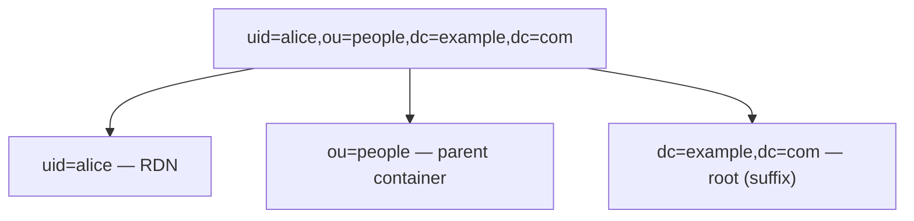

# LDAP Core Concepts

## Entries, DN, and RDN

Each node in the directory is called an **entry**, composed of several **attributes**. Each entry has a unique **DN (Distinguished Name)**, which is the path from the entry to the tree root:



- **RDN (Relative Distinguished Name)**: the leftmost segment of the DN, such as `uid=alice`, which is unique within its parent node.
- DN is ordered from left (specific) to right (root); `dc=example,dc=com` is typically the directory's **suffix / base DN**.
- **DC** = domainComponent, **OU** = organizationalUnit, **CN** = commonName, **UID** = user id — these are all attribute types that form part of the DN.

## Attributes

An entry's data consists of **attribute-value** pairs; an attribute can be **multivalued** (such as `objectClass`, `member`, `mail`):

```
dn: uid=alice,ou=people,dc=example,dc=com
objectClass: inetOrgPerson
cn: Alice Zhang
sn: Zhang
mail: alice@example.com
```

Attribute names are **case-insensitive**; whether value comparison is case-sensitive and how comparison is performed is determined by the attribute's **matching rule** (most, such as `cn`, are case-insensitive).

## objectClass and Schema

- Each entry must have one or more **objectClass**, which determines what attributes the entry **MUST** and **MAY** have.
- objectClasses can be structural (such as `inetOrgPerson`) or auxiliary (such as `posixAccount`).
- **schema** defines all attribute types and objectClasses; standardized cross-vendor schemas (inetOrgPerson, groupOfNames, etc.) ensure interoperability.

## LDIF

**LDIF** (LDAP Data Interchange Format) is the text representation of directory data, used for import and export:

```ldif
dn: uid=alice,ou=people,dc=example,dc=com
objectClass: inetOrgPerson
uid: alice
cn: Alice Zhang
sn: Zhang
mail: alice@example.com
```

## Operations: bind and search

- **bind**: establishes a session and **authenticates**. Anonymous bind (no credentials), simple bind (DN + password), SASL (such as GSSAPI/Kerberos). A successful simple bind proves the password is correct.
- **search**: the most fundamental read operation, determined by three elements of what it returns:
  - **base DN**: which entry to start from;
  - **scope**: `base` (only that entry), `one` (only direct children), `sub` (that entry and all descendants);
  - **filter**: RFC 4515 expression, such as `(&(objectClass=person)(uid=alice))`.
- Others: `compare` (compare an attribute value), `add`/`modify`/`delete`/`modifyDN` (write operations).

## Groups and Membership

Two common models:

- **groupOfNames / groupOfUniqueNames**: a group entry lists members' DNs in the `member` attribute (e.g., `cn=admins` with `member: uid=alice,...`).
- **memberOf** (a reverse attribute in AD and some directories): directly attached to a user entry, allowing filtering with `(memberOf=cn=admins,...)`.

## Secure Transport

- **LDAP**: 389/tcp in clear text (can be upgraded to TLS on the same port using **StartTLS**).
- **LDAPS**: 636/tcp, TLS from the start. Production environments must use TLS; otherwise the simple bind password is in clear text.

See [Reference](./reference.md) for quick lookup of terms and operators; chain these into a single login flow in [Typical Flows](./flows.md).
