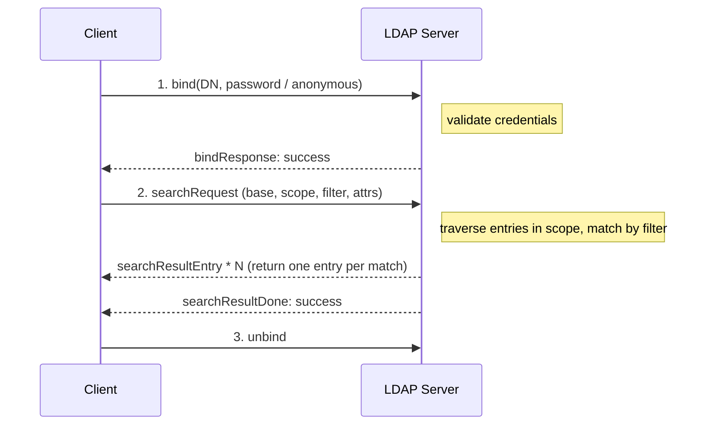
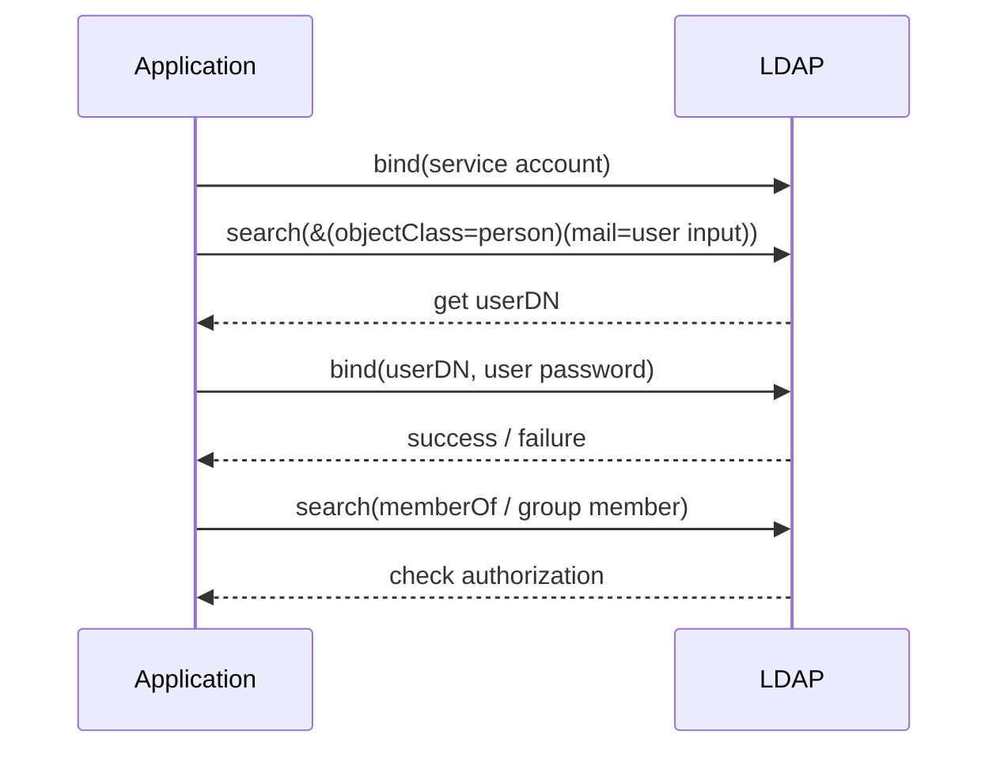
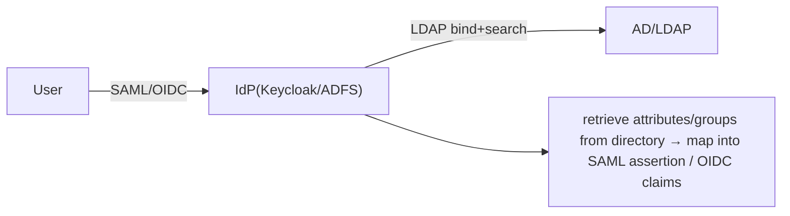

# LDAP Typical Flows

## Search: bind → search → result



Demonstrate the same process with `ldapsearch`:

```bash
ldapsearch -H ldaps://ldap.example.com \
  -D "cn=svc-reader,ou=apps,dc=example,dc=com" -w '****' \
  -b "ou=people,dc=example,dc=com" -s sub \
  "(&(objectClass=person)(mail=alice@example.com))" cn mail
```

## User Authentication: Two Approaches

### 1) Direct bind (simple bind)

The application directly uses **the user's DN + the password entered by the user** to bind; success means authentication succeeds:

1. If the user DN pattern is known (e.g., `uid=<input>,ou=people,dc=example,dc=com`), construct the DN directly;
2. `bind(userDN, password)`;
3. Success = password is correct; failure (`invalidCredentials`) = deny login.

Simple, but requires the application to be able to derive the DN from the username.

### 2) search + bind (most common)

The username may not equal the RDN (login might be via mail or sAMAccountName), so:

1. The application first binds with a **service account** (read-only permissions);
2. **search** the user entry by login name to get its true DN, for example `(|(uid=<input>)(mail=<input>))`;
3. Bind again with **the found DN + user password** to verify the password;
4. (Optional) search / read `memberOf` again to check group membership for authorization.



## Connection with Federated Login

LDAP/AD commonly serves as the backend directory for an IdP in enterprises:



That is, the front end speaks [SAML](../saml/flows.md) / [OIDC](../oidc/flows.md), but behind the scenes LDAP bind/search still performs authentication and data retrieval.

Want to try search and filters? Use the [Filter Builder](../tools/ldap-filter.md) on the [Mock LDAP](../mock/ldap.md) example directory.
