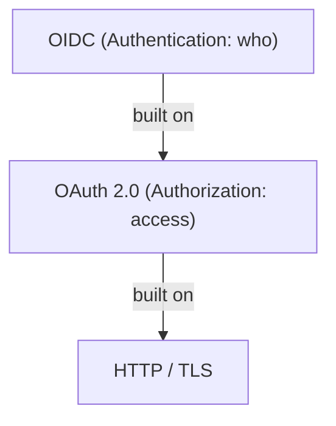

# OIDC Overview

OpenID Connect (OIDC) is an **identity authentication layer** built on top of OAuth 2.0. A one-sentence summary of their division of labor:

> **OAuth 2.0 handles authorization; OIDC adds authentication.**

OAuth 2.0 solves the problem: "how can application A access a user's resources on service B with the user's permission?" Its product is the access token—a "resource access credential." However, OAuth 2.0 itself **does not answer the question "who is the current user?"** OIDC layers a standardized identity assertion mechanism onto OAuth 2.0's authorization flow. Its core product is the **ID Token**—a JWT (JSON Web Token, a self-contained, cryptographically signed token format) signed by the identity provider, carrying information like "who authenticated, when, at which IdP, for which client."

## OIDC's Position in the Protocol Stack

OIDC reuses OAuth 2.0's endpoints (authorization endpoint, token endpoint), flows (authorization code flow, etc.), and security mechanisms (state, redirect_uri validation), with only minor extensions:

- Add `openid` to the `scope` when requesting authorization, indicating "this is an authentication request";
- In the token response, return `id_token` in addition to `access_token`;
- Add supporting infrastructure such as UserInfo Endpoint and Discovery.

If you're already familiar with OAuth 2.0 (see [OAuth 2.0 documentation](../oauth2/)), the incremental learning cost for OIDC is very low.

## Specification Family

OIDC is not a single specification, but a family of specifications:

| Specification | Purpose |
|------|------|
| **OpenID Connect Core 1.0** | Core specification: defines ID Token, authentication requests/responses, three flows, UserInfo Endpoint, standard Claims |
| **OpenID Connect Discovery 1.0** | Defines `/.well-known/openid-configuration` metadata document; RP can auto-discover OP's endpoints and capabilities |
| **OpenID Connect Dynamic Client Registration 1.0** | Allows clients to register dynamically via API instead of manual console creation |
| **OpenID Connect RP-Initiated Logout 1.0** | RP-initiated logout: redirect user to OP's `end_session_endpoint` to end OP session |
| **OpenID Connect Session Management 1.0** | iframe-polling-based session state monitoring (RP awareness of OP-side session changes) |
| **OpenID Connect Front-Channel Logout 1.0** | Front-channel logout: OP notifies each RP via browser iframe to clean up sessions |
| **OpenID Connect Back-Channel Logout 1.0** | Back-channel logout: OP notifies RP via direct server-to-server call (with Logout Token), not browser-dependent |

In engineering practice, the most common combination is **Core + Discovery + RP-Initiated Logout**; add Front/Back-Channel Logout as needed for single sign-out scenarios (Back-Channel is more reliable, not affected by browser third-party cookie restrictions).

## Why Not Use Bare OAuth 2.0 for Login

Before OIDC standardization, many "third-party logins" were implemented this way: run through OAuth 2.0 to get an access token, then call a private "get user info" endpoint, and treat the returned user ID as the login identity. This approach has fundamental flaws:

::: danger access token is not an identity credential
**The semantics of access_token is "allows the holder to access a resource," not "the holder is the resource owner themselves."**

Typical attack (token substitution): An attacker tricks a victim into completing OAuth authorization on their malicious app A and obtains the victim's access token; then submits this token to the vulnerable login interface of app B. App B calls the user info endpoint with the token and retrieves the victim's data, thus logging the attacker's session as the victim.

The root cause is: **access tokens contain no audience information**, so app B cannot determine "was this token issued to me or to someone else?"
:::

OIDC's ID Token eliminates such problems by design:

- The `aud` claim binds the target client; RP must verify `aud` is its own `client_id`, and tokens from other parties are rejected;
- The `iss` claim identifies the issuer; combined with signature verification, it confirms the token truly comes from a trusted OP and is unaltered;
- `nonce` binds the token to a specific authentication session, preventing replay attacks;
- `exp`/`iat`/`auth_time` provide time validity and authentication time information.

Furthermore, bare OAuth2 implementations have wildly varied "user info endpoint" fields. OIDC standardizes this layer with standard Claims (`sub`, `name`, `email`, etc.), allowing a single RP implementation to interoperate with any compliant OP.

## Applicable Scenarios

- **User login for web apps / SPAs / mobile apps**: Integrating with enterprise IdPs (such as Keycloak, Azure AD / Entra ID, Okta) or social login (Google, Apple, etc.).
- **Single sign-on (SSO)**: Multiple applications share the same OP's login session; one login, access everywhere.
- **Login + API authorization in one go**: A single authorization code flow obtains both ID Token (login) and access token (calling backend API), a significant advantage of OIDC over SAML.
- **Microservices / cloud-native unified identity**: Service gateways validate JWTs; identity information propagates with requests.
- **CIAM (Customer Identity and Access Management)**: Large-scale B2C user registration and login systems.

## OIDC vs. SAML

SAML 2.0 (Security Assertion Markup Language, an XML-based identity federation protocol) is the de facto standard for the previous generation of enterprise SSO. The two are positioned similarly but have very different characteristics:

| Dimension | OIDC | SAML 2.0 |
|------|------|----------|
| Data Format | JSON / JWT | XML (signatures use XML-DSig, complex and error-prone) |
| Transport | REST / HTTP Redirect | HTTP POST/Redirect Binding, SOAP (Artifact) |
| Token | ID Token (JWT) | SAML Assertion (XML) |
| Mobile / SPA Support | Natively friendly | Poor, basically only suitable for browser web apps |
| API Authorization | Built-in (reuses OAuth2 access token) | None, requires separate OAuth2 |
| Metadata / Discovery | Discovery document (JSON) | SAML Metadata (XML) |
| Ecosystem | Modern apps, cloud services, mobile, CIAM | Legacy enterprise internal systems, old-school SaaS |
| Typical Choice | Preferred for new systems | Integrate with legacy systems that only support SAML |

Simple decision: **choose OIDC for new projects; only use SAML when the counterparty (usually legacy enterprise software) supports only SAML**. See [SAML documentation](../saml/) for details.

## Chapter Navigation

- [Core Concepts](./concepts.md) — OP/RP roles, ID Token structure and validation, standard scopes and claims, Discovery, JWKS, logout mechanisms
- [Typical Flows](./flows.md) — Complete step-by-step authorization code flow example, comparison of three response_type values, Discovery/JWKS retrieval, RP-Initiated Logout
- [Typical Parameters and Claims Reference](./reference.md) — Authentication request parameters, ID Token claims, standard claims, prompt values, error codes and troubleshooting quick reference

::: tip Prerequisite Knowledge
We recommend reading [OAuth 2.0 documentation](../oauth2/) first to master authorization code flow, PKCE, state, and other basics before entering this chapter.
:::
