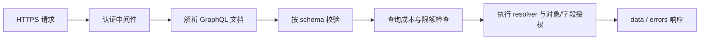

# GraphQL 概述

GraphQL 是一种面向 API 的**查询语言、类型系统和执行规范**。客户端声明需要哪些字段，服务端按照 schema（模式）校验并执行请求，再返回与选择集同形的 JSON 数据。

```graphql
query UserProfile($id: ID!) {
  user(id: $id) {
    id
    displayName
    department {
      name
    }
  }
}
```

GraphQL 适合把多个相关业务对象组织成一张可查询的类型图，减少客户端为了拼装一个页面而调用多个固定 REST 端点的情况。但它不自动解决认证、授权、限流、缓存、审计或数据治理。

::: warning 不要混淆协议角色
- **GraphQL 不是登录或身份联邦协议**：登录应采用 OIDC、SAML 等标准。
- **GraphQL 不是授权协议**：API 委托授权应采用 OAuth 2.0；GraphQL 服务仍须在字段和对象层执行授权。
- **GraphQL 不是身份供应协议**：用户与组的创建、更新、停用优先采用 [SCIM 2.0](../scim/)。
:::

## 规范边界

| 层次 | 标准化内容 | 状态 |
|------|------------|------|
| GraphQL Specification | 文档语法、类型系统、校验、执行、响应和 introspection | GraphQL 核心规范 |
| GraphQL over HTTP | HTTP 方法、媒体类型、请求/响应和状态码语义 | **仍是工作草案**，实现时应声明所遵循版本 |
| Cursor Connections | `edges`、`node`、`cursor`、`pageInfo` 分页约定 | Relay 生态的独立规范，不属于 GraphQL 核心 |
| Subscriptions 传输 | WebSocket、SSE 等长连接传输方式 | 核心规范不指定统一传输 |
| 认证与授权 | 身份验证、scope、对象/字段权限 | 不由 GraphQL 核心定义 |

## 适用场景

- Web、移动端和桌面端需要按页面组合多个相关对象；
- 多个后端能力需要通过统一、强类型 schema 暴露；
- API 需要 introspection、类型生成和演进能力；
- 内部一方客户端可以使用可信文档（操作白名单）控制查询集合。

下列场景不应只因为“接口现代化”就改用 GraphQL：

- 简单资源 CRUD，HTTP 缓存和状态码语义比查询组合更重要；
- 文件上传、流式下载或大对象传输；
- 需要跨厂商标准互操作的身份供应，此时应使用 SCIM；
- 团队无法实施字段级授权、查询成本控制和 schema 治理。

## 一次请求的处理顺序



认证通常应在进入 GraphQL 执行前完成；授权不能只判断能否访问 `/graphql`，还必须在业务逻辑或 resolver 调用的授权层判断调用者能否读取或修改具体对象和字段。

## 本章导航

- [核心概念](./concepts.md) —— schema、类型、操作、变量、resolver、null 与错误传播
- [HTTP 接入](./http.md) —— 方法、媒体类型、请求体、响应、分页与兼容性
- [安全实现](./security.md) —— OAuth、字段授权、租户隔离、查询成本和信息泄露防护
- [速查与标准链接](./reference.md) —— 请求、响应、错误和工程检查表

## 规范来源

- [GraphQL Specification](https://spec.graphql.org/)
- [GraphQL over HTTP 工作草案](https://graphql.github.io/graphql-over-http/draft/)
- [GraphQL 官方 HTTP 指南](https://graphql.org/learn/serving-over-http/)
- [GraphQL Cursor Connections Specification](https://relay.dev/graphql/connections.htm)

