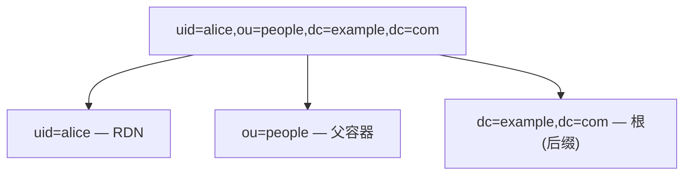

# LDAP 核心概念

## 条目、DN 与 RDN

目录里的每个节点叫**条目(entry)**,由若干**属性**构成。每个条目有唯一的 **DN(Distinguished Name)**,是从条目到树根的路径:



- **RDN(Relative Distinguished Name)**:DN 最左边的一段,如 `uid=alice`,在同一父节点下唯一。
- DN 从左到右由具体到根;`dc=example,dc=com` 通常是目录的**后缀 / base DN**。
- **DC**=domainComponent,**OU**=organizationalUnit,**CN**=commonName,**UID**=user id——这些都是属性类型,拼进 DN 里。

## 属性

条目的数据是**属性-值**对,一个属性可以**多值**(如 `objectClass`、`member`、`mail`):

```
dn: uid=alice,ou=people,dc=example,dc=com
objectClass: inetOrgPerson
cn: Alice Zhang
sn: Zhang
mail: alice@example.com
```

属性名**大小写不敏感**;是否区分值的大小写、如何比较,由属性的 **matching rule** 决定(多数如 `cn` 大小写不敏感)。

## objectClass 与 schema

- 每个条目必须有一个或多个 **objectClass**,它决定了该条目**必须(MUST)**和**可以(MAY)**有哪些属性。
- objectClass 有结构型(如 `inetOrgPerson`)、辅助型(如 `posixAccount`)之分。
- **schema** 定义所有属性类型与 objectClass;跨厂商标准 schema(inetOrgPerson、groupOfNames 等)保证互操作。

## LDIF

**LDIF**(LDAP Data Interchange Format)是目录数据的文本表示,用于导入导出:

```ldif
dn: uid=alice,ou=people,dc=example,dc=com
objectClass: inetOrgPerson
uid: alice
cn: Alice Zhang
sn: Zhang
mail: alice@example.com
```

## 操作:bind 与 search

- **bind**:建立会话并**认证**。匿名 bind(不给凭据)、简单 bind(DN + 密码)、SASL(如 GSSAPI/Kerberos)。简单 bind 成功即代表密码正确。
- **search**:最核心的读操作,由三要素决定返回什么:
  - **base DN**:从哪个条目开始;
  - **scope 作用域**:`base`(仅该条目)、`one`(仅直接子级)、`sub`(该条目及所有后代);
  - **filter 过滤器**:RFC 4515 表达式,如 `(&(objectClass=person)(uid=alice))`。
- 其他:`compare`(比较某属性值)、`add`/`modify`/`delete`/`modifyDN`(写)。

## 组与成员关系

两种常见模型:

- **groupOfNames / groupOfUniqueNames**:组条目用 `member` 列出成员的 DN(如 `cn=admins` 的 `member: uid=alice,...`)。
- **memberOf**(AD 及部分目录的反向属性):直接挂在用户条目上,便于用 `(memberOf=cn=admins,...)` 过滤。

## 安全传输

- **LDAP**:389/tcp 明文(可用 **StartTLS** 在同端口升级为 TLS)。
- **LDAPS**:636/tcp,一开始就是 TLS。生产环境务必用 TLS,否则简单 bind 的密码是明文。

术语与运算符的速查见 [参考](./reference.md);把这些串成一次登录见 [典型流程](./flows.md)。
