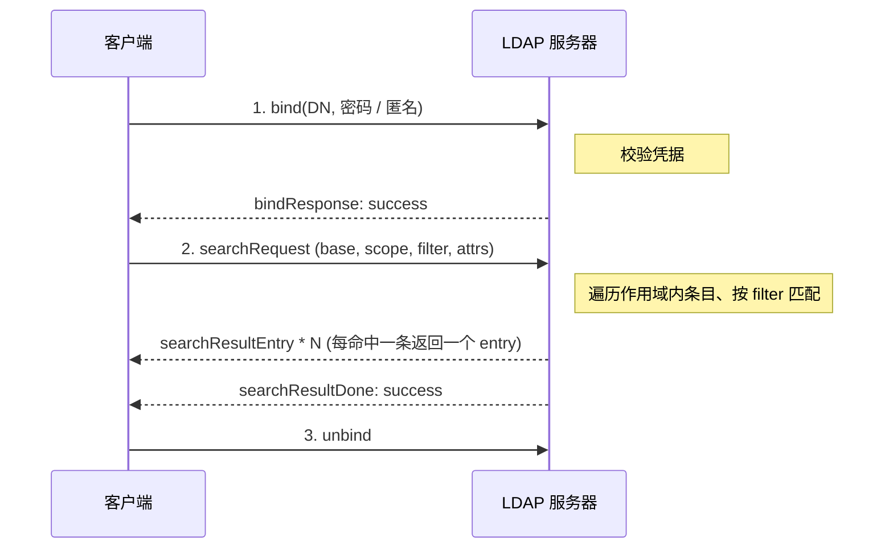
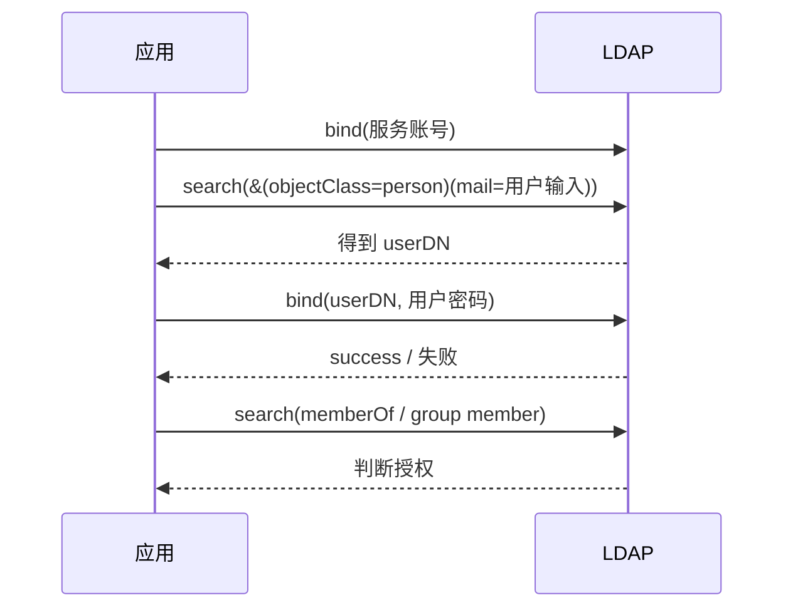
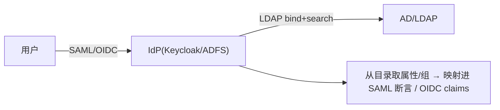

# LDAP 典型流程

## 搜索:bind → search → 结果



用 `ldapsearch` 演示同一过程:

```bash
ldapsearch -H ldaps://ldap.example.com \
  -D "cn=svc-reader,ou=apps,dc=example,dc=com" -w '****' \
  -b "ou=people,dc=example,dc=com" -s sub \
  "(&(objectClass=person)(mail=alice@example.com))" cn mail
```

## 用户认证:两种做法

### 1)直接 bind(simple bind)

应用直接用**用户的 DN + 用户输入的密码**去 bind,成功即认证通过:

1. 若已知用户 DN 模板(如 `uid=<输入>,ou=people,dc=example,dc=com`),直接拼出 DN;
2. `bind(userDN, password)`;
3. 成功 = 密码正确;失败(`invalidCredentials`)= 拒绝登录。

简单,但要求应用能从用户名推出 DN。

### 2)search + bind(最常用)

用户名不一定等于 RDN(可能用 mail 或 sAMAccountName 登录),于是:

1. 应用先用一个**服务账号** bind(只读权限);
2. 按登录名 **search** 出用户条目,拿到其真实 DN,例如 `(|(uid=<输入>)(mail=<输入>))`;
3. 用**查到的 DN + 用户密码**再做一次 bind 验证密码;
4. (可选)再 search / 读 `memberOf` 判断组成员做授权。



## 与联邦登录的衔接

企业里 LDAP/AD 常作为 IdP 的后端目录:



也就是说,前端讲 [SAML](../saml/flows.md) / [OIDC](../oidc/flows.md),背后仍是 LDAP 的 bind/search 在验证与取数。

想动手试搜索与过滤器,用 [过滤器构建器](../tools/ldap-filter.md) 对 [Mock LDAP](../mock/ldap.md) 示例目录搜索。
