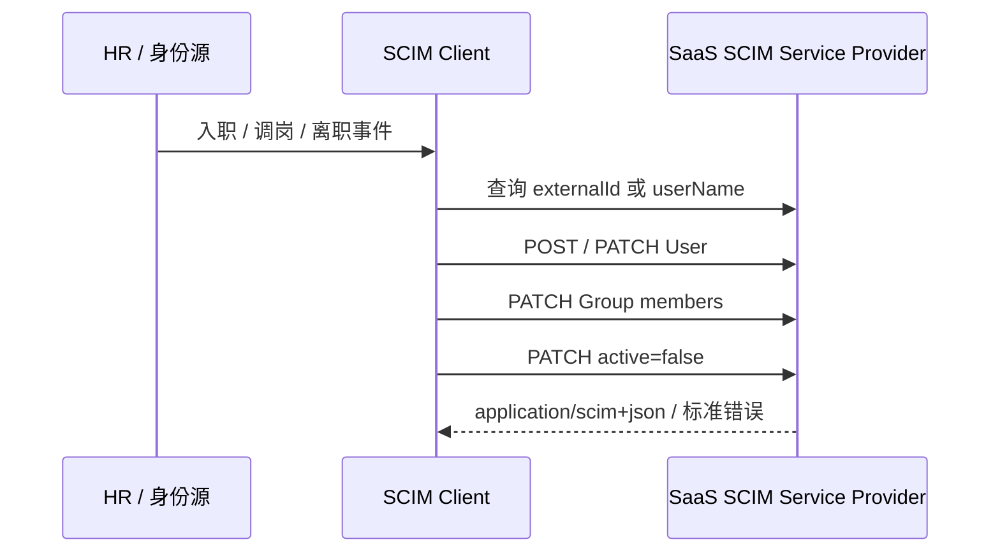

# SCIM 2.0 概述

SCIM（System for Cross-domain Identity Management）2.0 是 IETF 制定的跨域身份管理标准，用统一的 JSON schema 和 HTTP 协议管理用户、组及其生命周期。

它解决的是：

- 员工入职后自动在 SaaS 创建账号；
- 姓名、部门、邮箱或状态变化时同步资料；
- 组成员变化时同步应用权限映射；
- 离职或取消授权时及时停用账号；
- 一个身份系统用同一套模型对接多个服务，而不是为每家编写私有人员同步 API。

::: warning SCIM 不是 SSO
SCIM 负责**供应与回收账号**，不负责用户登录。登录认证采用 [OIDC](../oidc/) 或 [SAML 2.0](../saml/)，API 委托授权通常采用 [OAuth 2.0](../oauth2/)。

只做 SSO 不等于完成身份生命周期管理：用户可能能首次登录时即时建号，却无法在离职时可靠停用；SCIM 正是用于补齐这个边界。
:::

## 规范组成

| 规范 | 作用 | 状态 |
|------|------|------|
| RFC 7642 | 定义场景、角色、模型与需求 | Informational |
| RFC 7643 | 定义 User、Group、EnterpriseUser、属性特征和扩展模型 | Standards Track |
| RFC 7644 | 定义 HTTP CRUD、PATCH、过滤、分页、发现、Bulk 和错误 | Standards Track |
| RFC 9967 | 用 Security Event Token 通知异步 SCIM 事件 | Standards Track，可选扩展 |

通常所说的“支持 SCIM 2.0”，至少应以 RFC 7643 和 RFC 7644 为互操作基线。支持用户创建但没有发现端点、过滤、标准错误或停用语义的私有 JSON API，不应标成完整 SCIM。

## 角色与数据流

| 角色 | 职责 |
|------|------|
| SCIM Client | 发起供应请求，通常是企业 IdP、HR 驱动的身份治理系统或同步代理 |
| Service Provider | 提供 SCIM API，通常是接收用户和组的 SaaS/平台 |
| Resource | 被管理的 User、Group 或扩展资源 |

SCIM 是跨系统同步协议，不自动定义哪一方是身份真源，也不解决冲突合并。部署前必须约定属性归属、同步方向、账号匹配键、删除/停用策略和重试行为。

## SCIM 与其他接口

| 方案 | 适合解决 | 互操作性 |
|------|----------|----------|
| SCIM 2.0 | 用户/组供应、更新、停用和查询 | 跨厂商标准 |
| LDAP | 企业目录查询与目录内管理 | 目录协议，跨互联网 SaaS 暴露通常不理想 |
| JIT 建号 | 用户首次 SSO 时创建账号 | 不能可靠覆盖离职回收和未登录用户 |
| 私有 REST/GraphQL | 产品自有业务 API | 每家 schema、错误和流程不同 |

对于面向企业客户的平台，推荐同时提供 OIDC/SAML 登录和 SCIM 2.0 生命周期接口，并允许两者用稳定的外部标识关联，但不要把 SSO claim 当作唯一的供应控制面。

## 本章导航

- [资源与 Schema](./concepts.md) —— User、Group、扩展、属性特征、标识与发现
- [协议操作](./operations.md) —— CRUD、PATCH、过滤、分页、Bulk 和停用
- [安全实现](./security.md) —— OAuth、TLS、租户隔离、并发、隐私与审计
- [速查与标准链接](./reference.md) —— 端点、媒体类型、过滤器、错误和接入清单

## 规范来源

- [RFC 7642：SCIM 定义、概览与需求](https://www.rfc-editor.org/rfc/rfc7642)
- [RFC 7643：SCIM Core Schema](https://www.rfc-editor.org/rfc/rfc7643)
- [RFC 7644：SCIM Protocol](https://www.rfc-editor.org/rfc/rfc7644)
- [RFC 9967：SCIM Profile for Security Event Tokens](https://www.rfc-editor.org/rfc/rfc9967)

